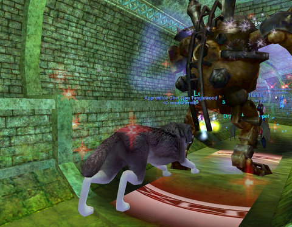

Back to: [West Karana](/posts/westkarana.md) > [2010](/posts/2010/westkarana.md) > [March](./westkarana.md)
# A short EverQuest travelogue: Levels 74-76

*Posted by Tipa on 2010-03-28 00:51:54*

What have I done today in EverQuest?

[caption id="attachment\_4892" align="aligncenter" width="480" caption="Hunting in Old Commonlands with Sispis"][/caption]

Sispis showed me how to navigate the Void and come to an ancient version of the Commonlands, where all the animals were level 75. I look like a kitty here because I'd just been to Shar'vahl, the kitty city on the not-yet-exploded moon of Luclin, and I always try my best to fit in. I have a huge bag full of illusion masks just for that, though you can purchase innate illusions with AA now. Though not the gnome illusion!

[caption id="attachment\_4893" align="aligncenter" width="480" caption="Bolvi and I making dead things even deader in the Hole"][/caption]

Bolvi, a guild mage who just started playing again last month after seven years away, invited me down to the bottom of The Hole in order to get some AA. I happily agreed, and we spent a couple of hours clearing the Dead Tower and chatting about what life has handed us since last we grouped, a long, long time ago. I also got four AA, and a friend added me to his monster mission tasks while we were farming, so I came out of the Hole with three monster mission rewards waiting for me.

[caption id="attachment\_4894" align="aligncenter" width="480" caption="Adventuring in the Freeport Sewers"][/caption]

The EverQuest 11th Anniversary event brings you to an alternate version of the Freeport sewers, which have been taken over by clockworks. Our job: kill them. There's no way a low level like myself would have been able to get into an Anniversary quest group, but this was with a group of former guildies and current friends who mostly had coalesced into the guild Synergy.

I ended the night two yellow bubbles from 77. I started out a few days ago at level 71, so I definitely can't complain about the leveling speed. In true EverQuest tradition, I didn't solo any of it. If you have friends who play, though, I don't think you can do better EverQuest for the social MMORPG experience.

I think it's wonderful how they are going back and reusing old zones for high level content. Old Commonlands, the Freeport sewers, the "Road to Underfoot" classic dungeon monster missions -- all reuse old dungeons (though I think the 'normal' version of the Freeport sewers are not as extensive). SOE is not above continually reminding players what EQ was like back in its glory days.

By this time, every EQ player has tried other MMOs, and all of them have decided there is nothing that compares to the old classics. Of course, the EQ player base is only a fraction of WoW's, but then, I bet there are plenty enough players to pay the dev salaries and keep the lights on.

I still haven't decided what character to use as a two box alt. I can just rent a cleric so there is no reason to pay $50 to have my 75 cleric moved back from Luclin and put on my other account. I have my druid -- my original main -- who could come back, she's 66, or my mage from Stromm -- she's 65. So both of those would be helpful, but they are 10-11 levels behind me now. I might bring my mage back just so she could sit in the Hole with Bolvi and clear the Dead Tower and relax. And Etha because... well, she was my first real character. So I guess, just because.

I got my baking up to 135 today with Fish Rolls; I need it up to 182 to do all the combines for the first tradeskill portion of my Epic 1.5 quest. So I will try to get some ingredient farming done tomorrow, finish up that first one. After that comes brewing, tailoring and smithing, and I get to skip any one of those. Then I rebuild Shakey the Scarecrow in Rivervale, talk to some dark elves, and then comes the guy in Sol C and some bard killing. That should be pretty easy, since almost everyone I know is max level now. And then comes the last fight in the spectre tower in the Oasis, and for that I need 13 people, apparently, just to start it. Weeks away, basically.

And then, 2.0! And then, for my OTHER weapon, the [Boomerang monster mission](http://everquest.allakhazam.com/db/quest.html?quest=4941) in Underfoot.

EQ is really pushing this whole monster mission thing. Well, they ARE the only game with it (though LotRO has a simpler version).
## Comments!

**[kaozz](http://www.ectmmo.com/)** writes: Looks like you've had a lot of fun being back. The game is so much fun when you have friends to group with. Cool pics, I've been lazy about logging into EQ lately to do the anniv events. 

BTW there is a new gnome illusion item-Eyepiece of the Fancy Tinker, for level 85. I'm a sucker for illusions, I have sooo many masks.

---

**[Tipa](https://chasingdings.com)** writes: Someone was talking about a new Gnome illusion -- gnomes are not a race illusion you can buy with AA. I never got my gnome mask when I was on Stromm before the Sleeper was awoken, either. So, though I have human, Vah'Shir, Erudite, half elf, dark elf, high elf, earth elemental, iksar and froglok illusion, I don't have gnome. I had the barbarian mask once, but I gave it away. We only killed the Crag Matriarch once, and I didn't win the roll for the ogre mask, so... it would be nice to scratch another off the list. Thankfully, I never had to do the halfling mask camp.

---

