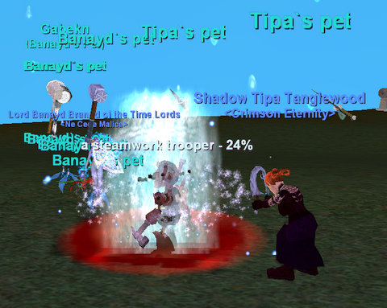

Back to: [West Karana](/posts/westkarana.md) > [2010](/posts/2010/westkarana.md) > [March](./westkarana.md)
# Weekend gaming: EQ, LotRO, STO, DDO

*Posted by Tipa on 2010-03-29 07:47:49*

The games in the title -- EverQuest, Lord of the Rings Online, Star Trek Online, Dungeons & Dragons Online. Three of the four have "online" in their name. It's Lord of the Rings, except ONLINE! It's Star Trek like you never imagined it -- ONLINE! Throw away your pencils and dice because D&D is ONLINE! EverQuest is just -- EverQuest. Online is all it knows. That's the power of having a pre-existing IP for your game; its name is its best feature.

[caption id="attachment\_4899" align="aligncenter" width="480" caption="The start of the \\"Infected\\" raidisode"][/caption]

Since capping out my level in Star Trek Online, I've really wanted to try out the "raidisodes". I've been farming the special currency you get from doing the daily missions for awhile, and nearly have enough for the uber epic science kit. I decided to head into Infected just to see what I'd be up against.

Borg cubes and spheres slowly circling a planet. These weren't the wimpy Borg of the tutorial, but ones that would slice through a single ship in no time. I warped out of the system ahead of a barrage of green-tinged beams. There were lots of groups forming for "Infected" and its follow-up, "The Cure", but there were reports that people were losing all their xp when they died. ALL of it. And sinking well into the negative.

Given that death was nearly certain in the raidisode, I decided to move along and play STO when a death wouldn't mean the end. Of course it was just a glitch, probably fixed already, but I'd rather just avoid the problem entirely.

[caption id="attachment\_4900" align="aligncenter" width="480" caption="Relaxing in Evendim"][/caption]

This last weekend was one of LotRO's free weekends, where they open the gates and let anyone who ever has had an active account play. Lots of people have been urging me to give LotRO another shot. It DESERVES another shot. A lot of people I respect really enjoy the game.

I logged in and checked my bank balance, first thing. Buying a horse has always been an unachievable dream for me in LotRO. I'd get close, and then some expense would arise and I'd be poor again. 3 gold and about 250 silver; a pittance. Even if I sold everything I had, that would only add another 140 silver to the total. Still a very long way from a horse at four gold. To get the rest of that money, I would go through and finish as many quests as I needed, but I would be riding away on a horse, one of the new ones they had for the spring festival.

I didn't make it. Evendim was just as I remembered; twisty paths, death around the corner, long lonely roads dotted with wolves, bears, and robbers. I finished a couple of quests, dinged level 37 (yay!), but died in the end without a horse to my name. Maybe next time.

[caption id="attachment\_4897" align="aligncenter" width="480" caption="Playing DDO like a house on fire!"][/caption]

The Sunday DDO group decided we'd seen enough of the Waterworks for now. Time to take a vacation in the sunny Cerulean Hills. I was livid when I got there and found that the hills weren't cerulean AT. ALL. They were GREEN. Heck, if I want to see green hills, I can look out the WINDOW.

The hills weren't only NOT BLUE, but they were full of orcs and bugbears... and bugbear BARDS, which are crazy, brutish-looking bugbears with long-necked lutes strapped to their backs. When we killed the bard, the other bugbears thanked us. No, really.

The Cerulean Hills are filled with little pockets of adventure here and there; mini-dungeons and things to see. The lengthiest of those was a poor trader whose caravan had been waylaid by orcs; orcs had overrun his farm and those farms near him. Would we, perhaps, go find his dogs? Of course we would. Unfortunately, we had to keep his dogs ALIVE, too, which meant we didn't get the best score for the adventure. Who knew?

Also needing saving was a princess and her loyal servants. Yawn. Another day, another princess. You can buy them half a dozen to the box at the local market.

Tony dinged 5; I am closing in on it. We all visited the Coin Lord patron outside the bank in the Marketplace and each earned an extra inventory tab for our services. Still pretty far from unlocking the Drow race.

[caption id="attachment\_4898" align="aligncenter" width="480" caption="Grinding XP in Zeka"][/caption]

Most of my free time this weekend was spent in EverQuest. I didn't INTEND to spend so much time in the game; it just happened that way.

I logged on yesterday intending to do some more work on my Epic 1.5. I noticed some friends were in the Plane of Earth; turned out they were farming rock monsters for the fabled rogue pet weapon, which eventually dropped for them. Egat asked if I would like to come up and we could see if the Spawn Gods would drop another for me, and of course I said yes.

After a couple of hours, we realized that Spawn Gods demanded a sacrifice. I volunteered. Fabled Glimmerstone killed me. I ran back and Fabled Glimmerstone killed me AGAIN. Carlisle came by to help, and in another hour or so, my pet weapon dropped from Fabled Shimmering Gem Monster Or Something Like That. YAY!

Sispis and Achernar asked if I'd like to do the trifecta of "classic dungeon" monster missions, and of course I agreed. They asked me to lead the Lower Guk - Dead Side mission. I used to know the place very well, but that was a long time ago. I got lost a few times, but we did manage to finish it.

After a short break, I noticed that another old friend from Crimson Eternity, Banayd, was on. (Most of the people I have grouped with have moved on from CE; the power of a good friend list cannot be denied, though). Banayd and I got to chatting; he's just returned from Xegony and is still getting used to the high-level guild politics in EMarr. Anyhow, he offered to take me and my two-boxed druid, Etha, recently returned from Luclin herself, to get some experience.

Wall of Slaughter was light blue; so was the Muramite Proving Grounds and so was Riftseeker's Sanctum which Etha, not yet 70, could not enter. We decided to move the party to Zeka, one of the experience instances off of Dragonscale Hills in the Secrets of Faydwer expansion. Experience was fairly slow, even after I popped my Lesson of the Devoted. I think Etha was dragging down the experience; SHE made a level and a half, so grats 68.5 on her, while I struggled to make two yellows, leaving me a yellow shy of level 79 on the rogue. Next time, I leave Etha out of the group.

I also transferred my mage back. Bolvi -- he of the Hole runs -- was asking if I was ready to bring her down into those Stygian depths but I was xping... am looking forward to it tonight, though!

Too many good games out there and too little time. I'd really like to give Fallen Earth a shot, but I have no time! And I have a LOT of stuff still to do on EVE.

## Comments!

**Longasc** writes: It is not that much of a money problem, but it just bugs me that I have to pay a sub if I just play the game a little or not at all. Some people (Hi Mr. Kae!) buy lifetime subs to avoid this nagging feeling, but I would like to campaign for a pay for content (aka major expansions) model for MMOs.

Right now I have 60 days LOTRO running, but I managed to do the spring festival and the new vol. III Book within 3 days, so yeah, that was very efficient of me. Now waiting for an expansion at the end of the year. At least I hope for one. :P

STO: Sub is running out next Sunday/Monday. I quite like to play STO, but Cryptic is an awful company. Even their monthly sub costs a bit more than a WoW or LOTRO sub, and selling respecs like in the store like in CO already or for 20.000 Merits (I could afford it - but I have much more merits/energy than the majority of players for sure) is really... awful. Still, I have an unhealthy love for my Bird of Prey and Assault Cruiser. Plus while the raidisodes suck hard, the new Klingon PvE content, while buggy at times, really rocks... weird, the least promoted feature is the best.

I would like to try "Infected" next weekend with you and Kae, probably impossible during the week. But till he is there, given the little time he can spend gaming and splitting that between many many games, I am afraid I might have already unsubbed for ages. :P

I think you need some more focus. But it seems you like all the mentioned games, still your love seems to belong to this stone old fossil called EverQuest. I personally suggest playing Guild Wars. :=)

But given your preferences, I think EVE, LOTRO and STO are a good spread and more than enough games. Otherwise you should start creating a Tipa clone dedicated to playing all the other MMOs...^^

---

**[mbp](http://mindbendingpuzzles@kevnol.net)** writes: Even though I am a big Lotro fan myself I have to admit that you have certainly given the game plenty of opportunity and if it hasn't grabbed your attention by now it probably never will. The only thing I can think of that you may not have tried is to roll a character on an RP server. Though I am not a RPer myself I imagine the Tolkien influence would ensure a steady supply of would be hobbits and so on.

---

**Egat** writes: Go Go Gadget Pets! You know, I should have thought of taking you to Zeka. I'd like to think the kill rate in Ashengate made up for the lower level of the mobs.

---

**Liquid Wolf** writes: So many MMOs and nothing to play... 

Between working through the Mortal Online beta, occasionally hopping into EVE Online for some space action, and running a character in WoW... I understand the feeling of not having enough time. Throw in my PS3 games, and I might as well sit on the couch and next to the computer from 8AM to 10PM on a daily basis.

Some friends and I three-manned Molten Core last night, and though it was fun I just can't help but wonder where I will find an MMO that can keep me attached. Ultima Online was my introduction to MMOs... a very hard Introduction... but WoW was the one I stuck with longest. I find I'm reaching my end of level caps and classes... hence my interest in a game like Mortal Online and continued subscription to EVE.

I am one character, and I will try to do everything and anything with that one character. Alts don't really keep my interest unless there is some benefit to my Main to have an alt or two.

I keep thinking of giving LotRO another go with my girlfriend, but I'm also concerned I should wait for something like Guild Wars 2... and with my time being invested in 3 MMOs already... I don't want to get going on another till I can get rid of AT LEAST 1 of them.

Looking at your blog, I see something similar... I might not be interested in STO, and have never touched Everquest... but what you are saying feels worth reading.

I'm going to bookmark your blog... it is an interesting read.

---

**PeterD** writes: Wait, even though you can get a mount at 20 now in LotRO it still costs the same amount of money? I just got my new captain to 20 recently and haven't gone to look yet, but I had expected that if they lowered the requirement to 20 they'd have made it a price a level 20 could reasonably attain. Ugh.

---

**flemick brellson** writes: baynad! sispis! egat! i really should get out more.

---

**[Tipa](https://chasingdings.com)** writes: Or get IN more -- in GAME, that is :)

---

**[warhammermer](http://exploringwar.wordpress.com/)** writes: The horse/pony at 20 costs 200 silver. You should get that.

---

**[Tipa](https://chasingdings.com)** writes: I did get that for my hobbit hunter, but it is slower than running. Same in EQ; the mounts you can afford are more for looks (and in EQ, for medding) than transportation.

---

**Banayd** writes: This was a qute thread dear ... was REAL nice to talk to you and catch up ... HUGS !!!

---

