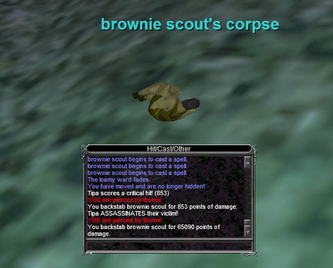

Back to: [West Karana](/posts/westkarana.md) > [2010](/posts/2010/westkarana.md) > [March](./westkarana.md)
# The 9000 players of EverQuest

*Posted by Tipa on 2010-03-30 07:00:17*

OpenEdge1 has for awhile been estimating the number of subscribers to a game based on the number of its players who report their usage with XFire. [His latest calculations](http://simple-n-complex.blogspot.com/2010/03/xfire-game.html) put Star Trek Online at 117K players, which more or less jibes with Cryptic's reports. I'm dubious about the other standings. His formula would give WoW 6.3 million players in the West, which I believe would be a real high water mark for them. Of oft-repeated 11.5 million players, the majority were in Asia, and unlikely to be XFire users.

EverQuest I and II didn't come out so well. OpenEdge1's formula gives EQ2 a bare 35K subscriptions, and EQ1 only 9K players spread out over all their servers. I can say from personal experience that EverQuest is far busier than that. It's more likely that the sorts of people who play the EverQuests use XFire less than the sorts of people who play WoW and EVE Online. I'm an aberration -- I play all of them!

[caption id="attachment\_4903" align="aligncenter" width="480" caption="Bristlebane\\'s Quest"][/caption]

April 1st comes Thursday. April Fools day in the USA is Bristlebane's Day in Norrath. The Image of Bristlebane already prowls the Plane of Knowledge in EverQuest, handing out quests to run around the world finding rare things and bringing them back. Modern EQ quests offer a wide variety of rewards. You can often ignore rewards for which you have no use and choose to get money or just raw experience instead. Bristlebane's quest has a vast variety of possible rewards, including special fireworks and experience potions. I've been swigging experience potions like water flasks since my return to the game.

You won't find me on EverQuest on Bristlebane's Day, though. I'll be in EQ2, doing their ONE DAY ONLY events. It'll be a nice break from working on my epic quest in EQ.
[caption id="attachment\_4904" align="aligncenter" width="480" caption="I assassinate harmless woodland creatures!"][/caption]

Last night was spent relaxing in EQ; aside from a single monster mission (that dinged me to 79), I spent it working on my epic baking skills.

I have always hated EverQuest's crafting; it's just so useless and arbitrary, but it's also REQUIRED for the rogue epic 1.5. So I spent a good portion of the night on fairly pointless tasks like slaughtering lava basilisks in Lavastorm for their eggs, with which I could make dough, with which I could make pie crust which I could put in a pie tin but I had to make that pie tin first! So off to the forge and pottery wheel for those after hunting down the ingredients all through PoK. Finally get all the ingredients together and make batwing pies (yum?) until trivial. Then sell all of them because they take up space and the Fish Rolls I made earlier in this baking madness are better food. Then off to Lesser Faydark to camp brownies for their parts.

Back to PoK to make White Chocolate from them as an ingredient in Birthday Cakes. But oops, don't have a Cake Round, have to go smith up one of those and.... sigh. This is all just skilling up baking. The actual foods I have to make will require rare ingredients gathered from all over Norrath.

After baking comes brewing, the halfling skill that I could skip if I wanted. It sounds a lot easier than baking, though, so why skip it? I'll save that for later. I'd LIKE to skip smithing and tailoring; those sound like real chores.

Very much waiting for the parts of my epic where I can kill things....

## Comments!

**[ModemMisuser](http://www.sentence-ov-desire.net/)** writes: Yeah - usage of one IM client or another is a very, very poor way to try to estimate a game's subscriber base. I've never understood why some people (not you - of course) take these things to be near "gospel truth." 

Honestly, the only people that REALLY know a game's true sub numbers are employees of the company(s) responsible for publishing and/or developing the game. And they're (usually!) not talking.

Remember back when live sub numbers were right next to the server name when you logged into Everquest I? :)

---

**[Tipa](https://chasingdings.com)** writes: I remember when they stopped :) I do suspect that the XFire statistics may be able to show how a game is TRENDING -- higher or lower, and how fast. This assumes that the XFire adoption rate fir a specific game is more or less constant, even if the specific rate across games is variable.

The challenge for both EQs is bringing new players. EQ2 hopes to do this with the new Halas newbie zone; EQ has very much tweaked their XP curve till 80, but I doubt that by itself can bring many new players.

---

**[Victor Stillwater](http://iamstillwater.wordpress.com)** writes: I was wondering why these purple shinies showed up with impossible body parts for the various races in EQ2. Hahaha... :D

---

**[Toldain](http://toldaintalks.blogspot.com)** writes: There's nothing harmless about brownie scouts. Those guys have ganked me more times than I care to remember.

---

**[Tipa](https://chasingdings.com)** writes: Yeah, I remember having to bring friends when I camped them for my druid epic in my 40s. They seem a little less fearsome at 79, though!

---

**[Jomu](http://www.justonemoreunlock.blogspot.com)** writes: are you going to kill the baddies with a pie to the face? insta-Critical!

---

**[Ardwulf](http://ardwulfslair.wordpress.com/)** writes: Having tried to extract actual subscription numbers from Xfire's statistics... it just doesn't work. You can calculate how one game's known subber numbers relate to Xfire's stats, but when you try to use that same constant to figure out other game's numbers, they get more out of whack the further you move up or down from the original datapoint. In other words, you're doctoring the number to make that first statistic come out right, but the fudge factor can't be applied to other games whose subscription numbers *aren't* known from an outside source, and the numbers swiftly become nonsensical - like they are here, in the case of EQ and EQ2.

---

**darksilver** writes: I agree with Tipa that XFire shows a trend. Because the data can be off by a very large margin. If you look at the XFire stats for Star Trek Online before the last update hit the server. XFire did show only around 6 players playing with 25h. I guess cryptic is lucky that OpenEdge1 did not publish then his numbers. ;)

---

**[Tipa](https://chasingdings.com)** writes: Y'know, I have some sour jumjum pies sitting in the bank that could be pretty deadly... I'd still eat them, though. Pit, you know.

---

**Egat** writes: Tipa, you may enjoy this thread regarding the EQ active population: http://forums.station.sony.com/eq/posts/list.m?topic\_id=151162

I'm not nearly enough of a math nut to enjoy looking into this. I tend to estimate based off active bazaar sellers, assuming that one in 5 people run a seller all the time. That puts the Erollisi Marr population at about 1k. Not an exact science at all but I would be very surprised if there were more than that on my server and expect it to actually be far less if you take out the accounts who are boxed.

---

**[Tipa](https://chasingdings.com)** writes: Where do you get the 1 in 5 figure? That seems as arbitrary as OpenEdge1's ratio. Clearly it is all just conjecture, but the last I saw an estimate, both games were in the area of 100K with EQ1 slightly ahead. Of course, those numbers could be total fiction as well, but if EQ has shed 9/10s of its players in the last couple of years, then I can't imagine why they keep the servers open. That would be around Matrix Online numbers.

---

**Egat** writes: Yup totally arbitrary on my part. You could also try the number of players inhabiting the general chat channel, although again you can't prove everyone uses the channel as it is an option. Unless Sony speaks, there is no real way to know. I doubt even Sony could separate an actual player from his boxed toons either.

---

**Bhagpuss** writes: My current impression of EQ's population is based on the half-dozen or so servers I have played on in the last two months (I have a lot of characters on a lot of servers). I play GMT hours up to just before what would be the peak US load.

It's hard to estimate how many people are currently online, but there's an obvious comparison you can make, based on one figure that we do know. Back when SoE announced that EQ had around 450k subscribers, the Bazaar on most servers I played on ran at around 470 - 500 traders. 500 is the most traders the Bazaar will hold and there were complaints that people somtimes had to wait for a spot.

When I was playing EQ a couple of years ago, on most of the servers I used the Bazaar had around 250-280 traders. Currently I am seeing something like 150 - 180 traders.

Another indicator might be the number of afk characters in the Guild Lobby. I don't actually count those, but I would estimate it is now at around 40% of what it would have been a couple of years back. 

Then there's the number of people in Plane of Knowledge. It's no longer the hub it once was, but it's still a meeting point of sorts. Currently I am still seeing 50 - 80 people there most of the time. Once upon a time that would have been a couple of hundred.

My impression from all this is that if EQ at it's peak had 450k subscribers it might now have something like a third of that. All the indicators seem to have dropped by roughly the same amount. That would still leave EQ with over 100 thousand players, which would be very healthy indeed for an eleven-year old MMO.

The wild-card factor in EQ/EQ2 population speculation is multi-boxing. It's a real culture in the EQ games. How any of these methods reflect how many actual people are subscribing vs how many active characters there are I have no idea.

---

**[Tipa](https://chasingdings.com)** writes: 100K sounds about right for both EQ and EQ2.

---

**[/AFK &#8211; April Fool&#8217;s Edition &laquo; Bio Break](http://biobreak.wordpress.com/2010/04/04/afk-april-fools-edition/)** writes: [...] Tipa wonders if EQ really has only 9K players left [...]

---

