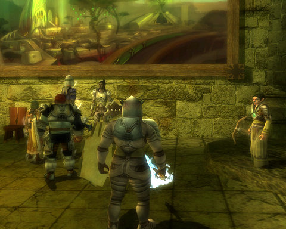
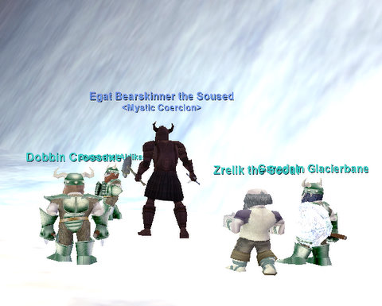
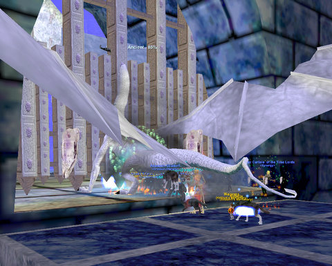

Back to: [West Karana](/posts/westkarana.md) > [2010](/posts/2010/westkarana.md) > [May](./westkarana.md)
# Weekend Gaming: A little DDO, a lot of EQ

*Posted by Tipa on 2010-05-03 06:24:35*

You say you're about to do "The Proof is in the Poison" quest you picked up in the Stormreach Market? You're standing at the door, about to click in? Wondering how hard this adventure is going to be for you and your pals?

STOP! Just ... just stop right there. Time to take a little inventory of your party's levels. Do you have a rogue in your party? Does this fine person have at least two levels of rogue to their name?

If the answer to EITHER of these two questions is "no", then turn around. Back away. Go tell a tall tale of struggle and woe in the nearest tavern. Because, without a rogue, this dungeon is *Mein DDO Kampf*. No lie.

For a few months, the Sunday DDO static group has been gladly and happily smiling at the traps we can neither see nor avoid, trusting healing to get us through. That ended with this dungeon.

Who'd EVER have thought that someone would make an MMO where rogues actually had a role besides just doing as much damage as possible? EverQuest consistently made rogue special abilities (assassinate, detect/remove traps, lockpicking) useless while giving other dps classes equivalent or better dps. WoW followed that route, and as a result, rogues are among the least popular classes in both games. Both games didn't want a group to rely upon rogue abilities, though they had no trouble making groups rely upon tanking and healing....

Anyway. You NEED a rogue in your group in DDO. Don't assume that just because EQ, WoW and other similar games make rogues pointless that the same applies elsewhere.

Moving on....

I was doing a boring smithing quest in EverQuest's Abysmal Sea (epic related, of course) and chatting with folks to pass the time. Egat mentioned doing his 10th Coldain Ring quest in the Great Divide, and I wanted to be there. The quest turns the Great Divide into a war zone, with armies of giants attempting to take the hidden Coldain Dwarf capital of Thurgadin. The player on the quest becomes a general, and can order squadrons of dwarfs to meet the giant advance, but for good measure they usually will bring an army of players to help.

That was the situation nine years ago, anyway. Today, it's probably soloable. But it was still an event, something you'll rarely have a chance to do in these days of heavy instancing.

Although the anniversary "Fabled Monster" event is over for the year, some of the Fableds are still up, and will be until killed or the server is reset. We went looking for Fableds to kill, and found one in scaly person of the Fabled Vyskudra the Ancient at the bottom of Sleeper's Tomb.

I (naturally) retold my story of waking the Sleeper on Stromm and angering the uber guild who'd been farming the Warders for Scepters of Destruction and Gnome Masks and selling them for real money to people on other servers by transferring them through the Legends server. The Legends server was the center of crime for the entire game; the ability for Legends players to easily move gear to other servers -- something possible at that time no other way -- could turn EQ into a very profitable part time job for many people.

Anyway, we woke the Sleeper, changed ST and ended all that, the uber guild got angry at us, but guess what? It's been seven years and I don't remember any of their names, but I remember waking the Sleeper.

Though the Ancients don't drop the Warders' gnome masks, they DO drop new dwarf masks, and the other rogue and I were hoping the dragon would drop one or more.... it wasn't to be.

The rest of the day was taken up with Seeds of Destruction progression. We started off in the Field of Scale "theme", moved on to Bloody Kithicor, and ended up in the verdant hills of ~~Qeynos~~ Oceangreen. Is Oceangreen what Qeynos would have been called if Sony hadn't published the game? (Qeynos is SonyEQ spelled backward).

The general theme of the Oceangreen quests is to fix time by going back in time and ensuring events go as they were meant to go. In Oceangreen's case, we're to stop the followers of Bertoxxuluous from gaining a foothold, at which we were entirely successful. So why does modern EQ have a whole section of the city (the Catacombs) devoted to their headquarters? I don't know!

The new Blackburrow shares the floor plan of the old one. It's still a horribly confusing maze of twisty passages, all different. Still too many gnolls. Who stink. Just saying.

Anyway, ended the day with access to "The Void 'C'", which is a little ways along the path to repairing time (which will end with The Void 'G'). Apparently, the dragon goddess Veeshan is alive once more, so that balances the dragon I killed in the morning. Kill one, rez one.

## Comments!

**warhammermer** writes: In Dnd the tabletop game you always need a rogue for dungeon bashing, and a wizard for countering and a cleric. Everything else is optional.

---

**[rowan](http://ihavetouchedthesky.blogspot.com/)** writes: I can totally sympathize with the Rogues of the world that feel their abilities underutilized in WoW (and EQ, I guess, Never played). Having said that I thought about your comparison of rogues to tanks and healers. Again speaking only to WoW, there is a difference between rolls and classes. I know you already this but, my point is that many different people playing different classes can fill a given role. But only a rogue can be a rogue, dismantling traps, etc. So if you have a rogue in your party, then you're golden But if you don't, game over for you and your party on that instance, or if you find a rogue to go with you , someone else will have to sit it out.

One of the the things that kept me away from running raids prior to WotLK, was that raid leaders

---

**[rowan](http://ihavetouchedthesky.blogspot.com/)** writes: Woops, I did not mean to hit submit. Feel free to delete the unfinished one.

I can totally sympathize with the Rogues of the world that feel their abilities underutilized in WoW (and EQ, I guess. Never played). Having said that, I thought about your comparison of rogues to tanks and healers. Again speaking only to WoW, there is a difference between roles and classes. I know you already know this, but my point is that many different people playing different classes can fill a given role. But only a rogue can be a rogue, dismantling traps, etc. So if a dungeon requires a rogue, and you have a rogue in your party, then you’re golden. But if you don’t, game over for you and your party on that instance; or if you find a rogue to go with you, someone else will have to sit it out.

One of the the things that kept me away from running raids prior to WotLK was that raid leaders would sub specific classes in and out like it was a football game. Meaning: not everyone would get to see the story of the raid as it progressed. In my current experience, Strategy is much more important than raid composition, and we need a good mix of tanks, healers, and ranged and melee DPS; including rogues that ease the way, but not so essential that their absence would be a raid killer. (By the way, our two rogues top or nearly top the DPS race just about every fight.) It would be nice, as a priest, if priests were essential. But it's also nice that they don't have to depend on my presence to run the raid, especially given my frequent travel schedule required by my job. Reality can be a beyotch.

Anyhoo, tabletops were fun, and you could re-role on the fly if you *really* needed to. Online games are harder, since most players are locked into the characters they have spent literally weeks of online time leveling, and you can't suddenly change toons, unless you have also spent an additional set of weeks leveling that second toon. Blizzard and other developers have constant work, balancing the classes for their roles, plus keeping the gameplay and the story interesting. Sometimes they do better at this than others. But that's what we pay them for.

Excellent post again as always, Tipa. And obviously thought provoking. Well, opinion provoking, which is not the same thing. ;P

---

**[Tipa](https://chasingdings.com)** writes: Well, as a rogue in EQ, EQ2, WoW and D&D tabletop, I might be a little close to the issue. And yes, raid rogues in WoW do very well. But it could be better. 

EQ2 tried to balance things out, and failed. 

In EQ2, the myriad classes were divided into four 'archetypes' -- fighter, priest, mage and scout, corresponding to the traditional roles in a party. Each would be sufficient to handle that role, in their own style. In early EQ2, scouts were essential -- even opening loot chests was hazardous without one. 

Jump to present day. Fighters, priests and mages are still vital. But scouts? If there's room. Or they have a needed buff. None of their special abilities are needed at all. The last one -- the ability to control heroic opportunities -- hasn't been needed since the first expansion. 

---

**[Blue Kae](http://www.bluekae.com)** writes: Wow, that last screenshot of the entrance to Blackburrow really took me back. That's the first time I've ever felt nostalgic for EQ1.

---

**[Tipa](https://chasingdings.com)** writes: First dungeon I ever visited in EQ. What a wild place it was. Met people there I would keep in touch with for years. 

---

**[Rob](http://www.lostaneighth.com)** writes: If there is one thing I lament the most about the design changes in WotLK it is that there are no sprawling dungeons. Every dungeon instance is made to be consumed in roughly 30 minutes. I remember going into Blackburrow the first week that EQ was out and it was a nightmare. Even going back to it with a high level character, I can't help but have a slight tinge of nervousness in there. The dungeons in EQ were always great because there was usually no safety of the zone line. They were huge places full of danger and hidden wonders. Some parts of old school WoW were more like this to a degree (take a stroll through Maraudon some time), however, in my 5 years in WoW, despite how much I have enjoyed it, I don't think I ever felt the same fear about their dungeons.

---

**sirhyl** writes: Do you have any room left in your static group? I have been wanting to play DDO for sometime now, but people I have talked with said it wasn't worth it without a static group.

Ill try to find you tonight on XFire and talk about it.

---

**[Magson](http://phoenq-magson.blogspot.com)** writes: Why 2 levels of Rogue in their build? My rog/wiz only has 1 level of rogue so far (though I will eventually add the 2nd level for the Evasion) but I've kept the skills up, so he has a natural +15 to disable, +12 to search. And with skill boost abilities and gear I can bump both of those up by another +7 for disable or +5 for the search if I need to, though usually I don't need to. . . . . 

Anyway, I agree that it's nice to have the rogue abilities be needed in that game. I was slumming on a ranger with a 1 level of rogue splashed in the other day and got invited to a group specifically due to having that rogue level since the series of quests they wanted to run required a lot of disabling of traps and opening locked doors. It was a lot of fun. I tried to solo my rog/wiz through and the rogue parts aren't the problem, it's the protecting the npc's in a quest where losing 1 of them is a fail condition. Seems like I manage to protect the 1st 2, but always lose the 3rd. :-( Time to get me a group to finish it up. . hehe.

---

**[kaozz](http://www.ectmmo.com/)** writes: Ah, that makes me miss EQ. It's been a few months since I played.. not quite time to go back yet heh.

---

**[Tipa](https://chasingdings.com)** writes: Well, it's not my static group, it's a static group of RL friends who let me play with them. We're also kinda passed the point where it would be easy to catch up. 

That said, via Rubi at Massively, there is a Wednesday night event open to everyone specifically for getting new players started. That would be the way to go if you want to give DDO a shot and would like a regular set of people with whom to group! I'm there every week!

---

**[Tipa](https://chasingdings.com)** writes: I'd read two levels of rogue were needed to have a certainty for finding traps and stuff. If one level would work, all the better!

---

**[Magson](http://phoenq-magson.blogspot.com)** writes: Well.. you "need" 2 levels of rogue in order to cap up to 4 skills at level 20, and Rogue Level 2 gives Evasion (successful reflex save takes no damage from a trap) so it's nice to have, but it's not needed until "later." Generally the 2nd rogue level is suggested to be taken somewhere from level 8-11 depending on what you're splashing it with. For example, my rogue/wizard wants Wiz 7 as fast as possible in order to get the Firewall spell, so he'd not take the 2nd rogue level before 9th, but my rogue/ranger gets his 2nd "free" feats from his ranger class at Ranger 6, so he could take his 2nd rogue level at 8 without "slowing himself down."

---

