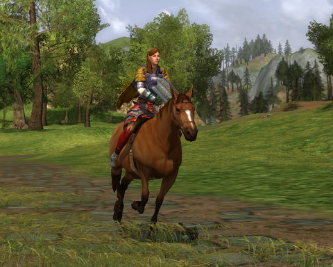

Back to: [West Karana](/posts/westkarana.md) > [2010](/posts/2010/westkarana.md) > [May](./westkarana.md)
# LotRO: Save a horse, ride a hobbit!

*Posted by Tipa on 2010-05-04 06:20:07*

Oh, this isn't a real post. Just was so happy to finally get a horse in Lord of the Rings Online. I don't subscribe to LotRO, but each time Turbine offers a free play weekend -- or week, in this case -- I log in and see if I can make enough to get a horse.

I was going to be riding last night. I WANTED the Spring Festival horse, but after doing a couple of the "spring leaf" events, I got bored and gave up on that project. I'd settle for the regular mount, if I could afford it.

I had auctioned off most of my 37 Captain's harvests and other gear a couple days ago; last night I did the same to my two alts. I ended up with 4 gold and 100 silver -- an all-time high. The riding quest was tedious -- ride a horse to Bree, Michel Delving and North Downs, ending with a race around the yard.

It was worth it in the end. I'm now the proud owner of [Brown Betty](http://watching-tv.ew.com/2010/04/30/fringe-season-2-episode-20/), my chestnut mare.

So; not a real post. Tonight is a non-MMO night, so tonight I will be (I hope!) starting my series of five IP's that SHOULD be made into MMOs. Tonight: #5: [Gunsmoke](http://en.wikipedia.org/wiki/Gunsmoke), the MMO.
## Comments!

**Longasc** writes: Congratulations! :)

Level up some more and then explore the lowbie areas again on horseback - I am sure you will find amazing stuff you did not explore yet. At least I always do, despite always trying to explore every area map completely.

---

**[Petter Mårtensson](http://blog.dontfearthemutant.com)** writes: Indeed, congratulations! To us both, actually, since it seems we both finished the horse quest yesterday. :)

---

**Thac0** writes: Very nice screenshot. You look quite dashing upon your mare!

---

**[kaozz](http://www.ectmmo.com/)** writes: Gratz on the horsie! Very interesting way to play LoTRO lol.

---

