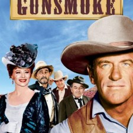

Back to: [West Karana](/posts/westkarana.md) > [2010](/posts/2010/westkarana.md) > [May](./westkarana.md)
# IPs that SHOULD be MMOs part 1: Gunsmoke

*Posted by Tipa on 2010-05-04 23:28:34*

A good intellectual property (IP) can more than provide a setting for a game; it can in a single word tell a player what his or her role is without even knowing one thing about the game itself. The very best IPs are open enough so that the game developers have plenty of room to grow beyond their starting bounds.

Westerns were big in the fifties and sixties. REALLY big. As many different sorts of crime shows are on today, were how many westerns were on back then. Every network had a few. The biggest of them all was CBS' [Gunsmoke](http://en.wikipedia.org/wiki/Gunsmoke).

Running for 20 years on television from 1955 to 1975, first in black & white and then in color, Gunsmoke told the story of Dodge City Marshall Matt Dillon, dance hall girl Miss Kitty, and a continuing cast that changed as show told its story of law and lawlessness, love, loss, drama, crime.... The setting was general enough so that almost any story could be told, and most of the western plots of the day had their time in Dodge City.

There hasn't been a Old West MMO yet, as far as I know. Rumors swirl. Tenderfoot Games' "[Wild West Online](http://www.wildwestonline.com/)" claims to be a MMO, but the site calls it a "single player or 1-on-1 multiplayer" game, which doesn't sound very massive to me. Other "Old West" MMOs are rumored and fall to pieces. What they need is a good IP to bring them all together.

In many ways, and perhaps not surprisingly, the best modern example of an Old West MMO would have been pre-NGE Star Wars Galaxies. The towns in far-flung locations, the saloon as a gathering spot, trading gunfire out of sight of the law.... Reskin SWG, and you're halfway there.

Players would start as a character with no particular skills. Wandering through Dodge City, they might see posters giving bounties on randomly generated outlaws. If they bring them back, they get their reward. If they bring them back alive, a better reward. Maybe the barkeep over at the saloon knows of a ranch that could use a hired hand, or someone to rassle cows. Maybe you could set up a small shop, or buy a deed and go homestead somewhere far off, or rise through the political ranks and get the train to come through your city. Or heck, plant a flag and start your own town and hire players to defend it.

As the game years progressed, crops would have to be harvested and shipped off, cattle would have to be driven to new grazing lands, negotiations with the local Native American tribes would seal beneficial deals or lead to war.

It would be wide open spaces everywhere you looked. A true sandbox game. There would have to be PvP -- it wouldn't be an Old West game without it. Like EVE, there would be towns that would provide safety from PvP most of the time. Smaller towns could be attacked by bands of outlaws now and again. Lone homesteads would have to see to their own defense, but for those who really want to succeed at Gunsmoke, building their own ranch in the middle of a thousand acres of land and keeping enough hired hands around to hold it would be the only way to go.

With the success of modern westerns such as Deadwood, 3:10 to Yuma and Unforgiven, I don't understand why we haven't seen a triple-A offering in the field yet. I think it's just waiting for that one golden IP to bring it to life.

Next up: If you're not a cop, you're little people -- rain and replicants collide in Blade Runner: the MMO.

## Comments!

**[Scott Hartsman](http://www.hartsman.com)** writes: Hey, stranger. :) 

Wild west mmos as a theme are one that keeps coming up over the years. I like the the setting a lot myself (and most of the IPs you mention, for sure), but there were always some core long-term usage problems I just couldn't get past, that no one seems to have a good answer to -- other than.. "But..cmon! You can be a cowboy!"

1) It's brown and dirty. (And even if it isn't really all brown and dirty, people think of brown and dirty. And we all know how "too brown" is the kiss of death for an MMO.)

2) The IPs tend to all be strongly character focused (even if the characters change over time), and less focused on a well-developed, unique setting. Properties where specific characters are the dominant attraction don't translate well to successful MMOs. (tangent: also why Firefly would be a risky move. Best characters ever. Totally overshadowed the universe.)

3) Everyone knows how it ends. Western-themed alt-history might be fun, but setting it in any of the real world wild west IPs would be kind of like making WWII online - You'll get some fans, sure, but not a big win.

0.02.

- Scott

---

**Longasc** writes: Mr. Hartsman is quite right, the yellow/brownish danger is looming on the horizon. I loved watching Gunsmoke.
I am still waiting for the game that lets me invade Russia online. Guess it will be an all male thing, but it would be cool. :)

---

**stnylan** writes: A pure western, not so much. Now, use the Deadlands RPG setting and I think things become alot of fun :)

---

**[Tipa](https://chasingdings.com)** writes: Someone on Twitter mentioned Aces & Eights as well. I think Deadlands would be a fantastic expansion for the core game.

As for brown-ness, well, the setting could include such colorful towns as San Francisco and New Orleans.... There's ways to add color.

---

**[Brian 'Psychochild' Green](http://www.psychochild.org/)** writes: Scott and stnylan beat me to it. I think that the standard MMO setup doesn't work too well with the typical themes of Westerns.

"Who is that mysterious stranger dressed in black coming into town?"

"Read the name above his head! That's Black Bart!"

While text games have tried to address this specific problem in the past, trying to implement an introduction system in a graphical game seems like a lot of overhead. Your typical players would likely get really confused, and preventing people from playing with their friends immediately is another one of those "kisses of death".

But, I think that a *Deadlands* type setting would be interesting. This is much more about the setting than the characters, so it would work well.

Anyway, looking forward to reading your further thoughts, Tipa. :)

---

**Mark** writes: I think part of the problem is that by it's nature an old west mmo would have to be a sandbox pvp game of sorts and if you look at the recent history of those games they haven't exactly been massive successes. Also look at a game like Fallen Earth which has a lot of the look and feel in some ways of what a wild west mmo would have. The game was fun and has a dedicated developer but still couldn't quite get it right. 

That said I think if done right it would be a really fun game, but it is going to take that golden ip to get it going. The success rate of similar game styles lately would probably scare off a lot of companies and investors.

---

**[Fallen Earth: Cowboys and Cowgirls &laquo; Exploring War Like Worlds.](http://exploringwar.wordpress.com/2010/05/05/fallen-earth-cowboys-and-cowgirls/)** writes: [...] West karana was saying there should be a gunsmoke mmorpg. Westerns were big in the fifties and sixties. REALLY big. As many different sorts of crime shows [...]

---

**[mbp](http://mindbendingpuzzles@kevnol.net)** writes: I love the setting but I think it might need to be an mmo-fps. The wild west is all about shooting and I am not sure that auto target and clicking skillbars would cut it. I do think that done right though there coul dbe plenty of room for those of us who are not crack shots. Players can group up in robber gangs, cavalry troops, indian tribes and so on. Also crafting and trade could be given important roles as long as there there is item loss (doesn't have to be pvp looting - wear and tear will do). I don't see this being a gear centric game though. There is only so far you can take a six gun and no amount of leather chaps is ever going to protect you from a full on shotgun blast. 

Scott makes a good point about it all being too brown but I don't think it is really that bad. If you think of all the combinations of hats and ponchos and boots and so on there is plenty of room for dress up. Not to mention Indians and cavalry and the occasional bar girl. There isn't much room for dayglo yellow but I don't think every one has to wear generic brown. There is also scope for lush green pastures and forests as well as arid badlands. Those cows have to eat something.

---

**[rowan](http://ihavetouchedthesky.blogspot.com/)** writes: Maybe we'll see how successful Red Dead Redemption is, and someone will think of developing an Old West (Gunsmoke) MMO.

---

**[The Best Of The Rest: Leaked Edition - We Fly Spitfires &#8211; MMORPG Blog](http://blog.weflyspitfires.com/2010/05/09/the-best-of-the-rest-leaked-edition/)** writes: [...] Tipa kicks off a fantastic series of IPs that should be MMOs. [...]

---

**Nina** writes: You're leaving out the female characters - the prairie mama armed with frying pan, the dancehall girl (the healer character?)

Raid/instance design could start with your basic saloon fight. Advance up to a street showdown, or a posse tracking a villain, or escaping from a posse. Then you've got the magnificant advanced raids - which absolutely MUST be 7-person.

---

**[Tipa](https://chasingdings.com)** writes: Not really sure a dance hall girl could be played in a non-ironic way. For all that was IMPLIED about Miss Kitty's profession, her actions on the show were entirely G-rated. Now, the pitchfork mama, I could see that :)

---

**[West Karana » Could Red Dead Redemption lead to an Old West MMO?](https://chasingdings.com/index.php/2010/05/20/could-red-dead-redemption-lead-to-an-old-west-mmo/)** writes: [...] couple of weeks back, I wondered if the world was ready for a MMO based on a fairly realistic version of the Old West, specifically Gunsmoke, an old TV series that ran for twenty years from the fifties through the [...]

---

**[Killed in a Smiling Accident. &raquo; Blog Archive &raquo; Mighty Morphin MMO.](http://www.kiasa.org/2010/05/24/mighty-morphin-mmo/)** writes: [...] through Saturday morning kids TV when I saw a show that I considered a contender for Tipa’s IPs that should be MMOs series, but despite Power Rangers being an incredibly popular show, I quickly realised that several [...]

---

