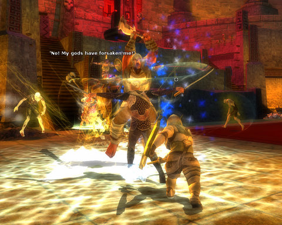

Back to: [West Karana](/posts/westkarana.md) > [2010](/posts/2010/westkarana.md) > [May](./westkarana.md)
# DDO: A night in Tangleroot Gorge

*Posted by Tipa on 2010-05-05 23:50:17*

Massively.com's Rubi had been hinting all day at something special for the Wednesday DDO meetup (9PM EDT, all are invited)... The big secret? We were going to explore some of the paid content in Dungeons & Dragons Online, courtesy of a double armload of 90-minute guest passes.

 .bbpBox{background:url(http://s.twimg.com/a/1273086425/images/themes/theme1/bg.png) #9ae4e8;padding:20px;}p.bbpTweet{background:#fff;padding:10px 12px 10px 12px;margin:0;min-height:48px;color:#000;font-size:18px !important;line-height:22px;-moz-border-radius:5px;-webkit-border-radius:5px}p.bbpTweet span.metadata{display:block;width:100%;clear:both;margin-top:8px;padding-top:12px;height:40px;border-top:1px solid #fff;border-top:1px solid #e6e6e6}p.bbpTweet span.metadata span.author{line-height:19px}p.bbpTweet span.metadata span.author img{float:left;margin:0 7px 0 0px;width:38px;height:38px}p.bbpTweet a:hover{text-decoration:underline}p.bbpTweet span.timestamp{font-size:12px;display:block} Nights of Eberron was great tonight. I bought a pile of guest passes and we did Tangleroot. Much fun was had.[less than a minute ago](http://twitter.com/Rubi_/status/13464161058 "Thu May 06 02:48:12 +0000 2010") via web**[Rubi\_](http://twitter.com/Rubi_)**

 

Though I usually am just content to get some of my solo quests out of the way to get ready for the Sunday group, tonight... tonight I wanted to be part of the special event. So I hung out in the Bleeding Stump Tavern, or the Sucking Leg Wound Saloon or whatever it's called, got a group, and debated what to do about the *destination de la nuit*, Tangleroot Gorge.

That's an adventure pack I didn't have, AND I just bought another adventure pack, Sharn Syndicate, last week. Rubi had bought a few guest passes (at 50 Turbine Points each), but I decided to take the plunge and just buy the adventure pack.

Both purchases combined don't even come to one month's subscription to some other title, and I've been playing DDO for a few months now. I've said many times that if I like a F2P game, I have no problem at all spending money in its cash shop. The developers have to eat, too! Still an absolute bargain.

Tangleroot Gorge is a huge wilderness area within which sits an equally massive dungeon. A long quest series sends you through that dungeon many times, each time exploring a little further, until the final mission which sends you to kill the leader. All very standard stuff, actually -- the fun was in the company, and the loot wasn't bad. I scored some rather nice boots from it, and got clerical advice from the group leader, which was much appreciated.

Afterward, I joined Kasul in Korthos Island, where we knocked off the Cannith Aqueduct mission on Elite. As in the normal difficulties, the Skeletal Mage was the only difficult encounter. He was too much for both of us, but my cleric hireling managed to finish the fight and get me standing. Dwarf cleric, of course. The reliable kind.

So, it was another fun night! Thanks to Rubi, Syp, and the rest of the Massively crew for organizing it, thanks to Kasul and my groupmates, and looking forward to playing again Sunday and next week!

The Tweet link, btw, was done with Twitter's new [Blackbird Pie tool](http://media.twitter.com/blackbird-pie/).

## Comments!

**[Brian 'Psychochild' Green](http://www.psychochild.org/)** writes: It was definitely fun. I bought a bunch of content when it was on sale, but it was very nice of Rubi to do that for people. Hopefully Turbine does something nice for her. :)

I stepped up and ran a group tonight. I prefer to follow the leader, but it was fun to run around in the zone. We got a bunch of rare encounters done and 4 of the quests. Then we ran some Harbor quests on Hard for extra favor. Fun time had by all. :)

---

**Longasc** writes: It still totally baffles me that DDO launched in 2006 and then it was off the radar of most people. In 2009/2010 it resurfaced and people totally love it.

Makes me wonder: Have people simply ignored a gem in 2006? Were people struck dumb by WoW? Was it really the change of the business model to a either sub or F2P hybrid???

Maybe it is me, but if I would play DDO atm I would probably already be subscribed. I don't play MMOs "a little", I devour them fully. This is also why I actually only play one MMO at a time. I am subscribed to LOTRO at the moment, but running skirmishes solo or grouped makes me just even more hungry for an expansion, so I am barely online.

---

**[Tipa](https://chasingdings.com)** writes: When DDO released, I couldn't then afford another full-priced MMO. I still can't. This is the exact same reason I am not subbed to LotRO at the moment -- it is not a game I would play enough to warrant a subscription. I just don't play enough on any given month to make it worth it.

Subscription games are held back by their pricing model. People are willing to give F2P games a chance; but $15/month is a huge investment requiring a lot of thought about 'value' and 'dollars per played hour'.

---

**[Brian 'Psychochild' Green](http://www.psychochild.org/)** writes: One of the guys I was grouped with last night provided some insight into Longasc's question. Basically, it's a variation on the "WoW tourist" thing.

He was playing WoW, heard about new MMOs and went to check them out. He basically said that he gave DDO and LotRO a little bit of time each and just didn't get into them, so he ignored them and went back to WoW. Now that he's bored with WoW, he's checking the games out again (thanks to Massively's effort) and finding out he's enjoying them. The games were just too different from WoW back when he was totally engrossed in WoW.

From a developer's point of view, this matches with my experiences.

1. People will tend to stick with a game they like and will look for the same things in other games.
2. People can get bored and will eventually look for "something new", but the have to be ready for it.
3. People will generally stick with their initial impression, even if it turns out to be completely wrong.
4. It takes something big to get people to reconsider their first impressions. DDO going free to play was a huge event, and luckily it was hugely successful.
5. People are herd animals and will follow the leader. (Latest article on Psychology of Video games is insightful here: http://www.psychologyofgames.com/2010/05/05/the-power-of-you-no-wait-others-i-meant-the-power-of-others/)

My thoughts.

---

**[Brian 'Psychochild' Green](http://www.psychochild.org/)** writes: Gah, the link parser added the ) to the end of the URL in my previous post. Delete that to get to the wonderful post. Tipa: Feel free to put a space in there and delete this message.

---

