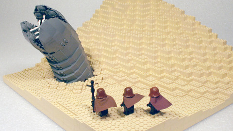

Back to: [West Karana](/posts/westkarana.md) > [2010](/posts/2010/westkarana.md) > [May](./westkarana.md)
# IPs that SHOULD be MMOs, part 3: Dune

*Posted by Tipa on 2010-05-07 06:47:38*

[caption id="attachment\_5126" align="aligncenter" width="480" caption="Click to see the builder\\'s (RebelRock) gallery"][/caption]

It is the best selling science fiction novel, ever. It has been adapted as a [film](http://en.wikipedia.org/wiki/Dune_(film)), a [mini-series](http://en.wikipedia.org/wiki/Frank_Herbert's_Dune), a duology of genre-defining [video games](http://en.wikipedia.org/wiki/Dune_II), a comic, the basis of many songs, paintings, poems and other works. Frank Herbert's 1965 *[Dune](http://en.wikipedia.org/wiki/Dune_(novel))* is as gigantic a presence in the science fiction world as Tolkein's *The Lord of the Rings* is in fantasy.

Set tens of thousands of years in the future, mankind has spread throughout the galaxy, ruled by an Emperor and governed by the Landsraad, a parliament of the Great Houses (noble ruling families). The future civilization is powered by the unique spice *melange*, found and harvested on only one planet in the known galaxy -- Arrakis, a desert planet known as Dune. *Melange* is the substance that makes faster-than-light navigation possible, extends life, and to some, confers prophetic powers. It is prophesied that it will someday allow one person to become a god, the Kwisatz Haderach.

The book opens with House Atreides, rulers of the water planet Caladan, being granted the right to rule Arrakis and harvest its spice by the Padishah Emperor. Displacing the villainous House Harkonnen, the Atreides attempt to bring peace and justice back to the planet while managing the spice harvest and avoiding the treacherous, immense sandworms. Knowing that he is being set up for betrayal, Duke Leto Atreides, the head of the House, forms alliances with the local Bedouin, the Fremen, and with the interplanetary smugglers that supply a thriving black market in spice.

Then everything goes pear-shaped. The inevitable betrayal leads to the destruction of House Atreides as a villainous alliance of House Harkonnen, the Spacing Guild, and disguised Imperial shock troopers invade Arrakis. Only young Paul Atreides and his mother Jessica escape into the desert, to learn the ways of the Fremen and eventually take back their planet -- and rule the galaxy.

The only way Dune the MMO could possibly work would be as a huge PvP game with war on many fronts. Warhammer Online meets EVE Online -- or just EVE Online, but set planetside instead of in space. The politics and shifting alliances of EVE Online's nullsec is exactly what you'd want to see in Dune, the MMO.

In Dune the MMO, the player would start out without any affiliation. Through the tutorial phase, they would join one of the NPC guilds, which would teach them a useful trade -- their class. Available guilds would be the Spacer's Guild (manage and control travel between planets), the Smugglers, the Mercenaries, the Sardaukar (Imperial troops), the Bene Gesserit (priestesses and advisors), the Mentats (human computers), the Ixians (purveyors of super technology), the Face Dancers (shapeshifters and spies) and so on.

Players may eventually join or form a House -- a guild. Every House has its own planet, travel too and from which is managed by the Spacing Guild (having Spacing Guild players manage interstellar travel is a necessity). NPCs on the planet will give randomly-generated missions to allow character growth and further progression in their profession. Using the resources on their planet, the Houses will build their forces and equipment and make war on the other Houses. Eventually, a House will battle for control of Arrakis itself, and until it is dethroned, have a certain amount of power over the entire galaxy.

Dune, the MMO, would be a game that has separate scopes. At the very basic level, you, as a player, are a member of your class -- one of the many unique professions from the Dune books. As you gain influence within your profession, you are able to command more of its resources. As a member of the Bene Gesserit, for instance, you could arrange for clandestine alliances between rival Houses. Higher-rank Mentats could deduce the secrets of other Houses (unless their Mentats are better at hiding those secrets). And when negotiation fails, it will be battles and tactics that determines who gets another planet to add to their collection, and who gets sent screaming back to their ruined world far from civilization.

Dune, the MMO, would be an impossible dream if CCP hadn't more or less DONE it already with EVE Online. Someone better grab that IP and make that game, because I want to play it.

Tomorrow, our series returns to television for inspiration as we explore [Law & Order](http://en.wikipedia.org/wiki/Law_And_Order): the MMO.

## Comments!

**Longasc** writes: I would like to say something about the Dune IP, but this LEGO SANDWORM totally cracked me up! :)

Sardaukar would probably fight as "trinity", like in the books... (they use to fight in groups of three, covering each other's back - maybe in a MMO as tank, healer, DPS?) SCNR. :)

---

**[Brian 'Psychochild' Green](http://www.psychochild.org/)** writes: This is the first setting you've picked that I would agree would make a great setting. Although I've only read the first book (and I have to admit I loved the movie from the 80s), there seems to be a lot more hinted at around the edges than is explicit in the work. The other books seem to flesh this out more, but there still seems to be a lot of room for interesting adventures.

Although, I wonder if this setting might not benefit from a different take on the typical MMO gameplay. I wonder if something more strategic might be a good idea, as opposed to the typical single-character type gameplay. Given the history of *Dune* games, perhaps it might even make an interesting browser-based game?

Anyway, an interesting thought experiment. :)

---

**[Tipa](https://chasingdings.com)** writes: I'd love a way to include the Twitter discussion on this here...

Something more on the lines of a Civ game? Hmmm....

---

**[Buzzregog](http://www.sevendead.com)** writes: I am thinking instead of choosing a guild, go with one of the great or minor houses.

---

**[Tipa](https://chasingdings.com)** writes: So, have the Great Houses be NPC houses that people join? I dunno if people would feel the same attachment to an NPC house, but it WOULD make it easier to stick with the setting. Maybe people could join a Great House, with NPCs in control, OR make their own lesser House?

---

**[hunter](http://huntersinsight.wordpress.com/)** writes: I love the dune setting but I'm not sure an Eve like game would fit well with the lore. Too many confining caveats that would restrict the sandbox.

---

**[Tipa](https://chasingdings.com)** writes: I think we would have to assume that Dune MMO devs would take what ever liberties they needed in order to make a fun game. The book, after all, is still around for the original, pure Dune experience. Making Dune into an RTS worked pretty well, after all -- it's been adapted to a game before. Now it's time to make it massive! :)

---

**[Buzzregog](http://www.sevendead.com)** writes: Yeah, was thinking each house could be a faction. PC's align themselves to a faction at creation, have the option to quest to change factions later (sort of like EQ2 betrayal quests). Minor houses (read player guilds) can ally themselves as a whole to a Major house (or not but there should be benefits to do so).

To make the game really rich there should be a way for folks to infiltrate other houses since the betrayal of one house for another is such a huge force in the books.

Brian Herbert and Kevin J. Anderson have done a really good job of expanding the canon while staying faithful with all of the prequels they have written.

On a completely different tangent. I've always thought Roger Zelazny's Amber series has a huge potential for a MMORPG. The MUD may even still be going. No shortage of worlds, faction war and betrayal there either.

---

