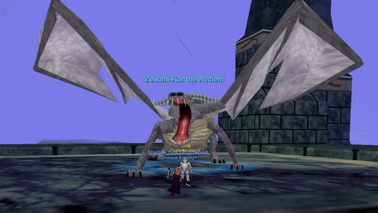

Back to: [West Karana](/posts/westkarana.md) > [2010](/posts/2010/westkarana.md) > [May](./westkarana.md)
# EQ: Dwarfing Sleeper's Tomb

*Posted by Tipa on 2010-05-14 06:12:08*

I might never get my epic rogue epic 1.5 done in EverQuest. I work a little on the tradeskills, get bored, and start looking for trouble. I logged in last night, did two weapons in the test of smithing, then had to go to Crystal Caverns and farm some velium ore for the Velious test. Snuck into Thurgadin after to get some Coldain Temper, was heading out to the Plane of Knowledge book in the Great Divide to return to the forge, when... I went a different way.

Thanks to the heroic efforts of Krijhok and other friends on Erollisi Marr, I'm partially flagged through Seeds of Destruction (and, again thanks to Krij and friends, as of last night just one mission from being flagged in Underfoot as well). As you progress through SoD, though, you gain access to ever more powerful mercenaries. I'd earlier picked up a Journeyman IV Cleric mercenary.

On the one hand, if cleric mercenaries didn't exist, I'd probably be playing my cleric instead of my rogue. On the other hand, since they DO exist, soloing becomes viable for non-solo classes.

I took a little detour and headed to Sleeper's Tomb. Just to, you know, see if any of the ancient dragons were up.

At least two of the dragons were up... One of them might have the dwarf mask -- the bard/rogue mask that can cast Illusion: Dwarf, one of the rarer masks in a collection that started years and years ago with the dark elf mask from Lower Guk.

I am not max level in EQ; I don't have a zillion AAs; my gear is mostly the stuff you get from monster missions, along with some of the Defiant "head-start" armor. That's the common and cheap armor sets created so that new or returning players can get fairly decent gear to start. Just to illustrate, I am not an uber character.

With the help, though, of my hireling, I was able to solo both an ancient dragon (light blue to me, warned me that it would require an army to defeat), AND a wanderer that respawned during the twenty minute fight. And the dragon had my dwarf mask.

Upshot is, if you've ever wanted to try EverQuest out, or are thinking of returning, common armor, weapons, and hireling mercenaries (as well as the free buffs in the guild lobby) will ensure you have stuff to do instead of just waiting around for groups.

## Comments!

**[stargrace](http://mmoquests.com)** writes: Oh wow congratulations on the mask! My rogue used to LOVE collecting those. The more clickies, the better. I absolutely love the quested tier of mercs as well.

---

**Longasc** writes: It's about time for World of EverQuest, isn't it. Instead of revamping EverQuest II over and over, a new EverQuest that is about as new and exciting as the old EQ, UO and WoW were to the masses.

---

**Egat** writes: Congrats on the mask! I'm a little sad I wasn't able to help you get it, but thrilled that you could obtain it regardless!

---

**[kaozz](http://www.ectmmo.com/)** writes: Gratz on the mask! It is nice to be able to solo with the mercs now. It opens up a lot of classes that people might not have played before. The ability to solo and make groups now is really nice.

---

**Fuan** writes: I remember way back when I got the mask on my Halfling Druid. If I remember correctly, if you had the item before it was changed to be Rogue only, you could still use it.

---

**Fuan** writes: Ooops, I meant the Dark Elf mask that dropped in Guk.

---

**Bhagpuss** writes: Everquest is now one of the best solo games you can play. Mercenaries were the single best thing ever added, in my opinion.

---

**Noffin** writes: FUAN!!!

---

