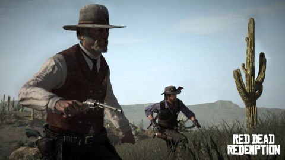

Back to: [West Karana](/posts/westkarana.md) > [2010](/posts/2010/westkarana.md) > [May](./westkarana.md)
# Could Red Dead Redemption lead to an Old West MMO?

*Posted by Tipa on 2010-05-20 06:11:52*

 .bbpBox14290030752 {background:url(http://a1.twimg.com/profile\_background\_images/14251900/twitter\_bkgd.jpg) #8493cb;padding:20px;} p.bbpTweet{background:#fff;padding:10px 12px 10px 12px;margin:0;min-height:48px;color:#000;font-size:18px !important;line-height:22px;-moz-border-radius:5px;-webkit-border-radius:5px} p.bbpTweet span.metadata{display:block;width:100%;clear:both;margin-top:8px;padding-top:12px;height:40px;border-top:1px solid #fff;border-top:1px solid #e6e6e6} p.bbpTweet span.metadata span.author{line-height:19px} p.bbpTweet span.metadata span.author img{float:left;margin:0 7px 0 0px;width:38px;height:38px} p.bbpTweet a:hover{text-decoration:underline}p.bbpTweet span.timestamp{font-size:12px;display:block} Only got an hour or so into Red Dead Redemption last night, but so far I'm liking it. Now I want @[tipadaknife](http://twitter.com/tipadaknife)'s Gunsmoke MMO, though via [Seesmic Web](http://seesmic.com/app)**[Peter Smith](http://twitter.com/pasmith)**  
pasmith

 

I couldn't agree more, Pete.

A couple of weeks back, I wondered if the world was ready for [a MMO based on a fairly realistic version of the Old West](../../../index.php/2010/05/04/ips-that-should-be-mmos-1-gunsmoke/), specifically [Gunsmoke](http://www.imdb.com/title/tt0047736/), an old TV series that ran for twenty years from the fifties through the seventies.

People wondered how such a game -- such a brown, drab game -- could possibly interest modern players who demand flashy, cartoony graphics and bright, vibrant colors in their games. I thought that the pull of the setting, especially if the pioneer lifestyle were heavily emphasized, could bring people in.

Now Rockstar Games has published [Red Dead Redemption](http://www.rockstargames.com/reddeadredemption/), a game about a gunfighter in the Old West. It's not an MMO as such, but check out their [multiplayer game types](http://www.rockstargames.com/reddeadredemption/features/multiplayer):

> Free Roam brings the open-world experience to multiplayer for up-to-16 players, with the opportunity to form posses of up-to-8 to take on the world's gang hideouts, ambient challenges - and each other. Free Roam also gives players a living, breathing world instead of a generic game lobby - with the freedom to roam the open expanse, hunting or creating shootouts before heading into competitive game modes - and leveling up with every major action. With each level come new avatars, outfits, mounts, playlists and challenges.

Sometimes it takes a posse to take on a gang. Form posses with friends to take on gang hideouts and ambient challenges within Free Roam, or have your posse leader bring you into competitive matches at any time. Posses can hear each other talk via voice chat, no matter how far apart they may be.

Just like in the single-player experience, some areas of the multiplayer world are overrun by bandits. Gather up your posse or any other players in Free Roam, ride out to find the hideouts and take those scurrilous bandits down.
Are you a hunter, a survivalist, or a shootist? The entire multiplayer world is filled with ambient challenges. Whether alone, with other Free Roam players or with your posse, discover unmarked hunting areas to take down waves of deadly predators, track down rare fauna in Survivalist Challenges, or earn yourself the title of Public Enemy by marauding towns and taking on Law Enforcement.

It's absolutely no problem at all to adapt this sort of thing to an MMO setting. Make those towns persistent, and you're halfway there. Allow players to play the sheriffs and deputies and cattle ranchers and dance hall girls and -- did I mention this has all been DONE already with the original Star Wars Galaxies?

DO want. Someone take a page from Red Dead Redemption and make a Gunsmoke MMO. PLEASE!

## Comments!

**Longasc** writes: Maybe we see the creation of a semi-persistent semi-online wild west world? :)

Rockstar got it right, people need a "world" to play in, this is what enticed people to GTA as well.

---

**Longasc** writes: I am tempted to link to our interesting twitter discussion. I think the game has a chance to show that "Online" worlds can work without gear and level mechanic driven gameplay. And, what GW already showed, without a sub.

Sure, it is not a "full" MMO, but it seems to offer a lot of fun for young gamers, hardcore gamers, casual gamers - I am really excited to try it when it gets released on PC.

I think it hits a bit the vein of Fallen Earth - Exploration, some combat, non-combat activities (~hunting, minigames) and an interesting twist: It seems to be a more semi persistent than a fully persistent online world.

All in all, extremely exciting and inspiring.

---

**[Tipa](https://chasingdings.com)** writes: I'd love to try RDR but, like you, would rather play on a PC. I might try it for PS3 anyway....

On a side note, I'd LOVE to include Twitter and Buzz discussions in with the relevant articles.

---

**[Pete S](http://dragonchasers.com)** writes: They really are half-way there. What they've really nailed is the random nature of living on the frontier. I've been bit by a rattlesnake while peacefully harvesting some herbs. I should've paid more attention to why my horse was so skittish. I've saved a random stranger from a pack of coyotes, found a treasure map, been ambushed by outlaws (be careful riding alone after dark), saved a woman from a mean drunk, had a random stranger pull me off my horse and steal it, leaving me stranded, I've been killed by a bobcat... none of this was "quest content" and it's worth noting that I have maybe 2 hours into the game. 

During quests I've collected bounties on bad guys, herded cattle, patrolled the perimeter of a ranch and in doing so broken up (non-lethally) some fist-fights and (lethally) foiled the scheme of a horse thief. I've played poker and horseshoes (!) for money (there're other games I haven't got to yet). I've got collection quests in-progress, some of which have me collecting what may as well be crafting materials (hides of animals, meat from animals).

Turn it into an MMO and you get gangs vs posse combat, territorial disputes, true crafting, farms, herds and mines that have to be protected (or taken from their owners under cover of night, or by force). It could be great fun!

I honestly didn't realize how much multiplayer content was in the game, or I would've got it for the 360. But I have the PS3 version, and all of twitter had the 360 version I think. :(

---

**[Jason](http://weblog.probablynot.com)** writes: Personally, rather than just a simple Wild West/Gunsmoke MMO, I'd love to see a company take on an MMO based on the concepts presented in the movie "Westworld". A central lobby from where you can go to one of many worlds, taking your base avatar and name with you.

---

**[Tipa](https://chasingdings.com)** writes: That movie had Future World and Roman Empire World, too. The various worlds were high tech theme parks where nothing could ever go wrong, at least until Yul Brynner started shooting things up. 

I love the idea of being able to take your character with you from theme to theme. I expect we'll see something like that as MMOs mature -- we already see it in Facebook games. 

---

**[Capn John](http://capnjohnsblog.blogspot.com/)** writes: I've always had a soft spot for the Wild West so I hope they're doing a PC version, because I don't have an XBox or PS3.

The Trailer looks great but the music was a little loud and drowned out the vocals, especially during the opening dialogue.

---

**[Blue Kae](http://www.bluekae.com)** writes: I'm about five hours into the single player so far, but the world is huge and very beautiful (even if brown). I tried a tiny bit of multi-player but the only thing I've noticed so far is the servers are having an MMO-ish launch. Apparently it played pretty well until people started picking up their copies and getting home from work.

---

**[Jason](http://weblog.probablynot.com)** writes: Actually, FutureWorld was in the sequel... the original had Western, Roman, and Medieval. :) Same thing though.

---

