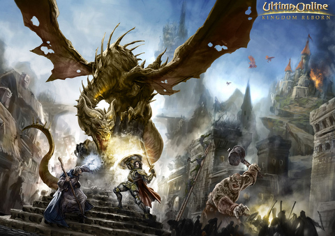

Back to: [West Karana](/posts/westkarana.md) > [2010](/posts/2010/westkarana.md) > [May](./westkarana.md)
# Ultima Online: A Classic Experience

*Posted by Tipa on 2010-05-20 21:39:04*

Flying dragons dive-bombing armies while squads of orcs rush in from the flanks! Death hems in on all sides as you struggle to give better than you get in a desperate bid for survival! Aid the forces of light against the numberless minions of the dark!

That's what Ultima Online shows in the picture above, and if you ask an old UO player, they'll have stories of exactly that. More, even!

What you get is more like....

You run around and kill everything you see, not for experience -- there isn't any in Ultima Online -- but to gain enough skill in swords and healing to survive against the tougher skeletons, zombies and two-headed ettins that populate the newbie isle.

Getting lost is not a problem in UO; exploration is very much encouraged, and the residents of the island seem, to a person, to be confused as to where they are and how to get to where they need to go. There were a lot of escort quests.

Ultima Online is a game that demands you use your imagination. By giving you so little detail visually, your brain starts to fill in all the missing pieces, like an Impressionist painting with pixels instead of dots of paint.

I'd met up with [Bio Break](http://biobreak.wordpress.com/)'s Syp to explore a little of Ultima Online. Though we'd both been through the tutorial, we had no idea how to send tells to each other (you can't) or figure out exactly what we were meant to DO.

It's a sandbox game; you make your own goals. Our goal of leaving the newbie island was a little more involved than we'd hoped. When Syp asked what we should be doing, I thought back to that Kingdom Reborn shot and said, simply, we need to kill a dragon. We walked up three tiles and -- THERE WAS A DRAGON!

A lot of games make you wait months to get to the stuff they show on the box, but we reached the "kill dragon" stage in minutes.

Until the guy who owned it started objecting to our attempts to scratch its rosy hide.

Ultima Online makes little effort to convince a player of modern MMOs to take a trip back in time to when there were so few MMOs that players didn't mind steep learning curves as long as they could play in a living world -- this UO shares with EverQuest, Dark Age of Camelot and Anarchy Online. All these games will welcome you with open arms... after you've proven yourself worthy.

## Comments!

**[Borgio](http://borgio.wordpress.com)** writes: Hope you enjoy your time in Sosaria, I played UO way back on first release all the way till DAoC was released and its still the most fun ive had with an MMO.

Take your time and just enjoy the world, thats what it is there for. Dont be fooled by others telling you that you must come up with a template, just play as you go, if you want to herd those sheep, go ahead, beg for gold (using the begging skill!) fight with a sword, fight with spells, its your world!

(Man i really want to resub UO now!)

---

**Longasc** writes: You need to tame a Nightmare Steed and a Dragon as personal companions. You should also take a travel to the lands of Ilshenar. :)

This said, I really loved UO, but neither the old nor the modernized client could make me return.

But take your time to look at the housing and crafting - and maybe the old client as well: http://www.ods-vw.com/gemaeldegalerie/vielfeind.html -> some players still prefer this look to the later pseudo-3D clients. As you can see I spent my youth with epic battles versus orcs and ratmen. ;)

---

**[Jomu](http://www.justonemoreunlock.blogspot.com)** writes: I absolutely loved UO.. probably my first mmo; if i had some friends to play with, I'd go back in a heartbeat :)

---

**[The Game Archaeologist and the Ultima Prize: My journey | atomicgate.com](http://www.atomicgate.com/video-games/massive-multiplayer/the-game-archaeologist-and-the-ultima-prize-my-journey)** writes: [...] I was not alone in this journey, as Tipa from West Karana graciously agreed to accompany me for an evening full of Ultimas and Onlines. Oh, the spellchecker [...]

---

