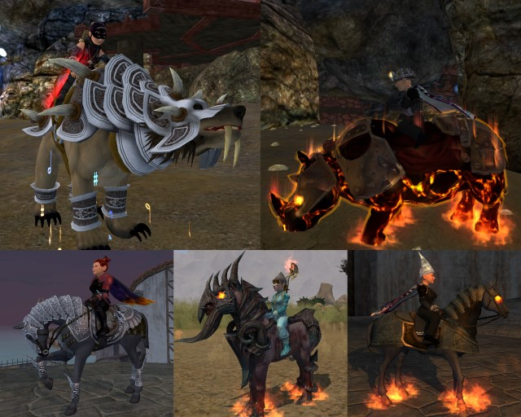

Back to: [West Karana](/posts/westkarana.md) > [2010](/posts/2010/westkarana.md) > [May](./westkarana.md)
# EQ2: My Mounts, a rant

*Posted by Tipa on 2010-05-21 06:45:52*

It doesn't bug me that SOE is selling mounts. Why not? It's widely reported that the MMO developers feel constrained by the industry standard $14.95/month subscription fee, and are always looking out for new ways to let players send them more money, above and beyond their sub.

Blizzard's sparkle pony and SOE's cash cat provide the opportunity to further support your game of choice. There's nothing wrong with that.

What really bothers me is the "me too"-ism. The original EverQuest was known for innovation. Raiding, monster missions, mercenaries, tribute, configurable UI, hardware graphics acceleration; some elements may be found in other games, but EQ was the total package. When EQ did something, other games would follow. World of Warcraft took the EQ model and leaped ahead, but nobody forgets the game that spawned it.

EverQuest 2 started out charting its own path, with the archetype/class/sub-class progression, raids from level 15 up so you would not have to wait 60 levels for the "good stuff", traps that needed disarming, solo and group-oriented heroic opportunities, player housing, mentoring so that people of any level could play together, a character creator that, at that time, was almost unprecedented in customization (City of Heroes being the obvious winner there -- by a hair).

Now, it really seems like EQ2 is taking its cues from Blizzard's lead. The spell and ability names, once unique and very much looking back toward its D&D roots, are now just generic and numbered. Fireball I, IV, IX.... Transportation is being simplified so that one click can bring you anywhere in the world -- there'll be no need to explore a zone any more. Now the copy cat.... I dunno. I imagine that soon EQ2 will implement the WoW quest tracker that points you toward your quests, and then the transformation will be complete.

Fact is, EQ2 players DON'T WANT to play WoW. But the more the distance between the games closes, the more people will just go with WoW because, well, they are the innovators of the day.

## Comments!

**[We Fly Spitfires](http://blog.weflyspitfires.com)** writes: I totally agree with your point about originality and it's obvious that EQ2 is implementing the mount at the $25 price tag because Blizzard managed to get away with it.

Your point about developers being constrainted by the monthly fee is a very interesting one and I can only hope the cash generated by these added value transactions is pumped back into the game and not just into someone's pocket.

---

**[Blue Kae](http://www.bluekae.com)** writes: To make an analogy to the computer industry. SOE is like IBM, the former leader who's now part of the pack. Blizzard is like Microsoft, the current king and either at their peak or slightly past it. The guess is, who's going to be Google and/or Apple, the next contenders to take the industry lead. Bioware might do it, but their handling of Dragon Age doesn't give me confidence.

---

**Yane** writes: I imagine that soon EQ2 will implement the WoW quest tracker that points you toward your quests, and then the transformation will be complete

Doesn't EQ2 already have a light beam that leads you to things?

---

**[Tipa](https://chasingdings.com)** writes: I hadn't heard they added that to the Quest Tracker, though. If they did, then I'm sad for them. 

---

**[Rob](http://www.lostaneighth.com)** writes: I don't think I have heard anyone complain yet about how these mounts, unlike the WoW pony, grant a stat boost. Now, I haven't played EQ2 in a while so I haven't been keeping up with whats for sale in the Station Cash Shop, but is this not the first time that an item actually makes your character stronger? I mean, right now, if I pay $25, all other things being equal, my guy would be stronger than your guy. This aspect of the copy cat is what bugs me because it crosses the "cosmetic only" line pretty hard core. As I say in my blog post on the matter, where does this end? Do you really think that if this is is successful that SoE wont eventually offer a service to buy your mythical for $200, if such a thing would make them money?

It's funny because I am generally fine with micro-transactions. I love the SoE appearance armor and house items. That is a great way for them to make money off fans of the game, but the key always was that these items are purely aesthetic and 100% optional to the player. People have a tendency to min-max in MMO games. Will we see people trying to form groups and saying "If you don't have your copy cat, don't bother sending me a tell".

I dunno, maybe I am missing something here, but the stat boost goes too far for me.

---

**[Tipa](https://chasingdings.com)** writes: Most mounts in EQ2 grant combat bonuses. If SOE didn't add them to the copy cat, nobody would buy it. The cat doesn't make a character more powerful than someone on a regular mount, first. Second, EQ2 dungeons disable the mount, so in the case of instances, no mount will give you an advantage. 

---

**[Rob](http://www.lostaneighth.com)** writes: That is a good point, and my lack of knowledge about EQ2 mounts and the fact that they all give bonuses made it easy to fall into thinking that this was something to be worried about I suppose. :) Thanks for a little perspective Tipa! Now to go amend my wreck of a blog post over this. :)

---

**[Lost an eighth &raquo; SoE unleashes the Copy Cat™](http://www.lostaneighth.com/?p=227)** writes: [...] LIED …: In the comments section of Tipa’s post on the matter, She makes a really good point:  Most mounts in EQ2 have stat bonuses and without them no one [...]

---

**charn** writes: Tipa said:
Second, EQ2 dungeons disable the mount, so in the case of instances, no mount will give you an advantage.

Actually, even though EQ2 dungeons "disable" the mounts . . . they only disable "part" of the mount. You don't get neither the mount graphic NOR the runspeed, but you DO get the stat increases; which is one reason why they added the feature that your mount stays persistent after death, because, although you couldn't cast your mount while INSIDE many EQ2 dungeons (though there are some (VP for instance (pun intended)) that you can), you could cast the mount BEFORE going into the dungeon, and you would still get the stat bonuses. You just had to leave the dungeon to recast it if you died. So to avoid people having to zone out, recast, zone in, they made the horse effect persistent (but disabled the graphic and runspeed). 

Of course, this isn't any reason NOT to have the "cash cat" since there are already many mounts that can be gained, both in-game with plat and out of game using real cash to buy LoN cards. 

Speaking of which, I would TOTALLY pay $25 dollars if they made a "cow" mount I could buy with spots in the shape of dollar $ signs on the side of it. The irony of the "cash cow" would be very poetic . . . ( - ;

---

**[The Multiverse – Episode #18: “You are my cold sore (featuring Syp)” - The Multiverse &#8211; an MMO Podcast](http://vagary.tv/multiverse/archives/217)** writes: [...] Just for fun: Tipa has a flaming Rhinocerrous [...]

---

**[Game by Night &#187; The Multiverse – Episode #18: “You are my Cold Sore (featuring Syp)”](http://www.gamebynight.com/?p=1621)** writes: [...] Just for fun: Tipa has a flaming Rhinocerrous [...]

---

