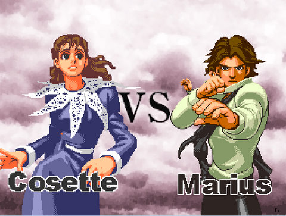

Back to: [West Karana](/posts/westkarana.md) > [2010](/posts/2010/westkarana.md) > [May](./westkarana.md)
# Les Miserables -- the video game

*Posted by Tipa on 2010-05-28 22:00:09*

A couple of weeks ago, Glee featured Lea Michele and Idina Menzel doing a duet with Fantine's haunting anthem from Les Miserables, "I Dreamed a Dream". That brought me back twenty years to when I couldn't get enough of the musical; I ended up seeing it twice while it was in San Francisco, and then once a couple years later when a touring company visited San Jose. I'd memorized all the songs. I'd even read the book.

I bought the soundtrack on Amazon MP3 and downloaded it on my iPad and listened to the whole thing, and at the end, I was just angry at Marius for treating Eponine like dirt. And Javert for hounding Jean Valjean for no good reason. And Cosette for being such a tool.

If only... if only there were a video game -- a FIGHTING video game -- where the characters of Les Miserables could meet on the battlefield to settle their differences the only way that makes sense. With rifles, barricades, and explosive meteor attacks.

The game is called "[Arm Joe](http://takase.syuriken.jp/ArmJoe.htm)", which is a sound-alike to *Les Miserables*' translation to Japanese, "Aa, Mujou" -- (Oh, the misery). Not to be confused with "[Aa, Mujou Setsuna](http://www.viddler.com/explore/Joystiq/videos/1820/)" (oh, a moment of misery), though perhaps Robojean (a robotic double of Jean Valjean) took off in an intergalactic fighting ship after he beat the crud out of 19th century France.

The instructions are in Japanese, and I've long since forgotten nearly all the kanji I once knew, but I figured out how to get into "Story" mode, where you follow the plot of Les Mis as one of the characters from the musical. Who can forget how Mssr Thenardier jetted around the stage with his awesome fart power? Or the gripping scene where Jean Valjean was chased down by a rabbit with a terrifying puppet? All those can be yours.

It's the "Les Mis" Street Fighter-clone the world was waiting for.

Here's a video someone made of Marius going through Story Mode on the banks of the river Seine.

Want more? Here's a little gallery I made of screenshots taken during gameplay.

[gallery link="file"]

## Comments!

**[Tesh](http://tishtoshtesh.wordpress.com)** writes: The Japanese people are so... inventively bizarre that I just have to smile. I think I'll send this one to a friend of mine who loves Les Mis...

---

**[Adventurer Historian](http://warpcorebreach.wordpress.com/)** writes: *If only… if only there were a video game — a FIGHTING video game — where the characters of Les Miserables could meet on the battlefield to settle their differences the only way that makes sense. With rifles, barricades, and explosive meteor attacks.*

YES

This was crazy absurd. Thank you.

---

