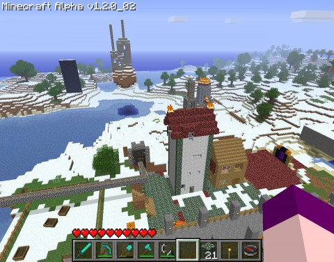

Back to: [West Karana](/posts/westkarana.md) > [2010](/posts/2010/westkarana.md) > [November](./westkarana.md)
# Is your teenager a Minecraft addict?

*Posted by Tipa on 2010-11-03 23:08:34*

Hey, if your teenage is a Minecraft addict, we have something in common. I thought, for awhile, that I was free of Minecraft. I'd gotten bored with digging holes in the ground. Exploration was fun, but there wasn't anything to FIND -- the world would go on forever in every direction, and all the same. If everything is the same, well, might as well just stay at home.

[The Halloween update](http://www.minecraft.net/boo/) brought some change to the world. Biomes -- areas of desert or freezing climate -- at least made the landscape look different as you explored.

I set out straight west until I came to a new desert area and decided this desolate place was going to be my new mining, um, digs. Just because it would be more fun to sail for ten minutes trying not to get lost in order to dig up a new load of sand. Plus, I soon found, the island sported a dungeon with a monster generator in the open-air cave. Dungeons are a fantastic source of moss-covered cobblestone.

I'd read that, with the update, you could travel quickly in the overworld by skipping through a hell dimension called The Nether, where you would travel at 16 times your normal speed. All you needed was some obsidian and a flint-and-steel. I got some lava mixing with water on the mining island to make obsidian and soon carved myself enough for a portal. Headed back to Tipaville (pictured above), made a portal, and found myself in a small pocket of Hellstone. Hellstone is neat stuff; it will burn forever without spreading.

Since another item in the Halloween update was that torches would now eventually burn out, an ever-burning source of light is a GOOD thing. Also, there is the uncommon Lightstone as well, rumored to yield a dust used in ever-burning lanterns. Nine dust combine into one lightstone -- you need to break nine lightstone to make a lightstone you can place in the overworld. Since a 1x1x1 cube in the Nether = a 16x16x16 cube in the overworld, it takes the equivalent of 3^2 * 2^4^3 overworld material to make one placeable lightstone.

Anyway, I dug myself out of the pocket of Hellstone by following the screams of the pigmen until I emerged in a giant, lava-filled cavern. I was immediately set upon by fireball-spitting ghasts, who exploded the tunnel I'd dug and killed me.

I respawned in the overworld and took a boat to the mining island, made some more obsidian and formed a second portal to the Nether. It was placed on a small ledge far above a different cavern. I carved myself a path down the cliff face to the ground, where ghasts found and killed me.

Frustrated, I quit to the main menu and turned monsters off. After several hours, I managed to find the first Nether portal and chart a path between them. I also had enough Hellstone to build any number of buildings. I used its flammable properties to set several of my buildings on fire, to make my roller coaster more exciting (OH NO WE'RE HEADED INTO FIRE! Oh, we turned JUST IN TIME!), to make a tunnel of fire in which to ensnare livestock and monsters, as a much cooler fireplace for my apartment in the Big 'H', decoration around my Nether portal... really, once you start using material from Hell, you don't want to stop. Too bad it blows up so easy.

So, that was Sunday. And Monday. Tuesday, I decided to stay out of Hell for a night and start a new project -- a "house a day" project to build out my overworld and make it look cooler. I've spent so much time mining and making cool things to see underground, but you can't get a good look at stuff underground. I figured I'd spend an hour gathering up one or two resources, then make a house each day from what I found. Yesterday was a wooden house (until I ran out of wood; then I did the rest with Hellstone). Today was a sheepskin and moss stone triple story house. Tomorrow will be a stone dome outside the Nether portal.

Minecraft is a cool game, but its limitations are showing. The multiplayer servers lag behind the single player game, and there's no way that I know of to do what I'd REALLY like -- connect my single player world to those of my friends.

Also, sandbox is nice and all, but it's going to have to become a game at some point. Otherwise, doing things like expiring torches and stuff is just cruel unless there is a balance reason for the change. Especially since Notch is ALSO making deeper regions more dangerous unless very brightly lit. It's hard, from this vantage, to understand how this is going to make my Minecraft time more fun for me.

Anyway, here's a couple videos: A trip through the Nether, and an older video of a mine cart run. I've changed the course somewhat since, but I don't want to litter Youtube with nearly identical videos :P

## Comments!

**[kaozz](http://www.ectmmo.com/)** writes: Loved the videos. Those pig men really made me laugh. Looks like so much fun, oh the time I could waste if I played!

---

**[Tesh](http://tishtoshtesh.wordpress.com)** writes: I've been spoiled by eternal torches. I'm not looking forward to losing that.

Great roller coaster, by the way. I haven't tried one of those yet... there's no physics, then?

---

**Cj Didge** writes: wow and i thought my mine excavations were to much and over done but you win :)

---

**[MMORPG Info &raquo; Minecraft: Day 2](http://www.mmorpg-info.org/guides/minecraft/minecraft-day-2/)** writes: [...] Is your teenager a Minecraft addict? – West Karana [...]

---

