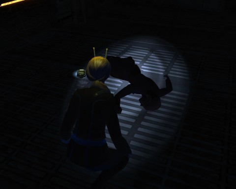

Back to: [West Karana](/posts/westkarana.md) > [2010](/posts/2010/westkarana.md) > [November](./westkarana.md)
# Star Trek Online: What Lies Beneath

*Posted by Tipa on 2010-11-05 07:04:10*

There were Bad Things prowling the depths of Drozana Station's maintenance decks in Star Trek Online's Halloween-themed episode, "What Lies Beneath".

Well, what DOES lie beneath? The Ferengi who run the station have no clue at all. THEY aren't stupid enough to head down to the lower depths. They can always find some suckers to do it for them if they just wait long enough -- suckers like the hapless crew of the USS Monterey.

Starfleet, when we asked to be sent off on a mission of exploration, we had in mind some newly discovered nebula or a spatial anomaly. I really don't think traipsing through the cellar of an old station is really an appropriate job for one of Starfleet's most elite crews now, is it? Though we did find some wicked old vinyls behind a maintenance duct.

Last week, an undercover operative working both for Starfleet AND the Klingon Empire gave us codes to enter the lower bits of Drozana station, and both Starfleet's Franklin Drake and the Klingon Empire's K'men were able to obtain a weapon of surpassing power against the wraith-like Devidians haunting the station and sucking the life clean out of their humanoid prey.

We didn't expect much trouble. How dangerous could some insubstantial ghosts really be?

The darkened corridors below were brightened only by the single flashlight we found in a box just before the first bulkhead. Our sensors were mostly useless; tricorder scans showed only the closest results, everything else being masked by the pervasive triolic radiation. The Devidians were certainly in evidence, but there were also signs of another danger...

As we descended toward the computer core level, repairing systems as we proceeded, we found the freshly dead bodies of Starfleet officers... dressed in uniforms from the 23rd century. How... we didn't know.

Delving deeper, we discovered at least one danger in an old hologram that had been given a mobile emitter and told to keep the station innards in good repair. It was thoroughly mad and definitely murderous. We managed to disable it and read the locking codes for the computer core from its program. With no little trepidation, we entered the core itself.

We'd come right to the nest of the Devidians. There incursion into our phase was powered by the station itself, holding open a portal, but to where?

Two powerful Phantasms barred the way to the core, as an untold number of lesser creatures kept us pinned down. We were able to turn some of the station services against the Devidians, weakening them enough so that the weapon Drake had given us could have its devastating effect. The weapon sent a beam through the Devidians that jumped from one to the other, holding them still and draining them to nothing.

With the last of the Devidian defenders gone, for now, we scanned the rapidly-shrinking portal, and found that it was a tear in time, leading back to the 23rd century. If we were to fix the Devidian problem permanently, we would have to head back through that portal ourselves, back into the past.

Drake concurred. He gave us some triolic pattern enhancers that will help bring Devidian-phased objects fully into our world, and told us to prepare ourselves. We would find out what lurked on the other side of that portal, and we will neutralize it.

---

A very spooky episode that brought to mind such games as Doom 3, Alan Wake and even the original Half Life now and then. Solo or with a group, it was good fun, but I think I preferred the solo experience -- spookier!

## Comments!

**[STO Halloween Episode | Blue Kae](http://bluekae.com/2010/11/11/sto-halloween-episode/)** writes: [...] I’m late to the party, I’ll leave the play by play to Tipa and Gamer Chick (warning spoilers on those links). If you play STO and you haven’t tried out [...]

---

