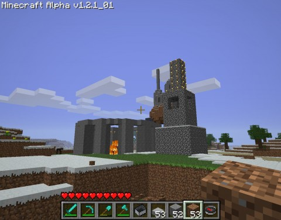

Back to: [West Karana](/posts/westkarana.md) > [2010](/posts/2010/westkarana.md) > [November](./westkarana.md)
# Minecraft: House of the Day #4 -- Druid Ring

*Posted by Tipa on 2010-11-05 21:43:40*

Well, I know it's not really "house" of the day. The first two were -- a house of wood the first day, and a house made of cloth the second day. The third day, I built an arch out of dirt. And today -- a druid ring, built of rock and trigonometry. I seriously had to calculate sines and cosines to make the thing circular.

The point is to improve the looks of my overworld. When I look out the window of my apartment in the "H", I want to see things worth looking at. I'm done with making things deep in the ground. For now, anyway.

Here's the ring during the day:

