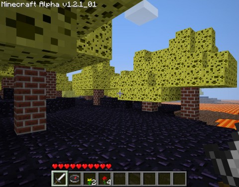

Back to: [West Karana](/posts/westkarana.md) > [2010](/posts/2010/westkarana.md) > [November](./westkarana.md)
# Learning to mod: Minecraft!

*Posted by Tipa on 2010-11-07 15:51:44*

I've been teaching myself the basics of modding Minecraft. So I've been toying with with Minecraft file format, and as a first test of my Python libraries, I turned all the dirt to obsidian, all the water to lava, all the trees to brick and their leaves to sponge.

Just... because I can.

Now everyone can see what the world looks like to me when I close my eyes....

## Comments!

**Noffin** writes: But where is the cliff? I know there is one especially when you have your eyes closed :p

---

**[Bronte](http://arewenewatthis.wordpress.com)** writes: Your world is a scary, scary place my friend.

---

