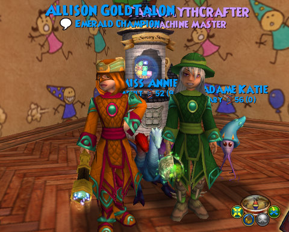

Back to: [West Karana](/posts/westkarana.md) > [2010](/posts/2010/westkarana.md) > [November](./westkarana.md)
# Wizard101: Halfway through Celestia!

*Posted by Tipa on 2010-11-12 08:01:02*

We've been through the Stellarium, the Lunarium, the Floating Island, the Celestia Base Camp, the Grotto and half a dozen other mini-worlds in Celestia. Quests have been shoveling experience points at us, and we're level 56 and starting to get some gear upgrades -- most recently, school-specific wands that add an incredible boost to the new stat, Crit.

Is Celestia everything I thought it would be? I'd have to say yes -- a qualified yes. And I say qualified, because I'm not really sure what expect from expansions.

I'm always measuring each expansion by Marleybone, my favorite world on the Spiral. I loved the silly puns and the steampunk ethos, the fantastically done Katzenstein's Lab and the marathon fight up Big Ben. I had both Professor Meowiarty and the mostly unseen Malistaire pulling me through the world, always just one step away. This was the theme of the worlds up through Dragonspyre -- always getting close to Malistaire, but being thwarted by his lackeys on each world. Krokotopia had Krokopatra, Marleybone had Meowiarty, Mooshu had the Oni, Dragonspyre had Malistaire himself, Grizzleheim had the Ravens.

There is, I think, a big baddy in Celestia (Queen Umbra?), but I haven't found any sign of such a villain yet -- I've taken care of dozens of minor evils, learned about the devastation that pulled Celestia below the waves, but that story hasn't yet coalesced into something I can fight. It's sad that misuse of power sunk the world, but that's not something I'm going to be able to fix.

The first few levels were a bit of a grind. I'm not sure I can kill another shark, even if it started gnawing on my feet. That sped up to such an extent that I made level 55 and 56 in the same night, last night. In two levels, I go for the level 58 spells and can start farming the legendary armor set, so in that respect, if progress keeps up at this pace, I could be looking at the end of Celestia sometime next week.

I'll still have lots of quests to finish. I also have my Myth wizard to level up after I finish with my Life wizard. Farming gear for three wizards will likely take a few months. I'm not really into crafting or pet breeding.

Celestia is a fun ride; I've been ignoring all other MMOs for the past several days because the game is moving too fast for me to let go. It's definitely a great expansion. My one concern with it is all the lower level wizards I see being boosted through. Celestia's bounty of experience could lead to new wizards skipping Mooshu and Dragonspyre entirely. And that would be wrong.

*Funny story: I was working through an instance in the Lunarium last night, when a mid-forties ice wizard ports in on me. Only has menu-based chat, so conversation is hard. He's helping with the instance so I'm happy to have him along. We come up to one mini boss and are working on it -- I have a feint on the boss, he had an ice trap, and he menus "I've got the boss". I'm not a big fan of people who ask a group to not kill things so that they can build up pips for some big attack when stuff could die faster or as fast without, but whatever.

Then I see he's about to play a minotaur, an out-of-school spell for him. The minotaur's first, weak attack will waste the feint. The second attack will not kill the boss. I drop the Judgment on the boss, doing 3K of damage, killing it. He gets angry and ports out.

If you tell me "I got the boss", PLEASE actually look like that's something you're likely to be able to do!
*
## Comments!

**Noffin** writes: I got the boss ;-) And the shark thing, well I will just let it be a surprise. It does get tiresome with all the low levels porting in on you and trying to get the xp boosts that Celestia gives, only prob is they can only do the side quests and only acquire experience from the instances once or twice so that still leaves the main story line which they can not complete until they finish the original story line through dragonspyre.

---

**[Tipa](https://chasingdings.com)** writes: ***sigh***

---

