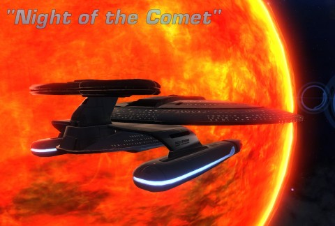
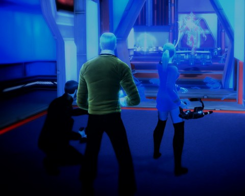

Back to: [West Karana](/posts/westkarana.md) > [2010](/posts/2010/westkarana.md) > [November](./westkarana.md)
# Star Trek Online: S2E5 "Night of the Comet" (spoilers)

*Posted by Tipa on 2010-11-14 01:55:54*

Time is a lot more resilient than people think. Free will? Free will is a joke. There's a reason Starfleet doesn't like people flitting back and forth through time -- it's because when you do, you realize what a sham this "reality" thing is.

And by-the-by? The Federation and the Klingons have a secret slingshot mechanism set up around a star in the Eta Eridani sector. Pretty much everyone is going back and forth through time whenever they like. We're not supposed to tell you about that, but we're the Federation News Service, and YOU have a right to know.

We'll be back after a word from our sponsor.

History doesn't record the first use of time travel. But then, it wouldn't. Niven's Law of Time Travel states that if time travel is invented in a universe, then an infinity of time travelers will eventually cause a change that erases that invention. The fact that time travel DOES exist and IS being used means the inevitable end of every species that uses it -- from the Borg to the Klingons to the Humans and every other race in the galaxy.

Section 31 operative Franklin Drake contacted us while we were in orbit around Sherman's Planet, near Deep Space K7, itself no stranger to the effects of time travel. Drake had been spearheading our assault against the extra-dimensional parasites, the Devidians. He'd been a resourceful asset against the creatures, full of new tricks and devices. We'd used one of the Devidian portals in the depths of Drozana Station to investigate the Devidians from their home in the 23rd century. There we'd found the source of their incursion -- a long-period comet that had passed by Drozana Station in the 23rd century and was passing it again now. Those twin passages could be, and were, breached.

Drake said that, this time, we'd be taking our ships through. Starfleet had recently re-assigned me to the USS Concord, a Nebula-class research ship, and I was eager to see it in action. Training cruises can't ever give you a real feel for your ship. But as nice as the ship was, I'd think a ship from two centuries in the future would get noticed. As always, Drake had a solution: holo-emitters. Our ships would be disguised as Klingon D7 battle cruisers, with the markings appropriate for the day.

We'll come back to those markings.

Drake sent us to a system that appeared on no charts (though how can one possibly hide a star?). Around the star were gravimetric catapults. Drake explained that using these gates around this star would "slingshot" us into the past. All hush-hush, nobody is to know just how malleable reality is in this quadrant. As dangerous as time travel is, though, the Devidians were a worse threat. We had no choice but to take this tunnel back in time.

It was ... indescribable. II can't even say if it was painful or disorienting or all of these or none. It was nothing like taking the Devidian portal or using the Guardian of Forever. But we were circling a reconstructed Drozana Station, and we were being hailed. By Starfleet.

Back to those markings Drake gave us? If you're a student of Human history, you might have read about a monster in their 20th century who killed millions of people. His symbol was a kind of a crooked cross called a 'swastika'. Well, apparently, the markings of the House of Duras that Drake had programmed into our holo-emitters was exactly the same as if the ship was named the IKF Hitler and was painted with swastikas stem to stern.

Starfleet demanded that we give them immediate proof that we had not just committed some petty offense, or be summarily destroyed. Before we could even open hailing frequencies, the ship had opened fire on us. We were forced to disable it.

Sensors showed a high level of triloic radiation on the station -- Devidians. We would have to deal with them before we could take care of the comet. Down we beamed, right into a bar fight between Federation and old-style Klingons.

We were impartial observers. We stunned them one and all, then killed the Devidians, and their swarm leader. The omnipresent blue glow finally faded, but there was still work to be done. A Starfleet engineer named James Montgomery Scott requested our help dealing with residual triolic energy on the station before it reached dangerous levels. That required getting a part. And THAT required getting some "nerve tonic" for a frightened requisitions clerk. And THAT required asking around for the kind of drink people thought she might like. The bartender here was about as much help as a tribble-stuffed replicator. Scotty had some amusing stories about the times he and the clerk went out drinking. By listening to these endless stories, we were able to describe to the bartender how to make a drink the clerk might like. She liked it, we got our part, Scotty was happy, and it was finally time to play some Asteroids.

I believe I have that name right? An ancient Earth game where a ship breaks an asteroid into bits, then breaks those bits to smaller bits? Yes, and that's what we were about. In place of the little alien ship that zips around the screen, though, we had... a fleet of Klingon D7 battle cruisers. REAL ones. Seems the House of Duras magic was still spinning its web of enchantments, summoning danger from across the quadrant.

So we'd tear a piece off the comet, turn and deal with the Klingons. Bite off another chunk, deal with more Klingons. And so on. They kept throwing ships at us, and we kept throwing disguised 25th century technology at them. It was important, said my science officer, to keep the head Klingon alive, as history showed he lived through this battle.

History! That word means nothing to me. Let me tell you why.

Time travel is not an exact science. One mistake, and you're caught in a time loop. We beamed down and cleared the station THREE TIMES. Three times, stuck killing the same Devidians, making the same drink. One time, the Klingon and Federation brawlers in the bar kept fighting EVEN AS WE KILLED THE DEVIDIANS. Neither side took damage, and they may be stuck in that time loop still -- if the word "still" has any meaning at all.

We destroyed the comet twice. I have contacts in the Klingon Empire. They report being forced into the same actions we'd taken.

There is no time, there is no history. There is no point to existence when existence can be snuffed out -- and has been snuffed out, many times. We returned to the present and the comet was gone, as if it had never been. All the people killed by the Devidians were once again alive. An insane hologram in Drozana station was sane again. Those Cardassian ships once again had living crews, and they had undoubtedly killed some people who had not died before.

We're all just a pack of cards.

I picked up this old-style phaser from one of the combatants in the bar. It works fine, works like new, actually. Worthless as a historical relic because it clearly isn't two hundred years old. 

Assuming some seismic shift in reality or some Klingon joyride into the past doesn't erase me from existence, this has been Tipa D'zoph reporting from the bridge of the USS Concord for the Federation News Service. The Devidian threat has passed. The threat from the KDF and Starfleet, however, remains dire.

## Comments!

**Longasc** writes: It should be mentioned that the "groundhog day" effect was due to a bug that plagues the weekly missions since they started. If someone joins in later, there is a high chance that he can't complete the mission and sometimes it screws up the mission for all. Then you have to drop, rezone (important), take again and ... even then we suddenly had some weird bugs.

I heard the guys from the STOked podcast got shot to pieces by the Klingon D7 cruisers in their science vessels. I find that quite entertaining! Seems they had to fight rather than think about their report while doing the mission.

That the phaser rifle is particularly powerful and that one gets this rifle, a "Seth" gun device inspired by Stargate and either a disruptor or oldstyle phaser should also be noted.

Anyways, here is my usual screenshot album of this episode: http://picasaweb.google.com/Longascimages/StarTrekOnlineFE02E05NightOfTheComet#

In a German science-fiction series (Perry Rhodan) there was once an entire species called the "Time Police", genetically engineered beings by a species that feared to get killed in retribution by their own creators through time travel.
So basically, if you do a time travel and the Time Police notices, you are in big trouble, as they always apply the same solution, wipe out the entire species of the offender.

Something like J.J. Abrams Star Trek X would have caused them to attack for sure!

---

**[Werit](http://www.weritsblog.com)** writes: I just finished up the mission. The ending was a bit confusing. The head guy in the Klingon ship died, my guys said we'd have to try again... we went back to the future and the mission was over. No more mention of the guy who died.

---

**[Tipa](https://chasingdings.com)** writes: Clearly you changed history!

---

