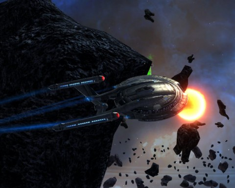
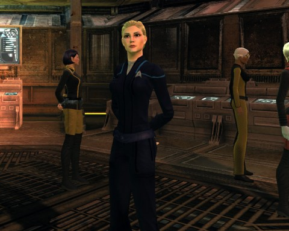

Back to: [West Karana](/posts/westkarana.md) > [2010](/posts/2010/westkarana.md) > [November](./westkarana.md)
# Star Trek Online: The Enterprise Pack (and Genesis)

*Posted by Tipa on 2010-11-18 07:27:41*

Yesterday, Cryptic dropped the Enterprise Pack onto the Cryptic Store. For 1250 points, you can get a replica of the NX-01, the Akira-class predecessor flown by Captain Archer and crew in Star Trek: Enterprise, a show which doesn't fully deserve its bad reputation. That also comes with the Enterprise uniforms, Mirror Universe versions of same, and the cat suit the Vulcan first officer T'pol wore. All these things are also available separately, naturally.

The NX-01 replica is a Lieutenant rank ship -- it replaces your very first Miranda, making it the second premium ship available for new Federation players (the first being the Enterprise as seen in the original series). The ship is fit identically to the Miranda. I bought the NX-01 and went on some missions with my Vulcan tactical officer, and every group I joined was NX-01s and old school Enterprises.

Cryptic will unleash Season 3 onto the live servers in the coming months, but the most exciting feature is one that will be living on the test servers for awhile -- the Foundry, Star Trek Online's player generated content creation tool. Using the Foundry, players will be able to make their own missions and episodes. The designers have said that they have used the Foundry internally to make some of the new daily missions for the recent feature episodes. I'm hoping that players will be able to expand on the diplomatic and exploration missions available. Being dropped into a random battle is fun in its way, but that sort of random game play is already well represented in the live game's "exploration" missions.

Klingons are getting some new missions (yay!) and access to a previously Federation-only sector, Pi Canis. I guess the war is going poorly for the Federation. Episode replay lets you run missions you have previously completed (finally!) and lots more, [full details here](http://www.startrekonline.com/season_three).

What I REALLY want? MORE FEATURE EPISODES. I'm missing them already!
