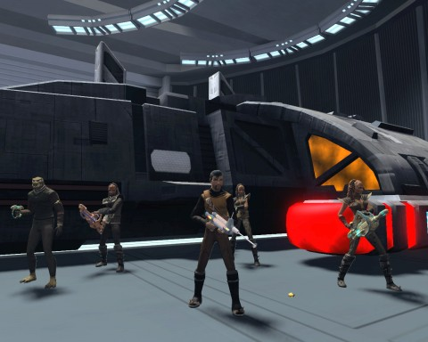
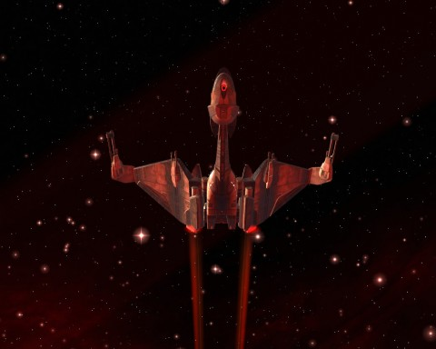

Back to: [West Karana](/posts/westkarana.md) > [2010](/posts/2010/westkarana.md) > [November](./westkarana.md)
# Star Trek Online: Red Mars

*Posted by Tipa on 2010-11-19 08:01:58*

I didn't even know Mars was even in the game. It's kind of ironic that the first time I saw that dead world was from the bridge of a Klingon K'tanco cruiser.

In Star Trek Online, the Klingons are meant to be leveled via PvP. There are dozens of PvP-oriented missions and commensurate rewards. I find PvP to be dull. I play occasionally, but never enough to level quickly. Instead, I've been leveling through the new Feature Episodes and working the new dailies. Those brought me very close to promotion to Commander.

The KDF brass on Qo'noS sent me to Alhena in the Eta Eridani sector block to repel a Federation strike force intent on taking one of our stations. When we warped in, we saw the USS DeWitt and a squadron of lesser ships taking Klingon lives. The K'tanco is not the most powerful ship in the Klingon Defense Force, but out superior tactics and courage left the Federation ships broken shards of debris, and the DeWitt dead in space. We beamed in and fought our way to the bridge, where the spineless human captain was more than eager to give us the defense passcodes to the human solar system in exchange for his life.

I laughed in his face, returned to my ship, and sent the DeWitt and its crew to wherever it is honorless humans go when they die cravenly.

The warrior's heart is a blazing beacon of red, and with it, I mustered a squadron of Orion raiders to my side. General J'mpok suggested such a fearless force should take those defense passcodes to Mars and bloody the noses of the pinkskins.

That we did. We warped in, easily passing through the Sol system's outer defense grid. The Mars shipyards were unprepared for our assault. While the raiders kept the shuttles and frigates of the construction yard occupied, the Vor'tuk disabled the communications array so they could not call for help, and then destroyed the cruisers under construction.

Mars is named after the human god of war. It is a Klingon world!

J'mpek was pleased with our success. We were true warriors, the pride of Qo'noS, heirs to Kahless himself. We should celebrate with barrels of blood wine, and the Klingon prisoners held in Starfleet Penal Facility #47. To live in confinement is no life at all for a warrior. We would need stealth and guile and a Federation runabout to get to the facility. A poorly defended Federation starbase was nearby -- perhaps they would have such a ship?

Starbase 157 was defended only by half a dozen patrols of merely 2-4 ships each. They were no match for a single K'tanco battle cruiser. We punched a hole in their defenses, beamed in, wiped the station clean of Federation and had our pick of the finest of Starfleet runabouts. We picked one and renamed it the IKS Mars.

At Penal Facility #47, the hapless Federation ships flew without suspicion on their patrols as the IKS Mars disabled the security beacons around the station. One or two Feds, sharper than their comrades, did treat us with some suspicion. We treated them with some suspicion in return, and went on our way.

Beacons disabled, we beamed down to the station, cleared it of all Federation life, freed our fellow warriors and fought our way to the shuttle bay. The prisoners commandeered a shuttle of their own, and in glorious victory, we escaped into the black and green of combat as the battleship sent to meet us was greeted by weaponfire from the Federation -- weapons which will fire no more.

In recognition of my success in battle, I was made a Commander, and given command of a Norgh-class Bird of Prey.

Glory to the Empire!

---

Klingons don't get nearly enough PvE missions, but what few they DO get are generally well-constructed and a lot of fun. "Second Star to the Right" and "Keep Your Enemies Closer" were fantastically written. Bringing Klingons to Mars was just exactly the right thing to do -- just what you'd expect the Klingons to do in a war. Remind the Federation that they are in a war. A war they may well lose.

## Comments!

**Longasc** writes: The Klingon missions added with Season 2 already are indeed better than many Federation missions. But as you said, they only happen around the time of your promotion to the next rank, there are not many.

But as Commander you can look forward to a bright future, you still have a lot of these special misisons to explore, you will like them for sure. :)

---

**[Blue Kae](http://bluekae.com)** writes: I've not made a Klingon alt yet, but between missions like this one and the changes coming in Season 3, I think I'll need to roll one soon.

---

**[Jomu](http://www.justonemoreunlock.blogspot.com)** writes: very cool; love the birds of prey :D

---

**[Yeebo](http://yfernbottom.blogspot.com/)** writes: Holy cow that sounded like fun.Nice writeup.

---

**[MMOGamerChick](http://mmogamerchick.wordpress.com)** writes: I'm with Kae on this one, looks like I'll be dusting off my low level Klingon alt very soon.

---

