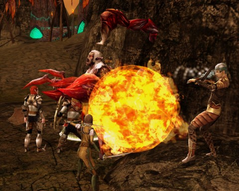

Back to: [West Karana](/posts/westkarana.md) > [2010](/posts/2010/westkarana.md) > [November](./westkarana.md)
# DDO: Searing(ly expensive) Heights

*Posted by Tipa on 2010-11-22 10:00:33*

Team Spode left Three Barrel Cove behind, complete except for one level 7 dungeon we may return to once more of us are level 7. But we'd fought pirate monsters long enough. It was time to strike the barnacles from the scurvy mains'l, star the board and drink the port, drive the wharf rats out from under the saxboard, swab the bo's'n and harpoon the gunwales, weigh the anchor and turn two sheets to the wind, and in all other ways, leave the pirate life behind us for awhile.

We were off to Searing Heights! Searing Heights, the high country, the land of volcanoes and drow, ancient terrors and ... PIRATES?

We walked in and within minutes were battling first mates and so on. We gave them the spodey death they apparently craved. Following us here from Three Barrel Cove! Who could believe it?

I was in tow only to meet up with my fellow surface drow. We all have our own reasons to leave the dark tunnels of our spidery lairs. Someday, I may tell you mine. These drow, the Sulatar, had chosen a drastic form of volcano worship that was really quite exciting. Harness the power of the Earth itself toward destruction? It's hard not to wonder how they were getting on with that.

I greeted them in our secret tongue. They killed me without a thought. Maybe it was the company I keep -- a human, a gnome and an elf? I hovered spectrally around the group as we searched for a shrine; I eventually released and ran back (from Three Barrel Cove...), by which time Team Spode had fought their way through the Sulatar encampment to the Bargain of Blood, our dungeon for the evening.

Or not. It was paid content, part of the [Sentinels of Stormreach](http://ddowiki.com/page/Sentinels) adventure pack. The end result of those quests is a bit of named gear, but those adventures are generally slightly beyond our level. I think Ulan has access, but couldn't give the rest of us guest passes, so there was no dungeon crawling for us this night.

We spent the rest of the evening working on slayer and exploration achievements. It's a beautiful zone, Searing Heights, and I'm sure the dungeon would have been just as amazing.

Next week, we return to the last module I ran with the Massively crew, [Delera's Tomb](http://ddowiki.com/page/Delera's_Tomb). This is paid content, and I'll be picking up the tab for the guest passes for those who do not choose to purchase it (yay me). I remember it being a heck of a lot of fun, and the end reward is a trinket, [Voice of the Master](http://ddowiki.com/page/Voice_of_the_Master), a 20-sided die that confers extra experience. Voice of the Master, indeed -- the Delera's Tomb module is narrated by the original DM himself, Gary Gygax, co-creator of Dungeons & Dragons, to whom this entire module is a tribute.

We'll also soon be welcoming a fifth member to Team Spode, Shylaren (sp?), a cleric and friend to the others from their LotRO days. Kinda makes me wonder what a good sixth class would be. Cleric was an obvious need. Between her, Ulan's Favored Soul and Spode's Paladin, we should have enough healing. Monk? Barbarian? Nah -- ranger is what we need. We are drastically short in the ranged damage department. (Our only real ranged class is the drastically short Gleek, a sorcerer).

Me, I leveled to 7 Rogue last night, still on the path of stealth and disabling. I got sneak attack, which might well be class-defining, and since I hadn't spent enhancement points for awhile, picked up additional +2 saves against all sorts of trap damage. I'll have to tote up my abilities in the various roguely skills to be sure, but I may be approaching the time when I can branch out to bard (for buffs) or ranger (for ranged attacks) and add some more utility to the group.

## Comments!

**[pkudude99](http://nomadicgamer.com)** writes: My group I used to run with did the same thing -- we went to do that dungeon, only to find when we got there that it was paid content, so then we ran all over the Searing Heights doing slayer and explorer stuff. 'Twas a fun night.

If you want ranged dps, get a wizard or another sorceror. (preference to sorceror if you just want nukes). Bow damage sucks in this game. Rangers are considered very powerful, but not for their bow use. It's the attack speed boost they receive as a Tempest while dual-wielding khopeshes (or if an elf they can get away with scimitars). Arcane Archers can do ok, but not until they get their slaying arrow ability are they considered "decent," where the Tempest is considered "awesome" by comparison.

---

**[Brian 'Psychochild' Green](http://psychochild.org/)** writes: The Threnal adventures feature the voice of the other (less PR-seeking) guy who helped start D&D, Dave Arneson. You get a set bonus of True Seeing if you have the Voice of the Master and the Mantle of the Worldshaper from Threnal quest line.

---

**[Tipa](https://chasingdings.com)** writes: Cool! I looked that up, looks like we'll have to level up to it :) We may be tabling Delera's in order to help level the new cleric.... which would give us a little more chance, perhaps, to get enough levels to do this content!

---

