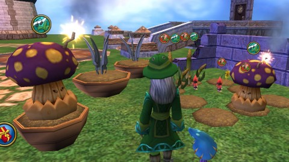

Back to: [West Karana](/posts/westkarana.md) > [2010](/posts/2010/westkarana.md) > [November](./westkarana.md)
# Wizard101: Gardening 102

*Posted by Tipa on 2010-11-24 08:23:43*

Yesterday, I played in Wizard101's test server for a time, hoping to figure out Gardening's strange attraction. That, and to figure just how you got experience in gardening! Well, I wasn't able to make any progress -- I remain one bubble into Rank 1, precisely where I started after talking to Farley, the Golem Court mole who teaches the skill.

Nonetheless, I pulled on my work gloves and got to digging. I bought two medium pots from Farley in which to grow Honeysickles -- the spell to prepare medium-sized plots of land is rank 2, but you can buy a medium pot at any level.

My first Boomshroom was spitting sparks all day. At one point it wanted some music; I cast the Flute Solo spell to calm it down. You will want to train all Farley's spells. They are bought with gold at the moment, not training points.

The slow-growing Dandelions poked their heads from the ground, and the grasping fingers of Desperagus groped blindly in the morning air. The garden was looking like a going concern.

This morning, the Honeysickles had sprouted! Some of the other plants needed care -- almost every plant wanted some music, and the Desperagus and Dandelions needed some bees summoned for pollination. I couldn't immediately tell if it was asking for pest control or pollination, so I cast both.

Everything I did took power from my power pool; nothing I did granted any sort of experience. I could find no option to perform any sort of harvesting on my mature Boomshrooms, but the Inspect spell showed they were still very much at the beginning of their mature phase, so there's time for that to happen.

The question on everyone's mind: Do garden gnomes really help? They do! I started a smaller garden on an alt before I started this larger one. The smaller garden has no gnomes; and even with half a day more growing time, the Boomshroom isn't even mature yet.

For those plants whose info suggests they like garden gnomes, BELIEVE THEM. They REALLY like the little diggers.
## Comments!

**[Sierra Starsong](http://www.modernautomagic.com)** writes: Wizard 101 tends to be pretty consistent with green for good things (like healing) and red for bad (damage), so most likely the red bug icons mean your plants need pest control.

---

**[Tipa](https://chasingdings.com)** writes: In the picture above, I don't think there's any particular good/bad thing -- pollination is red and music is green, but I wouldn't consider pollination a bad thing. The only bad effect is bugs.

---

**[What Are We Waiting For #LotRO #W101 #WoW #EVE &laquo; MmoQuests.com](http://mmoquests.com/2010/11/29/what-are-we-waiting-for-lotro-w101-wow-eve/)** writes: [...] 101 – Gardening. Tipa has been posting her progress on the test server and I have to admit, it looks like fun. While I don’t play wizard 101 nearly as often as I’d like, I’m still a [...]

---

**[william wallace](http://windowinternetexplorer)** writes: 1o1 Gardening has been post on server and i have to admit,it look like fun.and would like trie it.

---

**[william wallace](http://windowinternetexplorer)** writes: In the picture above, I don’t think there’s any particular good/bad thing — pollination is red and music is green, but I wouldn’t consider pollination a bad thing

---

