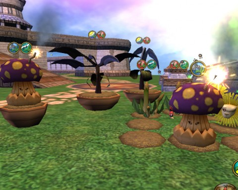

Back to: [West Karana](/posts/westkarana.md) > [2010](/posts/2010/westkarana.md) > [November](./westkarana.md)
# Wizard101: Gardening 103

*Posted by Tipa on 2010-11-25 07:57:29*

It has not been a happy day for the Boomshrooms in my Wizard101 garden on the test server. Rank 2 bugs have moved in, and are buzzing around it, disturbing its rest. The Boomshroom is a difficulty 2 plant, even though it is only rank 1. I guess that means the bugs it gets can't be driven away by the rank 1 spells.

I did get a harvest from it yesterday -- a spider silk and 5xp. It looks as though it takes 100xp to go from Rank 1 to Rank 2, so this harvest was 1/20th of the experience necessary.

The Dandelions and the Honeysickles have matured nicely. and the Desperagus are looking well. I have a separate control garden on an alt; the control garden does not have Tropical Garden Gnomes, while this one does. This garden grows much faster, so, in your own gardens, don't spare the gnomes!

The plants this morning needed rain, pollination and music. After I tended to the garden and cast Bug Bolt a couple times in a futile effort to drive away the insects, I had only five power left. I have nine plants in my garden; I could probably fit a tenth in, but past that, I wouldn't have enough power to tend all the needs of the plants. There'll be no Farmville-sized farms in Wizard101, especially since the Friendly Necromancer confirms that you cannot ask friends to help in your garden.

It's hard to judge the eventual rewards of gardening from the Rank 1 plants new gardeners can buy, but as it stands, 1/20th of a level and a spider silk is not an adequate reward for three days play.

## Comments!

**[M.W.S](http://sorcererofthespiral.blogspot.com/)** writes: It's a great feature! Very nice!

---

**[Vikki](http://uppoppedafox.com)** writes: I can't figure out how to harvest a plant. Is there a trick? Does it give you that option at some point?

---

**[Tipa](https://chasingdings.com)** writes: Yes, it just gives you the option at some point. Not exactly sure when, though I suspect it's when it reaches a new mark in the graph you can see with the "Inspect" spell.

---

**[Vikki](http://uppoppedafox.com)** writes: I was kinda frustrated because I had a mature dandelion and then it was just gone. Not even dead - just gone.

---

**[Tipa](https://chasingdings.com)** writes: That sounds like a bug!

---

**[Tipa](https://chasingdings.com)** writes: And .... the exact same thing just happened to me. I had a seedling Stinkweed and a young Laff-o-Dill just completely vanish on me. I sent in a bug report, of course.

---

**[Vikki](http://uppoppedafox.com)** writes: Yep. Seems like a bug because I have since been able to harvest and, as yet, no more disappearances. This gardening biz is slow...

---

**[What Are We Waiting For #LotRO #W101 #WoW #EVE &laquo; MmoQuests.com](http://mmoquests.com/2010/11/29/what-are-we-waiting-for-lotro-w101-wow-eve/)** writes: [...] 101 – Gardening. Tipa has been posting her progress on the test server and I have to admit, it looks like fun. While I don’t play [...]

---

