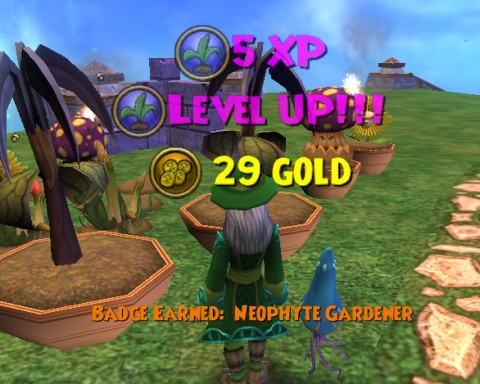
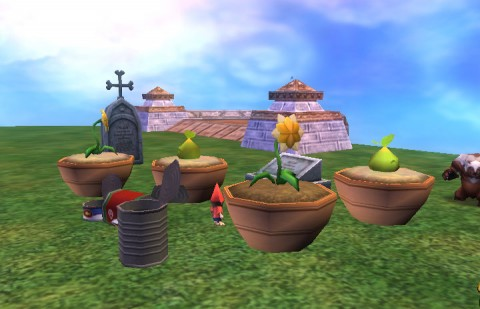

Back to: [West Karana](/posts/westkarana.md) > [2010](/posts/2010/westkarana.md) > [November](./westkarana.md)
# Wizard101: Gardening 104

*Posted by Tipa on 2010-11-26 16:13:38*

It's been a busy day at my Wizard101 garden, on the test server. I was tending my plants and harvesting when, after a 5xp harvest from a Honeysickle, I unexpectedly leveled to rank 2.

That meant I could train up in the advanced bug be-gone spell and get rid of the persistent insect infestation that had sprung up around one of my Dandelions. The gnomes seemed please to be done with all the buzzing; they need quiet for their work. Not that the Boomshrooms let anything get any rest.

If rank 2 took 20xp, what of rank 3? Every harvest since I leveled to rank 2 has been 2xp. The Desperagus has given Siphon Health cards and the Dandelions Cattail resources. My experience bar has hardly moved. I don't know if the days of 5xp harvests are over or not, but it definitely seems like the road from rank 2 to rank 3 will be longer than the one from rank 1 to rank 2.

Since I had a few extra plots, I filled them in with an additional Boomshroom, Desperagus, and a Dandelion. As of this morning, all had sprouted and seemed eager to be pollinated.

Rank 2 allows a gardener to grow Laugh-o-dills and Stinkweed. These two plants hate the Rank 1 plants, and the Rank 1 plants hate the Rank 2 plants. So I made a second garden a little ways off that I call the "evil" garden, just for fun. There I planted two each of the rank 2 plants. As of this morning, the Laugh-o-dills were trying to come up with some good jokes; the Stinkweed hadn't yet sprouted. The gnomes on the job had no comment.

## Comments!

**[What Are We Waiting For #LotRO #W101 #WoW #EVE &laquo; MmoQuests.com](http://mmoquests.com/2010/11/29/what-are-we-waiting-for-lotro-w101-wow-eve/)** writes: [...] 101 – Gardening. Tipa has been posting her progress on the test server and I have to admit, it looks like fun. While I don’t play wizard 101 [...]

---

