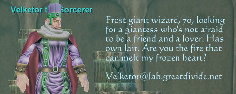
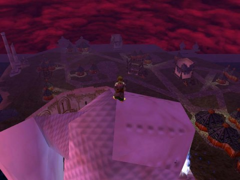

Back to: [West Karana](/posts/westkarana.md) > [2010](/posts/2010/westkarana.md) > [November](./westkarana.md)
# Daily Blogroll 11/29, Nostalgia edition

*Posted by Tipa on 2010-11-29 06:00:27*

Saturday, [I linked](../../../index.php/2010/11/27/daily-blogroll-black-friday-edition/) to a raid force taking down some old Kunark and Velious mobs. That got me into the game to try and see if I could find any of those same bosses - Cazic Thule, Faydedar, Trakanon and Velketor the Sorceror - up. As far as I know, CT and Faydedar, in their original forms, are no longer in the game. Trakanon had been killed just moments before I got to his lair. Velketor was up, though, and I've embedded a video of our meeting at the end.

Hit the break for the latest gossip from around the interwebs!

I'm not the only one feeling a little nostalgic. Sente of A Ding World writes about how the City of Heroes "Going Rogue" expansion has him [playing alts he hasn't played in years](http://adingworld.wordpress.com/2010/11/28/when-old-becomes-new-and-shiny/). It's the new faction changes and costume options that has reinvigorated his gameplay. Give someone a reason to play their abandoned heroes, and back they'll flock.

Is that an argument for MORE microtransactions as the key to a successful MMO? Even Blizzard seems to rely upon them more and more, though you hardly think they need to. Ahead of the Cataclysm launch next week, they are [tempting lapsed players to catch up](http://us.battle.net/en/int?r=bnet), expansion-wise, by offering the base game and the Burning Crusade expansion for $5 each, and Wrath of the Lich King for $10.

Yeah, I upgraded my account to WotLK, even though my 7 days of free time expires tomorrow. The price was so good that even if you DON'T PLAY THE GAME, you buy it. I'm not the only one lured back; Pete of Dragonchasers is considering making "[Back to WoW Again!](http://dragonchasers.com/2010/11/27/back-to-wow-again/)" one of his standard post categories.

Nobody has jumped on the "microtransactions = good" bandwagon quite as hard as Sony Online Entertainment. Want to be known as a SOE "Super Fan"? Then, starting Monday, [prove it](http://massively.joystiq.com/2010/11/27/soes-super-offers-for-super-fans/) by logging into a SOE MMO between Monday and Friday and [spending some money](http://massively.joystiq.com/2010/11/27/soes-super-offers-for-super-fans/)!

If you love something, you should love it enough to pay for a subscription and then, you know, a little more. You said you were a FAN!

Should MMOs be more like single player RPGs? In most modern MMOs, especially those not built around PvP, no player can have any impact on the world in the name of trying to provide every player a consistent, identical experience. Single player RPGs, however, allow the player's every decision to shake the world to its roots. Stargrace's [travels in Sims 3](http://mmoquests.com/2010/11/28/the-illusion-of-life/) have her wondering why MMO worlds can't be just a little more dynamic.

Well, first, in Sims 3 you can buy up every shop and home and rule your world with an iron fist. That probably wouldn't ever be allowed in an MMO. 

I'm really of two minds regarding achievements. I like them, but only when it's special. Walking forward? NOT an achievement. Leveling? NOT an achievement. Climbing to the top of the Firiona Vie statue in the Kunark outpost of the same name? THAT'S an achievement. She says, modestly. 

Indie game developer Cliffski, he of Positech Games and Gratuitous Space Battles, [ponders adding achievements](http://positech.co.uk/cliffsblog/?p=938) to his secret fourth game, now in development, and cleverly named "G4". I like achievements when they let me know there's something I missed -- "Don't let the Executioner behead the King", for instance. OMG, you mean I can STOP him?

Fave MMO blog [Massively is starting their own fleet in EVE Online](http://massively.joystiq.com/2010/11/28/eve-evolved-joining-the-massively-mob/), imaginatively named "Massively Mob". You can tell people won't be joining for its clever name. If I were thinking of a triumphant return to EVE (and I always am), I'd definitely do it with these folks. Director Brendan Drain's EVE articles have been a consistently clear and helpful guide to new and veteran EVE pilots for years.

I guess that's enough for now :) See you tomorrow and keep gaming!

