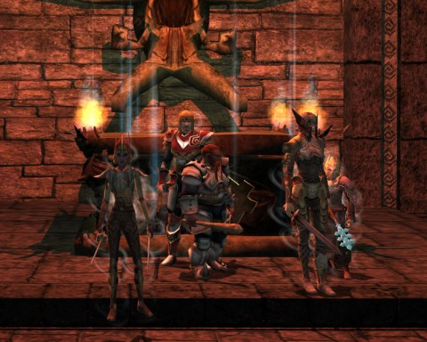

Back to: [West Karana](/posts/westkarana.md) > [2010](/posts/2010/westkarana.md) > [November](./westkarana.md)
# DDO: All the Wight Moves

*Posted by Tipa on 2010-11-29 22:24:27*

It was a night of crime and pun-ishment in Dungeons & Dragons Online last night. The crime was courtesy of the bandit crew we ousted from their little underground hole last night. The pun-ishment, alas, we inflicted upon ourselves.

It's just not Team Spode until Spode logs in, so the Spode-less crew milled about, uncertain and with no purpose in life. Ulan, I think, had found a quick quest we could do for House Jorasco while waiting for the rest of the group. New cleric Shananana(sp?) wasn't online, so, heck, why not? And then Spode logged in and we were good to go. Now, Spode's also been grinding a quest he found in a tavern in the Marketplace, and we'd been talking about doing that one on elite. So we did them both!

I stopped by my guild airship on the way. When asked why, I explained that I needed to get buffed up -- my guild (TEH "GAMERZ" RULE OMG!) has four NPCs who have just one purpose in their life, and that is to cast buffs on anyone who asks. Why wouldn't I want to stop by and get them? That sparked some discussion on, like, maybe we could all join the same guild? Sure, guys, but you slackers all went joining different guilds and never invited me to join. So I went and accepted the first random ninja guild invite that came my way. Don't blame ME if your guild airship is small and puny and smelling of elderberry.

My guild's airship smells of baby burps and kitty purrs.

Our first mission, [Mirra's Sleepless Nights](http://ddo.mmodb.com/quests/mirra's-sleepless-nights-194.php), was a rogue's paradise. "Never fear, I HAVE THIS!" I shouted as I tried ineffectively to disable a cold trap and was frozen to death before I could unlock the one shrine door. So I watched spectrally as everyone else killed the iron golems that were keeping poor Mirra awake. I WILL go back and figure that trap out!

Next up was Spode's quest, from the Phoenix Tavern in the Stormreach Marketplace, the [Swiped Signet](http://ddo.mmodb.com/quests/the-swiped-signet-252.php). He'd mastered the dungeon on hard mode already, opening elite mode for us all.

This place, full of water, narrow catwalks, and narrow catwalks over water, is just the kind of place Spode hates, but he danced over them like [Philippe Petit](http://en.wikipedia.org/wiki/Philippe_Petit). Normally nimble Gleek, however, kept falling. I sense some enchantment, here... Gleek had to make a couple runs to the rez shrine, but the run went fairly smoothly.

It was just short of midnight when we finally started on Delera's Tomb -- the perfect time to be tromping through a graveyard! A graveyard filled with nasties from DDO's Halloween event. The event was so buggy on the actual Halloween that they brought it back for a couple of weeks so that people could have their belated fun. Gleek had been there already and was turning everyone into skeletons. Also turning us into skeletons were the actual skeletons and other undead, who would occasionally turn up and smack someone into the ground.

Once into the tomb, we turned up our sound so we could hear Gary Gygax's narration of the adventure. "The door suddenly crashes to the floor," he'd intone, "as do the lids of ancient sarcophagi as a legion of undead issues forth."

Gleek and Spode were killing each other softly with undead-themed puns the rest of the night. "I'm a-ghast!" shouted Spode. After that, there was absolutely no stopping us. We finished the quest without much trouble, which was just the first of four or five, and then spent the rest of the evening hunting down respawning Ghostly Skeletons for the optional quest objective.

I was in freaking HEAVEN! There is nothing, well, ALMOST nothing I like better in this world than trying to incite someone to murder through puns alone.

I'm not going to tell them all to you now. As we go through Delera's Tomb, the best ones I can remember will be the post titles :)

Next week, more Delera's Tomb. Will our cleric, Shazzama(sp?), join us? We'll find out Sunday!

## Comments!

**Gleek** writes: Yours only has four buffs? Mine has seven! ;) what we lack though is a guild bank. 

*shouts* LFGuild for five people! You must have a bank we can loot and lots of buffs on your ship! Must be over rank 40! PST

---

