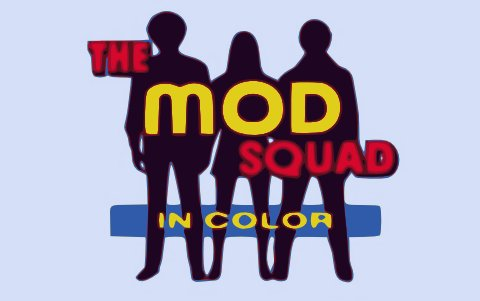

Back to: [West Karana](/posts/westkarana.md) > [2010](/posts/2010/westkarana.md) > [October](./westkarana.md)
# TV Recap: Mod Squad ep 1, "Teeth of the Barracuda"

*Posted by Tipa on 2010-10-15 06:33:22*

I think I missed a few weeks on my TV recaps. Well, tonight's is a good one -- Mod Squad's first episode. Set in 1968 (though the novel on which it is based was set in the 50s), Mod Squad follows a mod, a cool cat and a hippie chick as they narc on their friends for Johnny Law. Richard Pryor and a very young Harrison Ford have cameos.

It's a very sanitized version of the 60s, and it reassured viewers that beneath the beads and day-glo, kids of the so-called counterculture revolution were just good plain folks who would grow up to become Enron executives and investment bankers.

The people who ruined today's world were the rebellious kids of the 60s. Maybe they should have been concerned?

While writing this, I wondered how this show escaped being turned into a movie. Turns out it WAS -- in 1999. Who knew?

Click through for all the thrilling hippie action!

**ACT I**

A long-haired girl in lime green hot pants and black gogo boots (Peggy Lipton as Julie Barnes) hops onto a red Yamaha motorcycle and roars out of a drive-in burger stand and into a parking lot, where she joins several guys riding slowly on their small motorcycles around the parked cars. Everyone is having a great time, and then the fuzz roll in. The well-dressed teens slowly surround the cop car on their motorbikes.

Linc Hayes (Clarence Williams III) rolls up on a bike of his own, watching as the leader of the bikers (Michael Cole as Pete Cochran) tries and drunkenly explain himself to the police detective. The detective orders them all off the bikes. Julie good naturedly accuses the detective of police brutality. Linc drops into slave patois, implying the detective is a white bigot. Let's see if we can complete the trifecta by having Pete complain he is being treated like a gangster....

Nope, Pete informs the detective that he pays the taxes that bake his bread. So, he's playing the white privileged rich-kid card.

The police arrest the three of them. BUT, the police let Pete have a monologue informing the peaceful crowd that America has become a police state. When he eventually finishes, the police helpfully ease him into the car.

Just need to emphasize how NICE everyone is.

Down at the police station, Linc resists telling the booking officer his name. "Do you want my WHITE name or my BLACK name?" He finally admits his name, that he lives in Watts and that he carries kerosene to burn things (reference to the [Watts Riots](http://en.wikipedia.org/wiki/Watts_Riots) of 1965). 

Julie is taking flack from another officer about her clothes, her lack of an address, and her vagueness on what her mother does for a living in San Francisco. "Where does your mother work? What street?" "PICK ONE."

In his turn, Pete admits he's from Beverly Hills and tries to use his privileged position to get the police to turn him loose, threatening to sue them for illegal search and seizure.

You couldn't find three more annoying people.

The police detective, Captain Greer, orders the uniformed cops out of the interrogation room. He immediately starts explaining loudly just what kind of terrible actors the three of them are. "You stand out! You're supposed to blend in! You might as well be wearing your badges, tell them you're cops!"

SHOCKER!

**Opening credits!**

THE MOD SQUAD! (Pete runs in slow motion through a tunnel) Starring MICHAEL COLE! (Linc dodges corridors in a warehouse) CLARENCE WILLIAMS III! Meets up with Pete. They look over and see Julie running up to them. PEGGY LIPTON! The police captain opens the Apex Warehouse door AND ALSO STARRING TIGE ANDREWS! The three modders run down the VERY SAME TUNNEL he'd run through at the start of the credits, Pete and Linc dragging Julie along. FREEZE FRAME, FADE TO BLACK.

**ACT II**

A car rolls down the same tunnel as in the opening credits, but this time, the sun's out. It's the silent police observer who has been watching the proceedings, driving an unmarked Ford LTD. He stops outside the Apex Warehouse door.

CUT INSIDE to where Pete is fighting slowly with a man with a knife. The man wrestles Pete to the ground and pokes him in the belly with the obviously dull knife. The camera pulls back to show the captain watching, along with Linc and Julie.

"Congratulations," says the captain. "You're dead again."

Training continues with Julie successfully giving a perp's identifying details and Linc failing at picking a lock. The three are startled by an officer driving a Ford pickup at them, which they evade (Julie by sliding under the truck). The LA police force loves their Fords.

The observer takes the captain outside, where they explain the premise of the show, the observer doing a dead-on Dick Nixon impression. The captain admits the "mod squad" is doing very well, but he'd never tell them that. The observer has to leave, but refuses to say where to.

CUT TO: The inside of a crowded dance club, where the band on stage is doing a fairly credible imitation of the Doors. The observer, standing out in his suit and tie, elbows his way through the dancers to the bar.

At the bar sit the owner and another man. The owner introduces the observer as Lt. Wheeler, so now we know his name, finally. He's looking for a Julie Wheeler, but the two men aren't much help. Wheeler leaves the club. Camera does an upskirt shot of a gogo dancer as the band grooves. I'm being serious. They do an upskirt shot. Those wild 60s.

The band continues on the soundtrack as Wheeler prowls around a lit-up beach house. The camera pulls back as Wheeler climbs the stairs to show a hand holding a [zipgun](http://en.wikipedia.org/wiki/Improvised_firearm). The gunman shoots Wheeler in the back; he falls off the railing onto the sand, but is not dead. A blurrily-seen man bundles Wheeler into his own LTD and drives off.

CUT to Wheeler groggy in the back seat of his car. A man's hand covered with oil paints smears color all over Wheeler's face. The man pushes the semi-conscious lieutenant out of the car, and he tumbles into the surf. OMG, is he okay?

CUT the Chief's office at the police station, where Captain Greer is urging the chief to let his "mod squad" investigate Wheeler's murder (so he must be dead. Poor guy.) Greer explains the premise of the show to the chief, just in case we missed it the first time. Three kids on probation, forced to join the police force in exchange for no jail time. Narcs, basically, but I guess "The Narc Squad" just wouldn't have been as popular.

The chief reluctantly allows the Narc Squad to take the case. The Narcs are looking through Wheeler's rap sheets, but the captain explains that Wheeler wasn't on a case at the time.

Linc recognizes one of the mug shots. Greer tells him to investigate it, but Linc refuses. "I don't fink on a soul brother!" Greer turns it around. "Wheeler was a soul brother, too." Pretty tricky, considering Linc was FORCED to join the police. After a staring contest, though, Linc silently takes the mug shot.

Pete looks at the scattered photographs and picks up the face shot of a gorgeous blonde model. He thinks he might be able to find her. Greer leaves, saying, "if you can get your foot in the door -- kick it open!"

Julie leaves after Linc makes an inconsiderate crack on how police work is better than walking the streets.

CUT TO Linc is holding a punching bag while a boxer pounds his fists into it. Every time Linc shouts something encouraging, the boxer looks angrier. After a crack about "forget Sugar Ray" goes bad, Linc demands to know what's wrong. "Every time you come down here," says the boxer, "you're looking for a buck or a favor."

Linc claims he needs an alibi for the time around a fuzz murder the night before. He didn't do it, but Wheeler picked him up once. The boxer, Cully, refuses, because Wheeler picked him up once, too, and though he could have sent Cully away forever, he and Captain Greer brought Cully to the gym and paid someone to teach him to box. Linc clearly doesn't expect to find such support for the men in blue in a Watts gym. "I want three minutes with the cat the killed Wheeler. And it better not be you, Linc. You dig?" "Solid, Cully," says Linc, saying his catchphrase for the first time ever.

Pete's on the beach, enjoying the sun and the girls. Julie walks up on a man's shirt and a bikini. She's gotten a job at the dance club, the last place Wheeler was seen. Julie asks if Pete has found the girl in the photo.

The camera pulls back, and we see that they are outside the beach house where Wheeler was killed. "That's her pad," says Pete. "Who is she?" asks Julie.

"Tina," says Pete. "Tina?" asks Julie. "Tina." "One name, like [Twiggy](http://en.wikipedia.org/wiki/Twiggy)?" "For now," says Pete.

A man carrying an airline case walks out of the beach house. Pete asks Julie to go after him. She reluctantly goes when he calls her "officer" (a crack to when she called he and Linc policemen, earlier).

The mystery man is getting into a car when Julie bums a ride to town from him. "Sure, get in." He looks back to the beach house before getting in himself. What model Ford will this be? It's a convertible, maybe a Ranchero. Stay tuned.

After they are out of sight, Pete runs up the stairs to the beach house. Apparently nobody knows this is where Wheeler was shot. Pete opens the door, goes in, sees Tina lying on a couch, prominently wearing a wedding ring. Pete pries open her eyelids, see's she's drugged, calls a doctor. 

**ACT III**

The doctor cleans a syringe as Tina dabs at the injection wound with a cotton swab. The doctor lectures Pete and "you kids" on the dangers of LSD. Thanks, doc!

Tina and Pete bond for a bit. Tina assures Pete this was her first time touching drugs. Pete wants her to vow it to be her last. Big hug! Drugs are bad, m'kay?

CUT TO inside the club, night. Julie, dressed in a tiger costume (?) takes a picture of a raver with an old-fashioned flash camera. Um, takes a picture of a cool guy with a state of the art pro camera. "The picture will be ready when you are," she says in a bored tone. "I'm ready now, baby!" says the cool guy.

Julie walks off, camera pans to Linc dancing with someone. "Don't you go away, momma!" he says, as he follows Julie off the dance floor. "Anything?" he asks. "Negative!" she says, punning on her camera job. Julie asks Linc if Pete has ever talked about Tina. Linc says Pete has never talked to him about Tina or anything else. Julie asks Linc if he could find out who she is from Pete. Linc relates an old African proverb that goes "Cat who provides shoulder to cry on winds up with wet sut and no friends."

Julie's friend from the car walks in, wants to meet the manager in a moment. Linc takes off as the man walks up to Julie, who didn't know Julie was working here. They flirt for a moment, and the man goes off to his meeting with the manager.

Next morning, Julie, Pete and Linc are watching a beach volleyball game outside the beach house. An older man in a suit drives up and walks up the stairs and into the house. Linc cleverly wires a tape recorder under the floor of the house.

Turns out it's Tina's father, and Pete called him. Cut to the mod squad and Captain Greer listening to a playback of the tape later on, Tina is railing against her upper middle class upbringing. There is a very long pause. Tina's dad says goodbye and leaves. Tina bursts into tears. Greer shuts the recorder off.

Greer lays into Pete for not admitting at the police station that he knew Tina, and that she came from a rich family. Pete says Greer told them again and again that their jobs weren't to narc on their friends, but to solve crimes, and he did what he felt was the right thing to do. Does Greer think joining the force meant the police got his immediate loyalty?

Greer says, yes.

**ACT IV**

Julie and her boytoy are sailing down the highway flirting when boytoy gets a call on his mobile phone -- which is a princess dial phone set in the dash, gotta be seen to be believed. Boytoy helpfully repeats everything said to him as a film of a California highway spools out behind him. "Meet at the Oyster House. 2:30. Got it."

Julie asks to be let off, allowing us to see that boytoy's car is a Ford GT convertible. In 1968, everyone drove a Ford.

Turns out Pete had been tailing them in a Ford Woody (remember, everyone drives a Ford) decorated with a couple of surfboards. She tells Pete about the Oyster House gig.

CUT TO downtown. Boytoy drives down the boulevard in his GT. Julie turns from admiring a painting in a shop window to watch him pass. She nods at Pete, who is dressed as a parking attendant, who takes the GT's keys from boytoy and hands him a ticket.

CUT TO inside the restaurant, where Linc is dressed as a waiter. Pete walks up to him, and they both watch through the kitchen window as boytoy is shown to the table of a man whose face is hidden by a newspaper, but we know from his hair that he is Tina's father. He puts the paper down and we see for sure it's him. Camera zooms in and everything.

Linc offers water to boytoy, but boytoy wants none, but it was a good excuse to get close to the table.

Mr. Tina's Dad doesn't like boytoy, doesn't like whomever called him (Pete), and wants to leave. Boytoy passes him a wallet full of pictures and urges him to look inside, says a man couldn't get elected dog catcher with that kind of publicity. Boytoy is blackmailing Mr. Tina's Dad, sticks him with the bill, accidentally leaves his lighter at the table.

CUT TO boytoy driving in front of a movie of a California street as he talks on his mobile phone to his employer. They chortle together as boytoy helpfully continues his horrible habit of repeating everything said by the other man so we, the viewers at home, know. After he hangs up, he reaches for his lighter and realizes he's forgotten it. He turns the car around in the middle of the street and returns to the restaurant, sees Julie getting in Pete's Woody, where Linc is sitting, realizes something is very sour. Wasn't that that parking attendant? And the waiter?

They drop Julie off at her "home sweet pad". She invites them in to look at her psychedelic curtains. They beg off. As they drive off in front of a movie of California houses, Pete asks Linc about Julie's past.

"She cries a lot," says Linc. "For a cop."

CUT TO Julie's apartment. A knock on the door. Julie answers, sees boytoy, gears turning as she tries to explain about missing him at the beach etc, not knowing he saw her outside the restaurant. He silently makes sure she's alone, then he dumps out her purse and finds her BUSINESS CARD!!! stuck in the top of her compact. Reads "Barnes, Julie, LAPD" off it.

Seriously. She has a business card. That's going to get her into trouble. Boytoy starts to beat her up. Linc and Pete walk in unsuspecting, quickly peg the situation and manage to subdue boytoy after a lot of broken furniture, banisters, and other items of shoddy handiwork meet their ends.

Pete and Linc get all police brutality on him, then when he's unconscious, Pete comforts Julie.

Linc calls in to tell the captain that their cover is blown. Julie asks Pete why they returned, and he says, "you left your work clothes in the car," holding up her bikini.

**ACT IV**

(Actually, I never finished this. It's been sitting in my drafts folder for months. I'm sure it all worked out in the end!)
