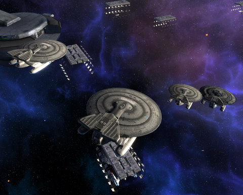

Back to: [West Karana](/posts/westkarana.md) > [2010](/posts/2010/westkarana.md) > [October](./westkarana.md)
# Star Trek Online, Minecraft, Treasure Abyss

*Posted by Tipa on 2010-10-01 07:02:49*

I've been wanting to write more blog posts, but every time I sit down to write about [Minecraft](http://www.minecraft.net/), I end up playing Minecraft, and then it's suddenly midnight.

If you've managed to avoid all the Minecraft hype over the past few weeks, I hope it's warm and cozy under your rock. The basic premise is, you're plopped with nothing into the middle of a world that is fully moldable and destructible. At night, The Monsters Come. You must first build some sort of shelter and hide before the sun goes down.

Your only tools are your imagination and the world around you. Lots of other blog posts and guides exist to get you started, so I won't get into the rules of survival in Minecraft. Instead, I just want to tell just how much this game scratches my Explorer itch. Not since EVE Online, and before that, EverQuest, has a game really been designed around the Explorer, rather than the Killer or Achiever, gaming personalities. 

It comes down to this. If you love exploring, Minecraft is your game. If you love leveling up and being rewarded by games for accomplishing pre-determined goals, you won't.

Wiith the Breen arc ended and the [Devidian](http://memory-alpha.org/wiki/Devidian) arc not expected for a few weeks, Cryptic has offered us a new ship (and a lot of smaller updates) to keep us interested. On offer soon is the Nebula-class science ship, a cousin to the famous Galaxy cruiser. I only spent a short time with it on the test realm, but I like the looks of it. Given that, though, I can't see it replacing my Intrepid refit with the ablative armor. I end up using that armor a lot -- especially after setting off a few area effect weapons.

Still, I've been cruising the stars in my Galaxy X dreadnought lately, and I imagine I'll be able to find a spot for its cousin in my hangar. It really depends on the final number of bridge positions open -- if I can get a higher rank science officer in, that would make my mind up. Higher rank bridge officer positions are golden.

|  |  |
| --- | --- |
| 

 | 

 |

Bandai Namco's social RPG Treasure Abyss got an update a couple of days ago. There's now a fifth dungeon, a dungeon filled with seven floors of undead meant for characters level 30 and up. The experience is good, but the loot is bad -- there's only one spot in the dungeon, on the bottom floor, where the rare component for the new wizard, thief and warrior weapons can be found. That would be the slot machine in the corner -- 7s gets you the Hex Stone (thief, wizard), cherries gets you Stainless Steel (warrior), and bells gets you a 50% health potion. 

The new wizard staff takes a vast number of hex stones, so I haven't gotten those yet. The new thief and warrior weapons are above. The increased damage for both weapons over the alternative make them must-haves for those two classes, though thieves pay for their increased ranking on the MVP scale with more aggro. I imagine the wizard staff will be the long-rumored AE staff, which should put wizards high on the meaningless death list once used.

I have a lot of stuff to write about, this is just a quick update. If I can just put Minecraft down for a few minutes, maybe I'll be able to get to those.

## Comments!

**[Ethic](http://www.killtenrats.com)** writes: "If you love exploring, Minecraft is your game."

Yes, yes, a thousand times yes!

---

**Longasc** writes: I can't get over the looks. Sorry, I am that shallow. Yeah, I am talking about Minecraft, what else.

STO/Nebula: 200 Marks of Exploration or C-Store as usual - that's not that much. I could buy it right away for that price. The thing is, getting Marks of Exploration is now much harder, especially if you are already Vice Admiral. 5 per day at max, 3 B'Tran Explorations basically. But if you already gathered some before... you might have as much as 500+.

I think I did not recommend you Brandon Sanderson's book "The Way of Kings" yet. I just did it.

---

**[Capn John](http://capnjohnsblog.blogspot.com/)** writes: I was enjoying Minecraft for a while, but I guess I prefer a slightly more polished game, or maybe I prefer something a little less sandboxy.

I did build my little 10x10 2-story Castle on top of the tallest hill I could find, complete with oven/forge and a 4x5 viewing window of the rising sun. After exploring and dying a few times I also built a smaller house, complete with door, right next to my respawning area.

I tracked down a herd of cows and made myself some leather armor, but I felt that task was harder & less intuitive than it should have been. A simple 'n' shape did not create a pair of pants, nor did my quite reasonable facsimile of a t-shirt produce a chestpiece, and in the end I had to check the Wiki for how to make them. Finally, fully armed & armored and carrying a bucket load of torches & a spare crafting table, I set out to find some of the natural caves I'd heard so much about, and which are apparently filled to overflowing with rare minerals. Unfortunately my life as a Spelunker would be short-lived.

After descending quite some distance into the earth - and I'll admit, it was rather disconcerting & vertigo-inducing having to carve out steps in some areas to continue down - I neglected to place sufficient torches and the low light level allowed a creeper to spawn. With one hit he knocked me off my ledge and my journey to the center of the earth was greatly accelerated. My avatar didn't survive the fall (actually it was the landing he didn't survive) and my gaming experience didn't survive the setback.

As I respawned in the middle of the night and took refuge in my temporary home I realized that although there are no levels in Minecraft the game is still a grind; a grind for mats.

I've seen what some folks have created in their games and am suitably impressed by what they've accomplished, but I think I'm all mined out.

---

**[Yeebo](http://yfernbottom.blogspot.com/)** writes: That's the first game I've heard of where the high end gear slot machine is 'literally' a slot machine.

---

