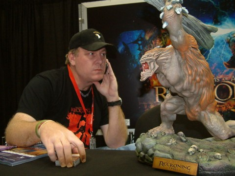

Back to: [West Karana](/posts/westkarana.md) > [2010](/posts/2010/westkarana.md) > [October](./westkarana.md)
# Kingdoms of Amalur: Reckoning -- The Well

*Posted by Tipa on 2010-10-07 17:48:02*

I'm more interested these days in the single player RPG version of 38 Studios' "Kingdoms of Amalur" than I am in its future MMO incarnation. My recent several play-throughs of Bioware's excellent "Dragon Age" RPG have firmly confirmed me as an RPG nut. When companies make their IPs into MMOs, they have to have some grind in there to slow people down. In single player RPGs, you're there to be part of a story. The very best RPGs provide a platform for your OWN story, but that's rare, indeed. Have there been any besides Oblivion's?

I don't know.

Anyway, I'm following news of "Kingdoms of Amalur: Reckoning" with great interest. I want it to be amazing. I want it to start a franchise that will keep 38 Studios' developing new games, because I definitely wouldn't want to bet their future on an MMO. I wouldn't give a dime for a new MMO's chances these days. Single player RPGs, well -- there's always room for a good one.

Today, the folks at 38 Studios sent out their first newsletter for KoA:R, which [links to an interview with Curt Schilling at Gencon](http://www.reckoningthegame.com/TheWell/Welcome) and a gallery of pictures. No great detail; in the interview he even admits that they'll be dragging out the news over a very long period of time (something which could backfire; people get impatient, and then they get bored, and then they lose interest).

Does anyone else totally think "[80's-era discussion boards](http://en.wikipedia.org/wiki/The_WELL)" when someone talks about "The Well"? Here's the text of the e-mail:

> Hi everyone,
 
From all of us at 38 Studios, thank you for joining The Well!
 
When Curt originally founded this company he wanted to create a world that he, as a gamer himself, would love to experience, so he put together the best team in the business. Kingdoms of Amalur: Reckoning blends R.A. Salvatore’s storytelling mastery with Todd McFarlane’s eye for artistic excellence, all wrapped up in an expertly crafted RPG by Ken Rolston and the Big Huge Games team. We're all very proud of the products we’re creating and the team creating them, and are excited to have this outlet to share with you.
 
We’ll be updating you regularly. Among other exciting news, we’ll give you a peak behind the scenes and introduce you to the 38 Studios and Big Huge Games teams. We can’t wait for you to be the first to know more!
 
We’ve put together a video and photo gallery from the GenCon Indy 2010 show exclusively for subscribers to The Well. We hope you enjoy it. Check it out here!
 
Welcome to The Well!
 
38 Studios
 
Curt Schilling, Founder and Chairman / Jen MacLean, CEO / Denise Kaigler, Chief Marketing Officer

## Comments!

**Longasc** writes: This single player game and the MMO "Copernicus" are the big ??? - I hope we get positively surprised.

---

