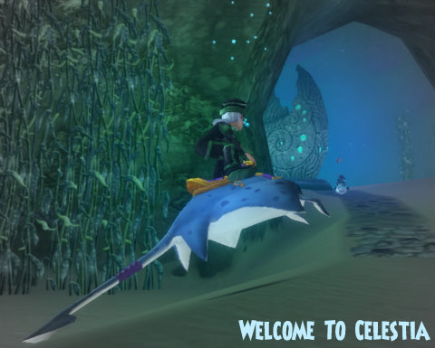

Back to: [West Karana](/posts/westkarana.md) > [2010](/posts/2010/westkarana.md) > [October](./westkarana.md)
# Wizard101: Welcome to Celestia!

*Posted by Tipa on 2010-10-09 18:49:46*

**Updated! Links to information about the new spells at the end of the post.**

Whoa! Celestia's finally on the Test server! I've been playing on it a few hours, just long enough to learn the mystical incantation which allows wizards to survive underwater and to start investigating the Crab Realm. The crabs, you see, have been attacking the underwater city constructed by the Marleybone explorers, who traveled across the Spiral by balloon.

The journey from level 50 to 60 will eventually (at level 58) get you a quest from your trainer for a new spell, but other folks you meet along the way will be able to teach you spells from the Astral Magic schools. Save those new training points.

Aside from the new Critical and Block effects you might find on new gear and spells (Block blocks Crits), the Astral schools bring entirely new abilities to your deck. 

Sun spells are enchantments -- they are the same sort of spells used to make treasure cards, except that Sun-enchanted cards disappear at the end of battle. Their powers can go well beyond just affecting accuracy or power -- they can mutate cards into entirely different cards. Sun spells can even cloak your other cards, disguising your blades or shields so your opponent is unaware what buffs you have.

Moon spells confer the ability to polymorph into another creature entirely, with its spells and abilities. If you come against a monster strong against your school, pop a Moon spell and become its worst nightmare instead. Moon magic looks to be a real winner.

Star spells cast Auras -- short term buffs to damage, fizzle rate, resistance and so on. Could be useful in a pinch.

Of course, adding too many Astral spells to your deck will likely run the danger of crowding out your regular spells. Only time will tell how they will fit into the short decks used by most grandmaster wizards.

There's a good chance you won't be able to hang with Selena Gomez once Celestia goes live, so if you haven't gotten your Gomez statue -- [which has over a hundred and one uses](../../../index.php/2010/09/23/wizard101-fun-with-the-selena-gomez-statue/) -- best hold your breath, dive deep, and help her get back to recording her new hit CD! And video!

The full Celestia patch notes are ---> [over here](https://www.wizard101.com/game/community/updatenotes)!

*Thanks to commenter M.W.S., here's a link to [the level 58 Storm spell, Leviathan](http://www.youtube.com/watch?v=6VttYAFnJtI). There's a thread on Wizard101 Central about [the new school spells](http://www.wizard101central.com/forums/showthread.php?p=1223812) -- the new Fire spell, Efreet, has been discovered, but no video. It appears to be a 895 point direct damage spell that also casts a 90% shield -- very nice. I wonder if the Life spell will be another heal? Shadowrunner has compiled a list of all the Astral school spells available on the spell vendors. After looking at them, I still feel the Moon spells will be the most generally useful for how I play, unless trash fights turn out to take forever. The first couple of areas didn't seem any worse than Dragonspyre.
*
## Comments!

**[M.W.S](http://sorcererofthespiral.blogspot.com)** writes: Already a YouTube Video (Leviathian-Storm-Lvl 58)...

---

**[Yeebo](http:/yfernbottom.blogspot.com/)** writes: Great preview.

---

**[Tipa](https://chasingdings.com)** writes: That video rocks! Adding it to the post. I wonder what the Life spell is?

---

**yo** writes: how do i go to the under water place

---

**[Tipa](https://chasingdings.com)** writes: Once you've defeated Malistaire in Dragonspyre, Ambrose will give you the key to Celestia. You get there through the Spiral door, the same as the other worlds on the Spiral. The preview bit of Celestia that went live with the Selena Gomez quest is closed now; that connected to Triton Avenue in Wizard City.

---

