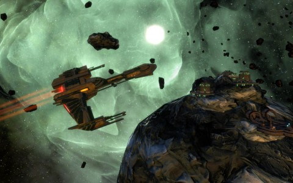

Back to: [West Karana](/posts/westkarana.md) > [2010](/posts/2010/westkarana.md) > [October](./westkarana.md)
# Star Trek Online: Devidian arc starts Saturday!

*Posted by Tipa on 2010-10-13 06:23:55*

The follow-up to Star Trek Online's fantastic Breen arc begins this Saturday. This new five episode arc takes us back to the Neutral Zone to [battle the Devidians](http://www.startrekonline.com/feature_episodes), a ghostly, extra-dimensional race which feeds off the life energy of mortal critters. One of the story missions in the area had us closing the portals which allowed them entrance to the physical realm; they have once again managed to infect reality. A ghostly race for a spooky time of year!

[From the website](http://www.startrekonline.com/feature_episodes):

> Series 2: [The Devidians](http://memory-alpha.org/wiki/Devidian)
Thousands of Starfleet officers and KDF warriors have died in the battles in the Neutral Zone. The destruction has drawn the attention of the Devidians, unseen predators who use chaos as a cover for their kills. This time, however, their plans involve more than simple survival. You must stop them before they can change the face of the quadrant forever!

Episode 1: Skirmish
An unexpected enemy returns when your ship is called to battle in the Neutral Zone.
Debuts: October 16, 2010 at 11:00 a.m. PDT.

Time to raise shields and charge the phasers once again. The Federations News Service will be there for all the action.

If you still haven't completed the Breen arc, you have only until the 14th -- tomorrow -- to do so and still receive the Breen bridge officer reward. Once the Devidian arc starts, you'll still be able to battle the Breen, but you'll no longer be able to hire one for your ship.

(You don't know HOW HARD it was not to make a joke about Branch Davidians.)

