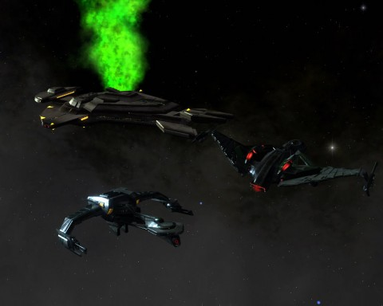
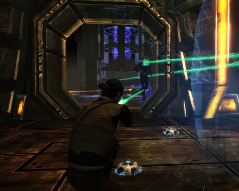
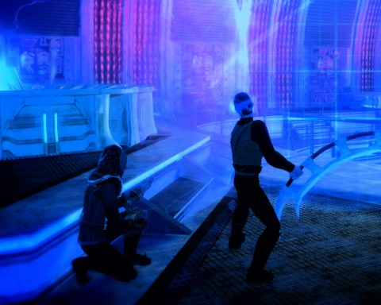

Back to: [West Karana](/posts/westkarana.md) > [2010](/posts/2010/westkarana.md) > [October](./westkarana.md)
# Star Trek Online: Skirmish (spoilers)

*Posted by Tipa on 2010-10-16 17:27:54*

**skirmish**: *a minor or preliminary conflict or dispute.*

It is said that four thousand throats may be cut in one night by a running man. The same can be said of a Bird of Prey under warp when the disruptor beams run hot. Hot as the blood of a warrior; hot of the blood of your enemies filling your cupped hands. Hot enough to tear a rip through the fabric of space itself and show what peers from it the heart of a true warrior.

K'men is no friend to the House of Krontor, but he has the ear of the High Council. My crew were relaxing on the Ferengi station in the Eta Eridani sector, Drozana. The campaign against the Breen had been fought and won valiantly. Many barrels of blood wine needed drinking; many duels needed fighting; many wrongs needed forgetting with good stories and brave companions.

When battle calls, though, every warrior answers. K'men told us that a True Way fleet had just entered the Neutral Zone between the Federation and the Empire; the Federation were fighting them in the Donatu system. The Empire had sent a small squadron of ships to watch the Federation and the Cardassians wipe each other out and remove the survivors. We were to join them. General Longash and Captain Kavana formed the rest of our strike team.

It was a good battle, and a good day for many Federation, Cardassians and Jem'hadar to die. We boarded the Cardassian ship "Axon" when we detected unusual radiation in the ship.

There were still Cardassians left to battle. We killed all we saw. Their medical bay was filled with dead spoon-heads; some in stasis. The medical records told a story of an unusual sickness that raced through the crew, leaving them weak and dying without any hope of a cure.

Even a Cardassian should die on his feet.

We used the ship's sensors to scan for unusual radiation; we detected trilon radiation in dangerous quantities. The science officer's log indicated the Axon had been in the vicinity of Driffen's Comet, which showed unusual levels of trilon and chroniton radiation. That explains much.

We headed for the bridge; the trilon radiation was concentrated there. The Cardassians were too weak to survive exposure. Klingons laugh.

This was no stray radiation; this was an invasion! The Federation has unleashed these creatures from an out of phase universe on us all! They come to us begging for peace, only to make alliances with secret enemies. They undoubtedly were on their way to Qo'noS to infect the home world with these soul suckers.

We screamed. We leaped. I took my bat'leth and showed them the way back to their own dimension. Their defeat at our hands was inevitable. K'men was pleased. Our names will be spoken with respect in the council chambers. But the fight has not ended. The Cardassians were prey. This can only be a Federation plot.

---

The opener to the Devidian arc featured a decent space battle and a good, quick run through a Cardassian ship. The surprise presence of a "boss" Devidian, a Phantasm with an extremely damaging attack, was alarming. The episode, though, was mostly notable for being very short, more an introduction to the arc than a standalone episode.

The mission reward was a space device that temporarily boosts the physical and energy resistances of the ship on which it is fitted.

## Comments!

**[Jomu](http://www.justonemoreunlock.blogspot.com)** writes: i always loved the look of the klingon bird of preys; i used to have a model set of a warbird, bird of prey and ferengi cruiser. The bird of prey was so cool, i didn't even need to (see: i was lazy) paint it

---

**[Tipa](https://chasingdings.com)** writes: Bird of Preys are very cool looking, sort of like a goose in flight. I wouldn't be at all surprised to find we Earthlings making space ships on a similar design for flitting around the Solar System in a few centuries.

What's always amazed me is the design for the original Enterprise. It looks nothing like what you'd expect to see; prior to that, it seemed all space ships were based off the V-2 rocket bomb -- fins, pointy nose, rounded body. Then the Enterprise comes along looking entirely different than anything like that, and wow!

---

