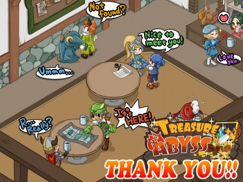

Back to: [West Karana](/posts/westkarana.md) > [2010](/posts/2010/westkarana.md) > [October](./westkarana.md)
# Treasure Abyss: Some exclusive wallpaper!

*Posted by Tipa on 2010-10-19 06:33:19*

A big "thank you" goes out to the kind folks at Namco Bandai, who sent me this very cool [Treasure Abyss](http://apps.facebook.com/treasureabyss/) wallpaper this morning. It features the characters who pop up now and then on their [Facebook Wall](http://www.facebook.com/apps/application.php?id=110417579004579) to introduce new features or dungeons. Namco Bandai has kindly offered to let me post this up on the blog.

The folks up on the upper left are clearly mages. To the right, a warrior meets a thief. On the upper right, a class we haven't yet seen romances the bartender. A healer class? We can hope. Note the brace of turkey legs hanging above the bar. Mmm.

At the lower left, a warrior looks over a map with a ranger. We haven't seen a ranger yet in game, either, but he's popped up in the interstitial screens.

Noticeably absent: monks and samurai!

Those samurai never get any love.

## Comments!

**PeterD** writes: Ok, is there some way to customize the look of your character in Treasure abyss? Those characters all look different, but all I've seen in game are a default red haired male guy.

---

**[Tipa](https://chasingdings.com)** writes: Click on your character, you'll be able to set your look.

---

