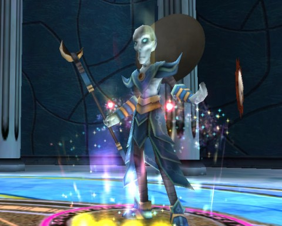
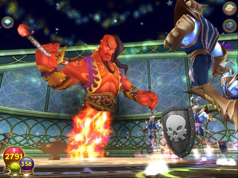

Back to: [West Karana](/posts/westkarana.md) > [2010](/posts/2010/westkarana.md) > [October](./westkarana.md)
# Wizard101: Celestia's Trial of the Spheres

*Posted by Tipa on 2010-10-19 07:11:23*

This is Mithraya, the final boss in the Trial of the Spheres. I'm not certain, when Celestia actually goes live, that the Trial of the Spheres will turn out to be the ultimate dungeon in the world, but it IS the one that drops all the level 58+ legendary armor. Putting traps on Mithraya is pointless; she just removes them.

I've heard again and again that Celestia is very difficult. I heard on Twitter that some are pronouncing the short deck dead in Celestia. That is wrong on both counts. We fought Mithraya with three wizards -- a level 50 life wizard, a level 50 balance wizard, and a level 58 (and again at 60) fire wizard. There was never any doubt that we would win. Sure, the bosses in the Trials CHEAT -- all Celestia bosses do. Sure, they start out with six power pips. But they don't pump out the damage the way the bosses in Briskbreeze or the Warehouse do.

Ptolemos is the twin of [Kif from Futurama](http://en.wikipedia.org/wiki/Kif_Kroker). He's always going on about charms. He loves them! He's the second boss of the three in the Trial, and I believe he drops the shoes of the legendary set.

He is so weak that it's almost certain he will be tuned to be more dangerous going live. There's nothing particularly stopping someone from soloing the entirety of the Trials of the Sphere, to be honest. Only the first fight presented us with a full group of four enemies, and the three minions only had 800 health.

Though the legendary gear is full of crit and block, it's sadly lacking in health and mana, making the Dragonspyre outfits arguably better in some cases than the Celestia replacements. The new spells, however, are awesome. 

I've been using the Sun spell to boost my Centaur attack whenever I can. I used the Moon polymorphs for a couple of fights, but found I really missed my regular attacks. I do run with a short deck; I usually can get the card I want when I want it.

The new fire spell, Efreet, packs a powerful punch and leaves the target debuffed. Combined with Celestia's boost to DOTs, fire wizards have really stepped up as damage powerhouses.

Celestia looks great and it's clear there's been a lot of work put into it. The monsters, the animations, the swimming -- all fantastic. I stand by my earlier reaction, though -- Celestia looks altogether too easy. Someone using a lot of potions can finish it in a day; a steady player will take a week; a casual player, perhaps a month. And then, there's just the farming to keep people in the Spiral. Farming, and pet games.

## Comments!

**...** writes: Your wrong actually, Mithraya does NOT remove traps.

---

**Jessie** writes: Hehe, I am a level 18 storm, in here right now with a level 58th myth and level 60th ice. So far we at ptolemos. we've been here for like 2 hours already. he keeps stealing my storm traps.

---

**[Tipa](https://chasingdings.com)** writes: One of the really cool things about Wizard101 is that almost anyone of any level can help out. First time I went through Big Ben, I was, I think, a level 34 life wizard, and a level 16 storm wizard popped in. He was a really huge help.

---

