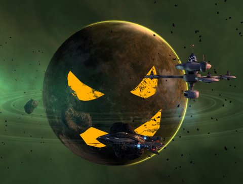
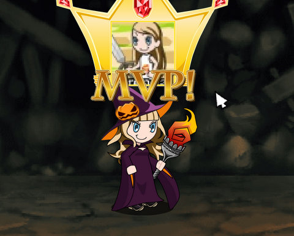

Back to: [West Karana](/posts/westkarana.md) > [2010](/posts/2010/westkarana.md) > [October](./westkarana.md)
# Halloween around the multiverse....

*Posted by Tipa on 2010-10-29 07:19:25*

Around the end of October each year, every game world is taken over by the dimly remembered remainders of an old harvest festival, All Hallow's Eve, AKA Hallowe'en. The ancients sucked at making abbreviations.

Star Trek Online wants to remind us that there's something scarier than the spectre it might join its cousin, Champions Online, in the "Freemium" payment model. The third episode of the Devidian arc, ominously titled "What Lies Beneath", comes out Saturday afternoon, on the day before Hallowe'en (AKA Halloweeneen, I guess). Should be a fun adventure tramping around in the bowels of an ancient space station looking for blue, soul-sucking ghosts.

EverQuest 2 brings back its haunted houses and trick or treats, and ties them together with a new overquest that, when all the Halloween events are completed, grants new rewards. EQ2 drew me in for the holiday events, I admit -- and I had a lot of fun in a very spooky mansion, fighting what turned out to be a very familiar enemy!

Wizard101 carries over its Halloween events from last year, with a new twist. The denizens of this year's Master Tower use new high level spells and abilities -- it's not the pushover of previous years, and the rewards have changed as well. Now you have the chance to find items from the Grand Spyre on the upper floors of the tower. 

Dungeons & Dragons Online is opening a special mini-zone for all players, free and otherwise, where you can band together to defeat a wide variety of creatures of the night, culminating in a raid against a spectral dragon!

Treasure Abyss has opened its cash shop to the dark forces of the night with a collection of Halloween-themed clothes and weapons. The Halloween robes and hat are best-in-slot for mages, and the Halloween shield is best-in-slot for warriors, so it's more than a purely decorative role for these items.

The wild monsters in Backyard Monsters are building a creepy looking Jack-O-Lantern in your back yard. I hope what comes out of it Sunday is a little less frightening than their daily "spin the wheel" rewards, which, for me, have inevitable ended in a "trick" -- a free orbital bombardment of twigs. Yay.

That's not all, but it's all I have time for today. Look for a followup on all these events on Halloween itself!

## Comments!

**[The Best Of The Rest: Halloween Edition | We Fly Spitfires - MMORPG Blog](http://blog.weflyspitfires.com/2010/10/31/the-best-of-the-rest-halloween-edition/)** writes: [...] finally, Tipa rounds up lots of Halloween events from around the MMOverse. It’s Halloween – how could I have not included this wonderful [...]

---

**[Yeebo](http://yfernbottom.blogspot.com/)** writes: I love the Halloween events in these games. This year was the first time I've done them in EQ II, I really got a kick out of them. Though I am not sure I'll have the patience to do all of the events.

---

