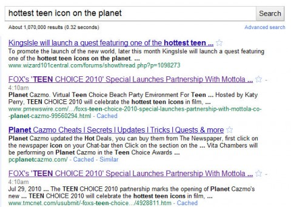

Back to: [West Karana](/posts/westkarana.md) > [2010](/posts/2010/westkarana.md) > [September](./westkarana.md)
# Wizard101: Getting the school ready for Celestia

*Posted by Tipa on 2010-09-03 06:35:53*

As part of Wizard101's second year celebration, every account gets a ninja pig transformation potion. Now everyone can understand for fifteen minutes how Myth wizards feel every day of the year.

Awesome.

In the [September Producer's Letter](https://www.wizard101.com/game/producerletter/2010September), Leah Ruben drops some hints about upcoming features, and precious little about Celestia! My number one Celestia question? Not that anyone asked, but if I could have her answer one question in her NEXT producer's letter, it would be how come Celestia is an underwater realm? The old Celestial Armor, before it was removed from the game (and later returned to the Crowns shop) had wings all over it. We know Celestia brings us Astral magic, based on the Sun, the Moon and the stars -- things of little concern to undersea critters (except the Sun). Well, arguably, both the Sun and the Moon affect tides and....

Do the worlds of the Spiral even HAVE moons? I've never seen one, and the Spiral worlds are so incredibly tiny (Wizard City itself is built among the roots of a tree) that I can't imagine any of them could capture a moon.... I also don't recall seeing a moon, not even in Marleybone, except when Orthrus summons one in order to howl to it.

Anyway.

> Last (but certainly not least), we're trying to incorporate fixes to legacy issues or those little "thorn in your side" issues. Ever sold an item you spent a whole bunch of crowns on? We're going to make sure there is a confirmation for that (and that it's defaulted to “No”). **Tired of your Life Minion healing itself when it doesn't need to?** We know that stinks, so Minions are getting some love. Are dye costs breaking your bank? We're reviewing those, too. Is selling and buying one reagent at a time getting you down? Us too... so we're fixing it.

Oh, I don't know about this one. My Sprite Guardian's capricious behavior gave her tons of personality in my book! About the only thing that could possibly stop her from healing herself would be me dropping feints, prisms, or traps on a monster. She'd have to make sure to send an imp to erase them all.

I just don't know what I'd do with a minion that actually helped. Helped me, that is. She'd let me nearly die while healing other party members who didn't need it. She had a particular fondness for [a certain necromancer](http://thefriendlynecromancer.blogspot.com/).

Yesterday, KI dropped a press release with some more news about Celestia. It said, in part:

> In early Fall, the next chapter in the Wizard101 story will begin with the introduction of the world of Celestia, the game’s largest and most ambitious expansion to date. In Celestia, Wizards will achieve new heights of power as they progress to level 60, discover extraordinary new spells, venture beneath the ocean and learn the deepest secrets of long-forgotten magic.

To promote the launch of the new world, later this month KingsIsle will launch a quest featuring one of the hottest teen icons on the planet. The quest, which will introduce players to new underwater environments and preview features of the upcoming Celestia expansion, will be available to all players in the game.

If Celestia doesn't bring a new damage spell for Life wizards better than Centaur, put it back in the oven, it ain't done. Just saying.

So anyway, who is one of the hottest teen icons on the planet???

Not being a teen myself, I did what anyone would do -- asked Google.

First result was KI's press release. Well, that's less than helpful. Second and third results were a collaboration with Yet Another Kid Social Networking Site. Because we need a few hundred more of those.

The fourth one down is something called "FOX TEEN CHOICE 2010!", where all the teens across the land come together to vote on....

You'd think the aftermath of all the teens across the land coming together to vote would be big news, but it took a fair amount of digging to come up with the results.

So, here's what [the teens of today are choosing](http://www.chiff.com/pop-culture/teen-choice-awards.htm):

 * Sandra Bullock, for her work in The Blind Side. Middle aged women rock. Not surprised.

 * Sandra Bullock, for her work in The Proposal. Go go, Sandra!

 * Tina Fey, for Date Night. Woot! Older women rock!

 * Sandra Bullock and Betty White for Best Dance, in The Proposal. YOU GO GIRLS!

 * David Beckham, teen choice sports icon, for a sport almost nobody follows in the US. (That sport would be soccer.)

So there you have it. America's hottest teen icon is Sandra Bullock. What's the quest going to be? **Davy Jones' Hurt Locker**? **While You Were Sleeping With the Fishes**? **Two If By Seaweed**? **Speed 3: Cruise Controlled**? **Near Miss Congeniality**?

I can't wait to find out!
## Comments!

**[Capn John](http://capnjohnsblog.blogspot.com/)** writes: Actually soccer is very popular among American girls so it's not surprising to see Beckham's name on that list but Sandra Bullock and Tina Fey as "hottest teen icons"? Really? Reeeaaally? Because when I think of hot TEEN icons I'm not thinking of women in their 40s, and I'm certainly not thinking of the last remaining Golden Girl. 

What about Emma Watson, Vanessa Hudgens, Taylor Swift, and yes, even Miley Cyrus? I'm not saying Sandra, Tiny, and Betty aren't worthy of accolades and recognition, but as TEEN icons? Come on!

---

**[Tipa](https://chasingdings.com)** writes: The actual hilarious thing about that list -- I don't know if you had a chance to follow the link -- is that, for a contest promoted by FOX, almost everything is related to a FOX property. 

The usual teen names were on the list here and there, but I very much enjoyed the focus on FOX properties I'd be surprised if teens had any interest in. 

Have fun picking out the famous Disney names, like Miley Cyrus, who lost to FOX stars...

---

**[Capn John](http://capnjohnsblog.blogspot.com/)** writes: Ahh, that explains it. It's Fox's Choice Teen idols :)

---

