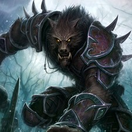
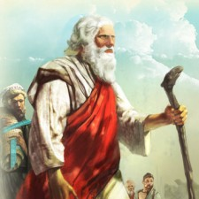
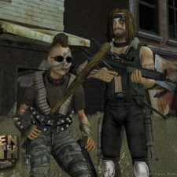

Back to: [West Karana](/posts/westkarana.md) > [2010](/posts/2010/westkarana.md) > [September](./westkarana.md)
# A Parent's Guide to MMO Gaming

*Posted by Tipa on 2010-09-03 20:59:20*

Someone needs to tell the truth about MMOs. I guess it falls to me to explain to parents about the games their children are playing online with people whose idea of a good conversation opener is "I AM SO HIGH."

**[World of Warcraft: Cataclysm](http://www.worldofwarcraft.com/cataclysm/) by [Activision Blizzard](http://www.activisionblizzard.com/corp/index.html).**

In the original World of Warcraft, children could take the role of a virtuous human fighting on the side of the Church against the evil Horde. The Burning Crusade expansion revealed that **the enemy Horde** came from **Hell itself**, and the humans took the fight against the villainous Orcs and other demons to the lower realms. 

Blizzard's game took a decided turn for the worse with Wrath of the Lich King, where human players were encouraged to become **Death Knights, soulless minions of Satan**. This trend continues with the Cataclysm, when **Hell comes to Earth**, and the good players become bloodthirsty werewolves. Expect your children to call one another "bitches", because, hey, they are playing female dogs in heat, and you're paying for the privilege.

**[Hello Kitty Online](http://www.hellokittyonline.com/) by [Sanrio, Inc.](http://www.sanrio.com/)**

In his novel "[Rising Sun](http://en.wikipedia.org/wiki/Rising_Sun_(novel))", Dr. Michael Crichton exposed the cruel designs **Japanese megacorporations** had for the trusting citizens of the United States. This lesson has been forgotten even as Japan has come to dominate the electronics and auto industries. Now **they are coming for our children** in the guise of a game where children help cheerful cartoon animals with household tasks -- tasks such as the **mindless slaughter** of cartoon creatures.

As innocent as this may first appear, Sanrio's real game is to **replace your children** with [soulless androids](http://en.wikipedia.org/wiki/Actroid), programmed to obey the orders of **their Japanese masters**.

Don't underestimate this threat. Ask your daughter to tell you about the **bishonen** boys in her **hentai** **manga**. And don't take "ee-ay" for an answer.

**[TERA Online](http://www.tera-online.com/) by [Bluehole Studio](http://www.bluehole.net/)**

Do we even want to know what a "bluehole" is in Korean? I sure don't. Your kids may learn when they play South Korea's "TERA Online", **a softcore pornography simulator** coming to your son's bedroom later this year.

In TERA, your son controls **scantily clad lingerie model**s who undress for his pleasure. Don't worry -- TERA understands if your son would rather see boys disrobe; chiseled male models cater to any sort of preference. There's even animal characters for **especially disturbed children**. Players may group into sex parties and have drunken orgies in a wide variety of **adult fantasy locations**.

If you've been putting off having "the talk" with your son, but he plays TERA Online, your work is done. **He already knows**.

**[APB: All Points Bulletin](http://www.apb.com/) by [Realtime Worlds](http://www.realtimeworlds.com/)**

You might expect that Asia would have little use for our "outdated" sense of Western morality, but you might be surprised to find that Great Britain hopes to lead our children into the criminal life with their gang simulator, APB: All Points Bulletin.

Children can experiment to see how they would look with **tattoos**, **piercings** and **high powered weaponry** as they take to city streets to **drive irresponsibly**, spray graffiti on public buildings, take drugs, become prostitutes, and **kill policemen**. An important portion of the game lets your **kids design their own piercings and tattoos**, and then have it [**done to them for real**](http://www.thehumanavatar.com/).

Remember, parents, **we trounced Britain** in 1776 and 1812, and they've never forgiven us for beating them back, cowering, to their side of the Atlantic. Their greatest dream would be to push our children into anarchy.

**[The Bible Online](http://thebible-onlinegame.com/) by [FIAA](http://www.fiaa.eu/)**

Surely **a MMO based on the Holy Bible** would be a safe haven for children? Not so fast. German developers FIAA GmbH, known for their **adult fantasy KALOS Adventure** and their war simulator [Operation7](http://operation7.fiaa.eu/) (where you may "**bare (sic) your own unique gun**") have turned the struggles of the Tribes of Abraham into **a game of resource control**.

In The Bible Online, FIAA GmbH brings together [**the Torah**](http://www.jewfaq.org/torah.htm) and Microsoft's Age of Empires in a way that manages to cheapen them both. Have **the Tribes of Abraham battle each other** in exciting, bloody battles on their way to **claim the Holy Land** for the victor.

We all look forward to the inevitable sequel, when **heavily armored Christians** arrive to [take it all back](http://www.newadvent.org/cathen/04543c.htm).

**[Fallen Earth](http://www.fallenearth.com/) by [Icarus Studios](http://www.icarusstudios.com/)**

In Fallen Earth, Icarus Studios has created a near-future utopia where the basic rights of Americans are preserved -- the right to bear arms, the right to defend ourselves, the right to our own happiness no matter the cost, and the right to free speech (especially when coated in armor-piercing titanium). In a land where [pathetically clueless liberals](http://) mouth **words they can repeat but never understand**, only those with the strength and determination to make their perfect America out of whatever land they can defend will thrive.

Don't like your neighbor? **Kill him**. Don't like your neighbor's dog? **Kill it**. Like your neighbor's house? **Take it**. When someone tells you to stop, **don't retreat**. **Reload**.

The only America worth having is the one patriots will die for.

---

***This post is satirical in nature. If you take offense from any part of it, take a deep breath, then take a step back, and try to look at the games we play as an alarmed non-player might.
***
## Comments!

**[rowan](http://ihavetouchedthesky.blogspot.com/)** writes: Fantastic. It was worth the anticipation, though totally unexpected.

---

**[We Fly Spitfires](http://blog.weflyspitfires.com)** writes: A bible MMO eh? Cripes! It's probably going to be one of the bloodiest and most violent MMORPGs around :D

---

**[Tesh](http://tishtoshtesh.wordpress.com)** writes: No Darkfall or WAR? No LOTRO? For shame.

But for funny on the rest.

...though I'm still /facepalming over the Bible Online thing. Oi.

---

**[Yeebo](http:/yfernbottom.blogspot.com/)** writes: I can't remember the last time a blog post made me laugh out loud so much. I have nothing to add to the conversation, save bravo..well typed :-)

---

**[Tipa](https://chasingdings.com)** writes: Heh, thanks all :)

I was going to write about mosque-building in A Tale of the Desert and the Satanist implications of Wizard101, but.... I just couldn't keep going!

---

**[Waafer](http://www.shotgunamerica.com)** writes: I always knew WoW had demonic underpinnings. Thanks for the confirmation and a good laugh! :)

---

