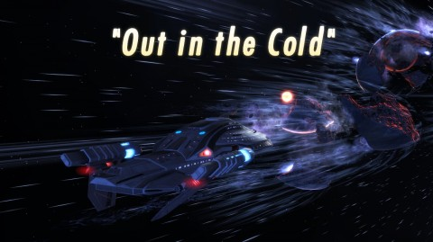
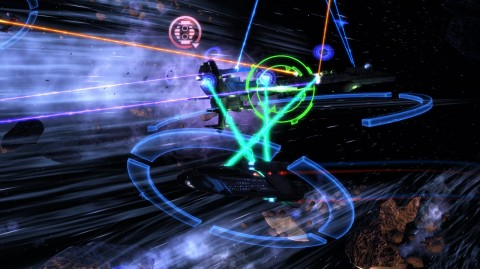
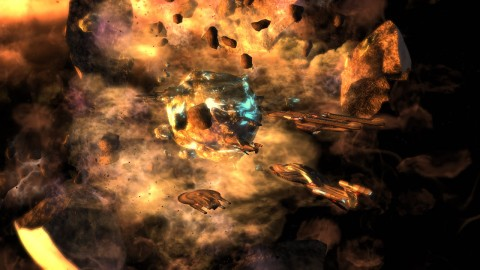
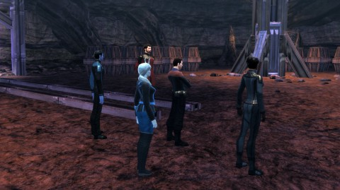
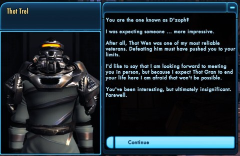

Back to: [West Karana](/posts/westkarana.md) > [2010](/posts/2010/westkarana.md) > [September](./westkarana.md)
# Star Trek Online: Out in the Cold (spoilers)

*Posted by Tipa on 2010-09-04 19:42:07*

In last week's episode, "[Cold Call](../../../index.php/2010/08/29/star-trek-online-cold-call-spoilers/)", we were introduced to the Deferans, a race that believes in balance in all things. They, for instance, see no reason to side with either the Klingon Empire or the Federation, and consider both allies against the Breen.

Searching for ancient Preserver technology, the Breen found evidence on the Deferan homeworld; and found as well, a non-violent, pliable civilization that they could exploit for their own, cold-hearted purposes.

While the Federation News Service (our STO fleet/guild) was setting up a foreign desk in the recently-liberated Deferan capital, beat reporters sent word that the Breen were in hot pursuit of some Deferan ships that had taken refuge in the tail of a comet.

We were first on the scene with the story. Ambassador Longasc's flagship Amgarrak headed the fleet response; Bryn and I followed in our Intrepid-class science ships, the USS Monterey and the USS Auryn. Captain Xerxes warped in with her escort, the USS Redoubtable, and Lieutenant Thomas with his first command, the Miranda-class Scorpius, followed closely behind.

We dropped out of warp at the last known source of the distress call.

> To all ships in range, this is the Deferi freighter Sabok! We are under attack and require immediate assistance! We have no weaponry aboard and our shields are failing! Anyone who can hear this, please help!

It's said in space, nobody can hear you scream. But everyone can hear a distress call. Two Deferi freighters were pinned down by the Breen, only the comet's tail protecting them from utter destruction. We headed in to save our newest allies.

It was a glorious fight, and the Breen seemed to have an endless supply of ships, each seeming larger than the other. The Amgarrak kept the attention of the capital ships as the Scorpius and the Redoubtable picked off the support craft. The Auryn and the Monterey were kept busy keeping the Amgarrak's shields up and the Breen weakened.

The skies were finally clear of Breen, if not of huge, speeding comet.

A second Deferi ship needed our aid.

> The is the Deferi ship Paktau!

We escaped from a Breen slaver attack and our antimatter containment unit and warp coils are non-functional. We need some replacement parts immediately! We are on the verge of a warp core breach! Is there any ship within range? Please help!

They need Warp Coils? How about some Seismic Stabilizers? Provisions? Entertainment Units? The industrial "Aid the Planet"-strength replicators that now are standard equipment on all Federation ships could make whatever was needed. We were in the area, and not even a handful of Breen capital ships could stop the FNS. If we could not defeat the Breen, perhaps we could at least tie up their industrial capacity for ship replacement.

One last ship, the Sobok, fled at the first sign of the Breen, and had perhaps taken refuge in the neighboring Zaria system. If we defeated the Breen there, we might well stop their slave trade forever. It was a chance we could not lose.

Turns out the Breen love their slave trade as much as they love their children -- perhaps more. The fights we saw dwarfed the other ones; a dozen capital ships all protected by frigates and fighter swarms attacked from all sides. I'd like to think my Photonic Fleet made the difference, but it was a team effort all the way.

Was it all for nothing? When the Breen were destroyed, we found the Sobok empty -- the crew taken to the Breen slave pens on the planet below. A transporter interdiction field prevented us from beaming the Deferans to safety but not, oddly, from beaming down ourselves.

The five captains, after a quick trip to the weapons lockers, met at the underground coordinates closest to the Deferi life signs.

The Deferi were imprisoned in force fields, packaged for easy sale and transport. We could not get near them, but tricorder readings suggested three control points deeper in the cave system.

We resignedly charged our weapons and went a'hunting, Breen-style.

The Breen cannot survive hot plasma. When we returned to the main cavern, though, the Deferi prisoners were gone -- the skeleton crew on the Sobok had beamed them up as soon as we'd dropped the shields.

The Breen, however, were still in the area; after a mocking call from a Breen commander in orbit, the now-disgraced Breen slaver and a squad of his best ice warriors came after us. If he killed us, his reputation could perhaps be restored. If he fell, as he did, well, his reputation would suddenly become somewhat less important.

---

Cryptic is doing an amazing job on these weekly missions. It is shocking how well they are received; there is simply nobody with any real complaints.

As one of the only MMOs that allow full level adjustment so that any group of players can match levels and do missions, STO is doing a stellar (heh) job of getting people logging in and into the latest content, no matter what their level. Naturally, being higher rank gives you more options, but we had fleetmates in everything from the basic starter ship to the most advanced ship in the game working together on the same mission, same task, and everyone could contribute.

That's the way it should be done, that it needs to be done. STO is finally reaching its potential.

## Comments!

**[Shuttler](http://www.yellowspandex.com)** writes: Great to know what these episodes are like.

I've just jumped back into STO after having a lifer account since launch and never using it!

Having lots of fun and it seems the starting missions have changed a little too

---

**[rowan](http://ihavetouchedthesky.blogspot.com/)** writes: Absolutely wonderful write-up. I totally agree on the level adjustment. I soloed both as Captain Starblanket, and Commander Locke, and the fights were well matched, hopefully I'll be on at a time when I can join in the fun next week.

---

**[Rob](http://www.lostaneighth.com)** writes: I have been sitting on a collector's edition for months now, waiting for the right time to cash in my free month. Today was that day. I have pretty much only finished the tutorial and spent a little time walking around the Earth station, but I am left wanting to play more, so thats good.

I adore getting to specialize my crew and ships. It may be a little to combat-centric for what many would want from a Star Trek MMO, but to me it feels like I am a kid getting to play with a giant toy box of Star Trek toys.

The screen shots in your posts are really fantastic.

---

**[Yeebo](http:/yfernbottom.blogspot.com/)** writes: Gah, christ as if I don't have enough MMO stuff on my plate. That sounds really entertaining :-)

---

**[STO: No One Left Out In The Cold &laquo; MMO Gamer Chick](http://mmogamerchick.wordpress.com/2010/09/06/sto-no-one-left-out-in-the-cold/)** writes: [...] usual, I’ll direct your attention towards our Chief Editor Tipa’s Federation report for a more detailed account of the mission, but I also echo her thoughts that STO may finally be reaching its potential. Not to mention what a [...]

---

**[Jomu](http://www.justonemoreunlock.blogspot.com)** writes: very cool write up :)
i hope to do something like this when Guild Wars 2 comes out

---

