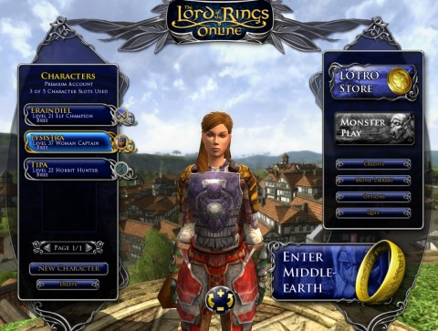

Back to: [West Karana](/posts/westkarana.md) > [2010](/posts/2010/westkarana.md) > [September](./westkarana.md)
# Lord of the Rings Online is F2P, for certain definitions of free

*Posted by Tipa on 2010-09-08 06:56:29*

Lord of the Rings Online launched as a free-to-play game today.

No, wait.

*The gates that had been shut beyond the memory of Man groaned open on hinges made of dwarven stone, mithril-inlaid runes pulsing a message nobody living could read.... BE FREE....*

No, no, no.

> In Evendim, did Lysistra, a Capitan of Men, foresee
A day of future memory when Eriador would be free
Not from Sauron's minions, not from Saruman's lies
Not from Archet's bandits, nor from the Shire's pies
Only freedom from quiet, freedom so bold,
freedom from mail delivery, thirty days old

Does that work? I don't think that really works. It's Lord of the Rings! It inspires bad poetry and people talking in rhyme and stuff.

Lord of the Rings relaunched as a free-to-play game yesterday for anyone who had ever subscribed, and Friday for everyone else. While parts of the game are free to play, and there is a path, as tedious as it may seem, to get to the edge of Moria without paying a penny, it would be a mistake to start in LotRO thinking Turbine won't ever earn your credit card number.

You WILL be paying, make no mistake. It would be more fair to think of LotRO as a game where you can try different races and classes to some arbitrary level -- let's say, 20 -- before you really have to start worrying about how much it will cost you. Well before that level, though, you'll have come up against the "unlock" button -- a hint at something that sounds like fun, and all you have to do is press unlock and spend some Turbine Points (which, through some error, were being given away for random actions... I earned 30 for logging in and getting on my horse).

I'd gotten bored with the LotRO quest grind when I was a subscriber, and even paying nothing wouldn't make me enjoy the endless killing of wildlife one bit more, but skirmishes -- they sounded cool. Skirmishes are instanced encounters sized for your group and aided by hirelings which you can customize to a large extent with Skirmish Marks you earn from successful completion. You can also choose to relive certain "classic" dungeons, all from the comfort of the skirmish window.

After going through the skirmish tutorial, which leads you through two sample skirmishes dealing with the retaking of Bree (this was given at the skirmish camp south of Bree; your mileage my vary), I was absolutely ready to continue on. The skirmish window had a nice variety of fun little encounters. I chose to defend Amon Sul from undead and....

PAYWALL. It had taken me approximately fifteen minutes to hit the edge of free content as a 37 Captain. Since I have bought the Moria expansion, that's open to me later on, but other than that, it's just boring killing grinding. The fun stuff, I'd pay for.

What the heck. Amon Sul needed defending, and my credit card is my shield. Card in hand, I went to the store to buy Turbine Points and unlock a few skirmishes and... was denied. The store just generated errors.

So, that ended my peek into LotRO F2P for that night, anyway.

I will definitely be checking back when their store is working. I want to play with the skirmishes. I even want to see Moria.

## Comments!

**[Anderson Hawkins](http://www.steelharmony.com)** writes: Hey Tipa, out of curiousity I know you emphasize that you'd eventually are encourage to spend money in the cash shop, but do you think you can have a good experience with the game beofre you hit the wall and feel the need to hit the store for goodies. I personally been thinking about trying LoTRO but wanted a second opinion from someone who has played before and now.

---

**[Tipa](https://chasingdings.com)** writes: I believe you can easily make level 20 before having to make a purchase. Note that the excellence of the starting areas is not really indicative of the quest grinding that becomes the bulk of play once out of the racial areas. 

That said, lots of people love the LotRO grind, and it's definitely worth checking out in any case. 

---

**[Green Armadillo](http://playervsdeveloper.blogspot.com)** writes: Your 30 TP came from new deeds, added in the patch, for reaching reputation milestones. Since you had already reached those milestones, you received the rewards automatically on login. Consider yourself fortunate in this regard - that system wasn't working properly for many of us, and Turbine's now having to try and fix it. 

Realistically, the thing that has changed is HOW you pay for access. Before, you had to pay for a monthly sub. Now, you have the alternate choice of paying to permanently unlock zones and other features instead.

---

**[Green Armadillo](http://playervsdeveloper.blogspot.com)** writes: P.S. RE time before purchase
The way they tweaked the prices in beta, you should be able to get to the late 20's or maybe even 30 before you have to pay. The price on the Lone Lands zone was lowered to 360 TP (will be further discounted by future sales), and there are over 600 TP to be had for completing deeds in the free content. I maintain that grinding all of these won't be fun, but you can get halfway there on low-hanging fruit (which are also awarding traits that you will want anyway). 

The thing that's odd about this model is that the two expansions are not optional due to the level cap. A player who buys the Lone Lands en route to level 65 will have unlocked 1-30 and 50-65. So really, you're trying to figure out what to do about 20 levels or so in the middle there.

---

**[Stabs](http://stabbedup.blogspot.com/)** writes: "my credit card is my shield" would make a wonderful motto. I wonder how you say it in Latin.

---

**[Stabs](http://stabbedup.blogspot.com/)** writes: Sorry, intended to reply to Tipa, not GA.

---

**[Yeebo](http://yfernbottom.blogspot.com/)** writes: I have yet to check out the new FtP service in LoTRO. My spare time is stretched pretty thin between EQ2X and DDO atm. I found skirmishes to be a lot of fun at first, but eventually pretty grindy. I think everyone in my KS got a good couple of weeks to month of so out of them. Neat little alternate story lines, and playing barbie with your soldiers is good fun.

---

**[LOTRO &#8211; Out of MMO Storage | Kill Ten Rats](http://www.killtenrats.com/2010/09/08/lotro-out-of-mmo-storage/)** writes: [...] However, I am back in it now that it has been re-born as a Free-to-Play (F2P) title.  Not because it is now playable without a cover charge as I have a lifetime account, but because it feels fresh.  It feels new, and in parts it feels like a different game.  One that is more caring of my time.  I like that.  There is so much to learn, but I think that many LOTRO posts will be coming in the future.  I saw a few blogger friends also in-game so hopefully they will speak on such things as well. (Oh look, during editing I see one has!) [...]

---

**[Makkaio](http://makkaio.com)** writes: I'll see you in LOTRO at some point, I suspect. I thought the free Turbine Points was comical as I kept earning 5 points every few minutes just for standing there. I logged into the game for a half hour to learn my UI again and was rewarded with about 75 in that half hour. Comical.

---

**[kaozz](http://www.ectmmo.com/)** writes: I've been looking forward to trying it out again. After seeing how some things really were limited in EQ2X I sort of worry about how this one will be. Thanks for the first hand peek!

---

**[Chris](http://gamebynight.com)** writes: Great article, but I'm a little confused. Granted, I haven't been following this as closely as I should have, but I thought anything you bought before the change you got to keep? So, if you bought the original game and Moria package, the quests included would remain open to you. That's not the case? I wonder if the same is true for lifetime subscribers.

---

**[Tipa](https://chasingdings.com)** writes: As far as I know, I have the Moria expansion available when I level up enough.

---

