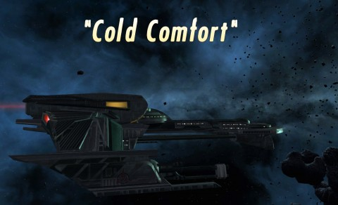
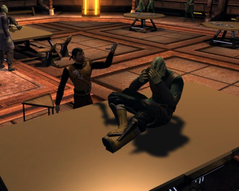
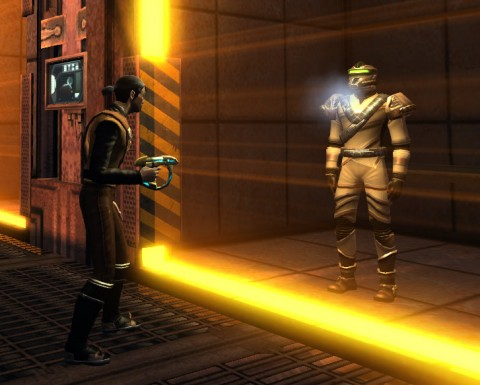

Back to: [West Karana](/posts/westkarana.md) > [2010](/posts/2010/westkarana.md) > [September](./westkarana.md)
# Star Trek Online: S2E3 Cold Comfort (spoilers)

*Posted by Tipa on 2010-09-11 18:14:07*

Lt. Commander Krontar commanding the IKS Van'tek, to the High Council: Qapla'! I, Krontar, report as commanded. I ask once again to be allowed honorable death by Mauk-to'Vor instead of this shameful sentence as a flat-headed victim of the augment virus. This more human appearance is a disgraceful punishment for the crime of allowing a human ship to leave the field of battle. Nevertheless, I obey.

The Van'tek arrived without incident in the Defera system. The cloak was operating perfectly; we were not detected. A Deferi patrol ship was found broadcasting a distress signal in the region. We scanned the area and found no Breen ships. We then approached the Deferi ship, decloaked, and hailed them.

The Deferi reported that they had been boarded by the Breen, who hadn't expected such a ship to be carrying several squadrons of warriors. The Breen were overwhelmed and some captured alive, but at great cost to the crew. They have asked that we transport medical supplies and personnel to their aid.

A true warrior awaits the judgement of the ancestors as to the worthiness of their death, but the Deferi are not warriors. I, Krontar, transported alone to the Deferi ship. Even in my infected state, I must show no fear, hesitation, or mercy.

The Deferi doctor was an incompetent! The first patient I saw was suffering from severe disruptor burns. Treating such wounds is known to every Klingon warrior. This patient will fight again. I ordered her to seek a more honorable death.

The second patient had regressed mentally to a childlike state, obsessively recounting facts from his youth. Nursery rhymes! Klingons teach their children the seven basic bat'leth attacks, here the rhymes are of toys, friends and ... the Preservers?

Chancellor, I did not understand why this creature would be talking of the Preservers in his childish state. I scanned and found a cortical implant responsible for his insanity. I was able to interfere with its functioning. Patient #2 will fight again.

The incompetent Deferi doctor allowed me to interrogate the Breen captives. Chancellor, why must you tie my hands? I'd have unmasked those creatures; let them suffer the heat of my disruptor; they would talk. I hear, though, and I obey. I did not kill these Breen.

After I arranged for him to be interrogated without the knowledge of his commander, a Breen medic admitted the attack and implantation on the Deferi vessel was a dishonorable attack on a civilian ship. He then asked for asylum for himself and several of his cohorts.

Chancellor, I urge you to reject this request. Traitors are the weight at the end of a string. You pull it toward you and it comes closer, let go and it swings as far the other way.

Lt. Commander Krontar out.

## Comments!

**[STO: Too Cold For Comfort &laquo; MMO Gamer Chick](http://mmogamerchick.wordpress.com/2010/09/13/sto-too-cold-for-comfort/)** writes: [...] expected. Several of my fleet members were online already, and I quickly jumped into a group with Tipa, all fired up and ready to go kick some Breen [...]

---

