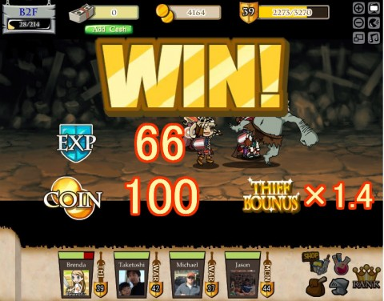

Back to: [West Karana](/posts/westkarana.md) > [2010](/posts/2010/westkarana.md) > [September](./westkarana.md)
# Treasure Abyss: I got eaten by a grue.

*Posted by Tipa on 2010-09-11 19:14:46*

Bandai Namco's co-operative dungeon crawling game [Treasure Abyss](http://apps.facebook.com/treasureabyss/) dropped a much-needed expansion on a treasure-starved world Wednesday; along with it came a lot of changes, major and minor. Treasure Abyss is, to rewind a little, is a (shudder) Facebook game. You form an adventuring party from you and your friends, and battle monsters in a variety of dungeons of increasing difficulty. I [wrote a little about it](../../../index.php/2010/08/31/treasure-abyss-not-your-ordinary-social-game/) a couple of weeks ago. Since then, it's been subject to continual balancing and has become a fair bit harder.

One side effect has made certain classes less desirable in a group. Wizards would take immediate aggro and die; thieves did overall poor dps and couldn't take a hit much better than the wizards. Monk agility somewhat made up for their lack of armor, but the tops in dps AND survivability was the warrior, and there was little reason to play another class.

The latest update adds a fourth dungeon, The Dragon's Nest. This is a ten floor dungeon, for level 20+ characters. It's mistakenly shown to take 10 candle power per move; it actually only takes three, the same as all the other dungeons. (Candle power is the slowly-rechargeable resource that limits the number of actions you can take before resting). Where previously adventuring in the dark was not only possible but preferred, any movement in the dark now brings you face to face with shadow copies of your adventuring party, who hit overwhelmingly harder than you do. It's a nice nod to the old Zork games, where blundering in the darkness would lead you right into the mysterious but slavering jaws of a Grue.

Monks can now craft the previously-uncraftable Cat Claws with claws found on the lower floors of the new dungeon. They'll probably prefer, though, to craft the new Bear Claws instead. A new uncraftable weapon, the Dragon Claws, is in place to tantalize us with a future patch. It requires two dragon claws to craft, and ... despite its name ... there is no dragon in Dragon's Nest.

Warriors get a new Giant Sword (which will require substantial farming to craft), but the Ice Sword and Thunder Swords can still not be made. Neither can the Ice Staff or Thunder Staff for wizards, putting them at an even more severe disadvantage in a party. Neither wizards nor thieves received any additional craftable weapons. The material cost for many higher level weapons, though, has been greatly increased.

Thieves have gained a new ability -- stealing. Thieves have a chance to have the party gain an additional 40% more coin from defeated monsters; suddenly, thieves have a role in the group. Rumors have it that wizards will get the ability to nuke more than one monster at a time. Right now, both wizards and thieves sit at the bottom of the dps charts in parties. (But at least thieves can steal!)

The party leader (you) will always gain more aggro than any other party member, even if all the other party members are warriors and you are some other class which does hardly any damage. This more or less requires the player -- at this time -- to change to the warrior class if they expect to survive to the bottom of Dragon's Nest.

To help with the survivability somewhat, the slot machine chests (in the Dragon's Nest, anyway) award 25%-50% health potions if you can win with 7-7-7. The chests can now also win you the rare resource Divine Iron (three bells, if I remember correctly, and not every time). 100% health potions and full candle recharges may be bought in the cash shop. You will need a fair supply of candles and some luck with health potions to make it through the entire dungeon, though once you learn the layout, you can get to the "good" floors -- 7-10 -- fairly quickly.

The level cap has been raised at least to 44 (the highest level of any of my neighbors). Experience held unused when adventuring while at the previous level cap of 30 will be applied after the first battle. I leveled immediately to 37.

Treasure Abyss clearly has a ways to go before it's fully balanced, but even in its current state it's playable and fun. I'm still addicted... but I really DID expect a dragon in Dragon's Nest!
## Comments!

**Lisana** writes: Nice, I guess I haven't played it in a few days. I'm not high enough yet for the new dungeon, but it does give me something to look forward to. Definitely a fun diversion from the standard FaceBook game.

---

**[Capn John](http://capnjohnsblog.blogspot.com/)** writes: The suggested level for the fourth Dungeon is 20+ but I found that even with a party of 4 30+ Adventurers (including myself) it's still a pretty tough slog, and you do not want to take a step now in any Dungeon (from what I can see) with your Candle Power at 3 or less or it's pretty much an automatic death at the hands of the Shadow Squad. Other than that and the grind for Mats (like Divine Iron) needed to craft the top gear, I'm still enjoying this one.

---

