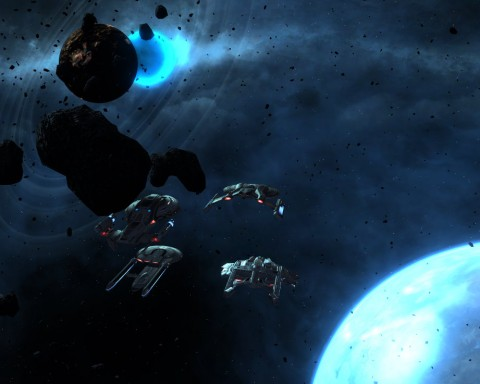

Back to: [West Karana](/posts/westkarana.md) > [2010](/posts/2010/westkarana.md) > [September](./westkarana.md)
# Star Trek Online: Cold Case (spoilers)

*Posted by Tipa on 2010-09-21 07:26:43*

I've just been informed that Episode 5 of the Breen arc will be called "Cold Cream". You heard it here first, folks. The Breen take off their masks and it is finally shown, for the very first time, that the Breen hide their faces because they have very dry skin.

This episode is very similar to the Star Trek: The Next Generation episode "[The Chase](http://en.wikipedia.org/wiki/The_Chase_(Star_Trek:_The_Next_Generation))", where Picard & crew went looking for genetic markers throughout known space in order to find and decode a message from an enigmatic race that were the progenitors of humanoid life throughout the galaxy, in this one, the good guys race the Breen to discover a message left behind by the Preservers, another enigmatic race responsible for shepherding the cultural evolution of younger races.

We were called back to Defera to investigate the ruins the Breen were so interested in, back at Episode 1, "Cold Sores". At that time, we'd managed to uncover traces of a Preserver message, but this time, the ancient device was fully activated and even came with explicit instructions. Which was darn kind of them. We were hoping the other pieces of this starmap puzzle would be as easy to figure out, and they were. No matter how complicated or obscure the key to each puzzle might be, my science officer would be able to figure it out instantly. Even if her explanations really didn't make any sense at all....

We'd no sooner scanned the holographic starmap fragment than the Breen came warping in from wherever it is they come from. Seriously. Why are they allowed to leave their home planet? We resigned ourselves to battle once again, returned to orbit and killed them all. We'd learned last week that there was a significant Breen resistance building in the Breen navy, and all I could think as I sent yet another Breen capital ship to its doom was, how many potential allies have I just disintegrated?

But there is no reasoning with either the Breen, the Federation or my own crew. We serve by killing. The Federation has the blood of innocents on its hands. These are the days I want to tell the helmsman to set course for the galactic rim, find out who's on the other side, see if they have found some answers.

The starmap fragment from Defera indicated the next bit could be found in the S'hinga system. Off we went. A trail of navigational beacons led us straight to a gaseous anomaly, which was darn convenient, if you ask me. The gas in the anomaly seemed artificial, but that didn't slow my science team down.

> "The Preservers were known to encode data in the world around them, so I superimposed the molecular structure of the sample onto the orbital pattern of the system."

Wow, nice job, science team. I know that's the first thing I would have thought of, even though it makes absolutely no sense whatsoever. Nice to see [Treknobabble](http://en.wikipedia.org/wiki/Treknobabble) is alive and well. Just to keep things straight, the [Preservers](http://memory-alpha.org/wiki/Preservers) were the people responsible for keeping the world of the transplanted Native Americans asteroid-free, and the [Progenitors](http://www.statemaster.com/encyclopedia/Progenitors) were the ancestors of humanoid life in the galaxy, right? Just keeping things straight here.

Anyway, we were led to a hollow moon -- OMG THAT'S NOT A MOON, THAT'S A -- that's another message pointing toward an asteroid, which had a holoprojector buried under some rubble that showed us another bit of the puzzle. The mission by now was getting exceptionally silly. An explored system that has a line of navigational beacons pointed straight toward a clearly artificial anomaly, a hollow moon, and sophisticated ancient technology buried beneath some rubble, and it had stayed hidden for a million years?

Balderdash!

The Breen had been there before us, so we had to kill them, because when someone is investigating the same things you are investigating, it is important to kill them. They weren't interested in fighting us, so we sped up to catch them, opened fire, and slaughtered them all.

Go go good guys!

Off to the frozen world of Raveh II. Would this be a Breen base? Would we see them without their cryosuits in the cold air of this frozen planet?

We beamed down to Raveh II and discovered several Breen science teams looking for the amazingly well hidden Preserver cache (hint: That large, artificial looking hill that doesn't match anything around it). We decided to help the Breen science teams by killing them all. After which, we were free to melt the thin ice sheet covering the entrance to the Preserver archives.

We stormed in and used the ancient machinery to put all the starmap fragments together once again. And in came the Breen, who took the information and fled! They left behind an officer they didn't much care for to be killed by us. How well they know our bloodlust!

---

Cryptic started out strong with the first two episodes of their Breen arc. The third episode was more or less a sleeper, but it did involve no killing of innocents, which was a point in its favor. This fourth episode was a linear slog that involved very little thought, but did have the Federation take the upper hand by starting hostilities against Breen ships uninterested in fighting -- a clear violation of the Federation's guiding principles. 

I was very disappointed in that. One of my initial objections to the very idea of a Star Trek MMO was the danger that the vast diversity of alien races and cultures would become little more than wrinkly-foreheaded target practice, which has in fact become the case.

We hunted down the Breen and killed them as they tried to run. [We have met the enemy and he is us](http://www.igopogo.com/we_have_met.htm).

## Comments!

**Longasc** writes: *Does the Terran Empire salute*

Captain D'zoph, I can only wonder that you question that our mission was in total concordance with Federation law and ethics.

Maybe bombarding the Breen home planet will finally bring this sector the much needed peace. But let us secure the secrets of the Preservers for man... erm the Federation before.

---

**Guinadrodd** writes: While I liked the content and the mission requirements with the latest mission, I have to agree that the mission story was a little weak. A few times during the play through I was thinking to myself "Why am I doing this?"

My biggest beef is that I returned to the same platform I fought over in Episode 1. Why was I suddenly able to use it? There was no plausible reason given.

I like the episodes, just wish the story was a bit more descriptive of the reason why I am taking a certain course of action. I'm fine with blowing up "bad guys" but need a good reason.

---

**[Dominium B](http://www.wowdistrict.blogspot.com)** writes: Aww you spoiled it all. Lol. Anyway thanks for the good info.

---

**[Tipa](https://chasingdings.com)** writes: Well, I DID put spoilers in the title :P

---

