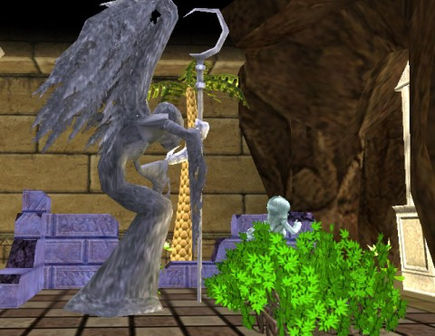
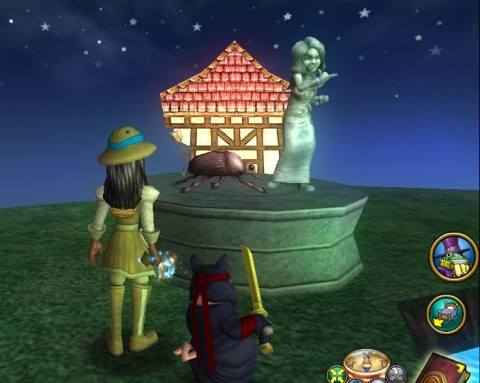

Back to: [West Karana](/posts/westkarana.md) > [2010](/posts/2010/westkarana.md) > [September](./westkarana.md)
# Wizard101: Fun with the Selena Gomez statue

*Posted by Tipa on 2010-09-23 07:24:46*

I know this Selena Gomez promotion KingsIsle is doing isn't MEANT for me. But we adult W101 players get pulled in anyway, because, hey, we want to play Celestia, and if playing Celestia TODAY means we have to do it while KI lends itself to the Disney megacorp publicity machine, then I guess I'll play.

So my characters, having battled the thousands of other players to FINALLY get their Tower Captains last night, managed to get their Selena Gomez fan kit -- statue and poster -- and had to come up with a place to put the things. And that became a little contest.

Above is Allison's humble entry; Selena Gomez as Lot's wife. God's wra(i)th is turned upon the poor woman because she turned back to look upon God's destruction of Sodom. Disobeying Lot's pleas, she stands now as a salty monument toward keeping the promises you make to God.

Sodom -> Sodium -> Sodium Chloride -> Salt.

Marissa set up Selena running from a bug. I'm not sure what she was going for, here. I'm going to have to award the No Prize to Allison, the clear winner. Grats, Allison! As your No Prize, you get this hilarious Wizard101 Facebook Ad!

I thought KI had turned the corner on deceptive W101 Facebook ads, and then I get this one on my sidebar. I clicked on it KNOWING it would turn out to be a w101 ad, even though nothing in the ad suggests it. And it was.

"Become a legend in your own world!" Well, the game lore has you being stolen from your own world by Ambrose and his cronies, so if by "legend" the game means "the legend of a child who was stolen from their family and sent into battle by a coven of warlocks in a distant land", then yes. If your name isn't Selena Gomez, then you are trapped and can never return home. If you have to complete your CD, you can return.

"Now for FREE!" Wizard101 is hardly free. You get a handful of zones for free. It's no more accurate to say W101 is free than to say that of any game that has a free trial. 

"Warning -- this game is highly addictive!" I once bought a book, "Infernal Devices" by K. W. Jeter, one of the founders of the Steampunk movement. In its faux Victorian style, it opened with a plea to the reader to close the book and set it aside if they didn't want to be drawn into some sort of plot that would rock their world or something. So I obediently set it aside. A couple of years later, I picked it up again, read that same warning, and set it aside AGAIN. About a year after that, I resolved to actually skip the warning and read the book. I enjoyed it!

And, yes, I really did do that.

So anyway, when I read that a game is highly addictive, so addictive that I am being WARNED against playing, well.... Why would I DARE click on that link! Only to see Ambrose staring at me through the foggy mist, snaring me and pulling me into dangers I cannot understand but must nonetheless fight....

So, what'd you do with YOUR Selena Gomez statue?

## Comments!

**[Sierra Starsong](http://www.modernautomagic.com)** writes: These are great! I hadn't thought of doing anything interesting with it, my Selena statue's just standing in front of my house guarded by a pair of Ice Colossus pets (failed Ice Hound hybrid attempts). Maybe they froze her for trespassing?

---

**[Heather Raven](http://thewanderingconjurer.blogspot.com/)** writes: Hehe! I love those ideas! 
I just stuck mine in the backstage area of my theatre.

---

**[Yeebo](http://yfernbottom.blogspot.com/)** writes: I am still using the free apartment. Maybe I could have her weeping over the sarcophagus at the foot of my bed. Love the pillar of salt idea :-)

---

**[Wizard101: Welcome to Celestia! - West Karana](https://chasingdings.com/index.php/2010/10/09/wizard101-welcome-to-celestia/)** writes: [...] with Selena Gomez once Celestia goes live, so if you haven’t gotten your Gomez statue — which has over a hundred and one uses — best hold your breath, dive deep, and help her get back to recording her new hit CD! And [...]

---

**Macaroni Man** writes: I moved my krokotopia counter thing in front of my rootbeer kegs and put some mugs on it, so it looked like a bar. Then I made Selena Gomez the bartender by putting her behind it!

---

**[Tipa](https://chasingdings.com)** writes: Oooh! Do you have a screenshot?

---

