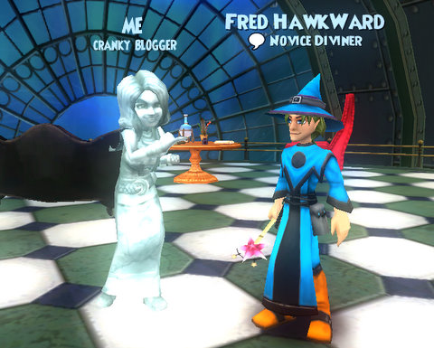

Back to: [West Karana](/posts/westkarana.md) > [2010](/posts/2010/westkarana.md) > [September](./westkarana.md)
# Wizard101: A Chat with KI VP of Marketing, Fred Howard

*Posted by Tipa on 2010-09-23 21:31:27*

Sure, Wizard101 is free... for certain values of free. I guess I'm just going to have to fall back on definitions, here.

I was thrilled to have the opportunity to talk to KingsIsle's VP of Marketing, Fred Howard, today! Thrilled and a little surprised. What about yesterday's Wizard101 post, I wondered, could have caught his attention? The gentle fun being poked at the humorously irrelevant Facebook sidebar ads?

"Those were made by a third party specializing in ads on social media," said Mr. Howard. (I'm paraphrasing here from my notes). "There was an error in the imagery, and the third party changed the text to drive players to the Wizard101 site. The ads with the incorrect imagery should be ceasing, though some may still pop up for awhile."

I had noticed one of the newer W101 ads did have some concept art from the actual game (the smallest Wizard City castle, if I remember right). It all makes sense, though -- a company specializing in social media advertising would say whatever they needed to in order to get people to click that icon. That's how they get paid.

I'd also written yesterday that Wizard101 is hardly free. Well, you know, I guess it depends what you want to do. If you want to go through all the worlds and do the quests and be part of the story -- the things I'm interested in -- then no, it's not free. But that doesn't mean there isn't plenty for free players to do.

"Wizard101 is free for what a lot of people do," said Mr. Howard. "The pet games, the dueling, the minigames which are as good or better than those on other sites, are all free." He went on to note that there were a ton of people who never paid a dime to KingsIsle yet happily spent lots of time playing with the pets and the minigames.

I guess the best way to think of the game, then, is as two games, really. You have the free one, with the pet games and minigames and the dueling, and then you have the pay to play one, with the story and the leveling. Other pay to play games with free zones, like Warhammer Online and Age of Conan, do not have a separate minigame areas.

My definition of a free game is one where all the content is open to free players, but they would be given the opportunity to speed their progression or buy useful items for cash. This is the approach taken by Turbine's F2P games, Lord of the Rings Online and Dungeons & Dragons Online, by SOE with EverQuest II Extended, and by SOE's Free Realms before they changed their model to be more similar to W101's (game is free to level 5).

The word "free" is, really, meaningless in an advertising context, since nobody REALLY thinks a company will actually give away anything without expecting more back. Mr. Howard pointed out that KingsIsle IS a "for profit" business, after all. Heck, I have no problem with that. I've spent LOTS of money on Wizard101 stuff, and gladly! But then, I never consider any commercial game "free".

The Selena Gomez Promotion has been a huge success for KingsIsle. Adults may not want chocolate in their peanut butter, but apparently, the target tween audience DOES want to see branded merch everywhere they turn. Backpacks, lunchboxes, TV, their video games -- they are happiest knowing that they are never far from the day's hottest kid-focused intellectual property.

Ah, I don't want to talk about Selena any more. It's clear I'm not a fan. I don't even have cable! But I did have to admit that I loved getting a peak at Celestia, and if Gomez' new CD promotion got me a look at it, then I guess I have to take part.

Done that darn quest four times now.... danced with the crabs so often, I'm growing a shell.

On to happier topics, I asked if wizards would get a training point reset so that they could invest extra points into the astral magics. Mr. Howard urged me to think of the new schools (sun, moon, and stars) as more of a "third school" of magic. We'll be getting sufficient training points on the way from level 50 to 60 to get our astral spells; and these training points COULD be spent on the traditional magics (but why would you want to?)

Celestia will be out somewhere between "very soon" and "before the Halloween content re-opens", which should give us an idea of when we can expect to see it. Celestia should keep us busy for awhile, and we should be looking forward to a big chunk of content in the new year that will have something for everyone, no matter their level. Probably not a new world, but I guess we'll find out more after Celestia arrives.

The folks at KI are already working on the actual next world to pop up on the Spiral (I suggested a "field animal" world, with mice and rats and bees and stuff, or maybe whatever world the bird NPCs like Mr. Lincoln come from, since the long-expected Celestia turned out to be a little wet for the kind of birds that fly.) Since we'd had hints in the game lore about Dragonspyre, Grizzleheim and Celestia before they were announced, I wondered if there were any similar hints in current game lore about the NEXT world! Who knows?

He closed by saying he appreciated the 'instructive feedback' KingsIsle gets from the Wizard101 community and urged all Wizard101 players to [vote for Wizard101](https://www.wizard101.com/game/gdcoaward) as the Game Developer's Choice "Audience Award" for this year's Game Developer's Conference. If W101 wins, everyone gets a really rare Storm Bat. Well, a suddenly not really rare Storm Bat :) But it is pretty cool. Er, sparky.

## Comments!

**[Tesh](http://tishtoshtesh.wordpress.com)** writes: I see it as "free to play" inasmuch as you don't have to pay a subscription, at least if you get involved a certain way. That's the funny middle ground between an item shop game and a subscription game; the Guild Wars model. W101 has a similar setup with content Passes, and while I pay to gain access, that's a singular fee, not a recurring charge for time.

That definition of "free to play" is one I happily spend money on.

---

