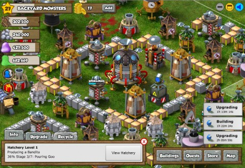
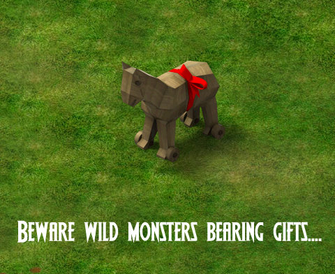

Back to: [West Karana](/posts/westkarana.md) > [2010](/posts/2010/westkarana.md) > [September](./westkarana.md)
# Social Game Review: Backyard Monsters

*Posted by Tipa on 2010-09-25 00:41:18*

I figured when I finally got the chance to bomb my neighbor's yard from orbit, that that would be the turning point. But, I guess not. Apparently twigs just don't do that much damage. I have a plan. Next time: I drop pebbles. Right onto the Tesla coil.

Bzzzzzzt, indeed.

[Backyard Monsters](http://www.facebook.com/apps/application.php?id=342684208824), a whimsical tower defense game from Desktop Tower Defense creators [Casual Collective](http://www.casualcollective.com/), is about as cruel with its goo-formed monsters as any sadistic game of Lemmings. You can zap them, shoot them, bomb them, mine them, shoot them, trick them...

You'll start in Backyard Monsters by hiring a worker (little fuzzy balls of blue lint) who will build you a Town Hall, the center of your defense. The Town Hall distributes resources to the workers with which they will build your defenses. But first they will need to build some resource harvesters for you -- twig snappers, pebble polishers, goo factories and putty squishers. You'll need some storage silos to stash the extra resources, guns, cannons, mines and walls to protect all of the above, and shinies from mushrooms. Shinies are the cash currency in the game; spending shinies will let you complete tasks very much faster (or even immediately), but it's not required to play the game. (And, as mentioned before, you can get some for free by picking mushrooms).

Wild monsters will occasionally decide to invade your yard. You can't adjust your defenses while under attack, but you do get a warning. The real danger, though, is from other players. They'll fling monsters of their own creation into your yard to destroy your base and steal your resources. It's a lot faster to steal someone else's resources than to harvest your own, after all. You'll get an alert when you've been attacked giving the villain's name so you can take immediate and overwhelming revenge. I've bee trading attacks and insults with a neighbor of mine for days.

Breeding monsters of your own, looking over other players' yards and devising attack and defense strategies form the true heart of Backyard Monsters. You can even lure wild monsters to your yard to see how your defenses hold up in a given attack to tune your defenses before another player does it for you.

You don't need friends to play the game, but they can be nice to have in a pinch. They can send you random bags of resources once a day, and come by and speed up your unit construction and upgrades. You can also attempt to trash their yard, but, sheesh, what kind of friend are you?

Almost everything you do -- complete a quest, build or upgrade a building, fend off an attack, attack someone else, unlock a new monster, etc -- brings with it an urge to spam your friends with your awesome achievement, but there's no reason to do so (unless you really want them to know!) Unlike games such as My Empire or City of Wonder, you don't need to have friends come click on your buildings so that you can move forward.

Backyard Monsters is a colorful, whimsical, and altogether fun entry in the tower defense genre, and I highly recommend it. Nonetheless, it really needs a way to replay other players' attacks on your yard. And the wild monster AI needs some serious work -- the entirely predictable manner in which they attack your yard in no way will prepare you for the disaster when an actual player decides to fling an army in. Also, as you get higher in level, a player's ability to defend vastly outweighs their ability to attack, though later in the game, advanced monsters (and aerial bombardment) can even the odds slightly. Still, any half-decent defense has no trouble keeping vast numbers of monsters away from strategic objectives with little danger at my current level of 27.

Genre: Tower Defense
Spam Level: Low
Friend Requirement: Low
Expense: Low
Overall Rating (1-10): 8

## Comments!

**[MMORPG Info &raquo; Monster Revival](http://www.mmorpg-info.org/guides/backyard-monsters/monster-revival/)** writes: [...] me take a further look. If you haven’t tried this game yet, you should look at Tipa’s Social Game Review which gives a great introduction to the [...]

---

