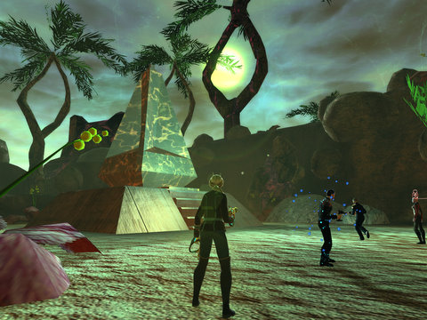
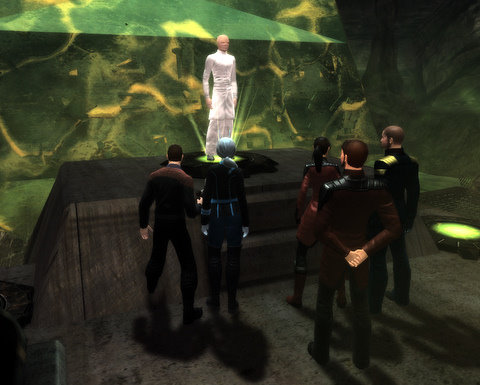

Back to: [West Karana](/posts/westkarana.md) > [2010](/posts/2010/westkarana.md) > [September](./westkarana.md)
# Star Trek Online s2e5: Cold Storage (spoilers)

*Posted by Tipa on 2010-09-25 17:28:08*

> I could while away the watches, Berating Ensign Hodges
But that would cause a scene
Oh I'd be the pride of Starfleet -- Among captains, I'd be elite
If I only had a Breen....

Oh, I could tell you why we ejected the warp cores,
We wanted an extra week on Risa's sunny shores
And so we beamed straight down for more

I might find at my court martial, that I will serve a partial
sentence on Bairus III
But all would be forgiven, the high life I'd be livin'
if I only had a Breen....

Um, sorry. Back to business. This week, Cryptic ends their five episode Breen arc with Cold Storage. In episode 1, the Breen invaded the Defera system in order to find traces of Preserver technology. In Episode 2, the Breen decided to stick around and enslave some Defera for fun and profit. Episode 3 uncovered a Breen resistance, opposed to the dishonorable actions of the Breen leadership. Episode 4 had the Federation and the Breen compete to complete a map and key to an archive of ancient Preserver knowledge. In episode 5, we follow that map to the end. And what we find there.... you'll have to read after the jump.

Vice Admiral D'zoph in command of the USS Monterey, in patrol around Defera, reporting to all subscribers to the FNS War News Service; welcome!

It's a tense situation around Defera; the Federation and the Klingons have set aside the war for awhile to compete for the favor of the Deferi and keep them safe from the depredations of the cryomorphic, enviro-suited Breen. All three factions have been following clues laid down millions -- maybe billions -- of years ago by the mysterious Preservers, the shepherds of humanoid life in the galaxy and the truth behind a hundred thousand legends of mysterious creators.

We are following an ancient star map to a small system on the fringe of civilization, in order to uncover the Preserver Archive, a vault of knowledge from the beginning of life itself.

One problem: the Breen have gotten there before us. Several Breen fleets orbit above the planet; reporters from the Federation News Service -- Vice Admirals Longasc, Thumupp, Thomas, T'Andromeda and your humble correspondent among them -- raised shields and joined battle. It almost appeared that the Breen were fighting among themselves. We didn't know which side to aid, so we destroyed them all.

Your tax dollars at work, people.

Yes, I understand that phrase doesn't make any sense. Ask your great grandparents, or you can access the FNS Archives and read all about "taxes". And then you can thank your shell-mother or Holy Ancestors or your Forest Brothers that you were born into this age and not the barbaric ones in our past.

Why this constant returning to the 20th Century by more famous captains than your correspondent was so attractive, I will never understand.

The planet of the Preserver archives is almost achingly beautiful. If some Preserver hologram had popped up and told me that this world was their gift to the modern races, I would believe it, and I would be thankful. Only duty would ever compel me to leave it, and if I did, I would (and will) return. The only fly in the amber were the Breen.

It must be difficult seeing anything in those masks, because they walked right by a Preserver power source, which we managed to re-tune to map a long series of underground passageways, that met the entrance at a strange, pulsing obelisk, that the Breen had also managed to miss.

We were forced to fight them anyway, though I wonder if we'd just stood still, they'd just have passed right by, blind as they are.

We fought our way through a crowd of Breen who turned out to be stuck at a series of three consoles that would unlock the Archives. Each emitted a tone; my science officer helpfully reminded me that Preserver technology was based on sound, which was surprising, since we'd seen no indication of that before. Good on her, though. There were six possible ways to activate the three consoles, but this was apparently beyond the ability of the Breen to manage. With a hint from my omniscient science officer that activating the consoles so that the sounds would sing in ascending order might activate it, we managed it first try.

The Breen could take lessons from the Pak'led in appearing competent.

The activated consoles summoned a strange, tall creature dressed in white. This being identified itself as a Preserver, the progenitor of all humanoid races in the galaxy, lain to sleep these hundred million years as their children grew and evolved to take their place, finally, as hundred thousand civilizations united in peace.

What a disappointment we must be!

The treasures of the Preservers were all their knowledge, and specifically their art of genetic manipulation. The Breen admiral who had been shadowing us all this time beamed in just then, screaming that the Breen hadn't gone through all this effort (ie, following us around) just to uncover a LIBRARY! He ordered the whole complex destroyed.

So we shot him.

Because he was violent, but mostly because he was stupid. What the heck was he expecting? A library filled with all the knowledge of the ancients is EXACTLY what you want!

(Careful readers may note that the obelisk entrance to the underground complex strongly resembles [the Preserver asteroid deflection device](http://memory-alpha.org/wiki/The_Paradise_Syndrome_(episode)) found by Admiral Kirk on the planet Amerind. This suggests the Progenitors and the Preservers are the same species, which brings into question if there was a second group of Preservers still guiding the races of the galaxy instead of being sealed in the Archive).

We signaled a Deferi science team to start the long process of learning from the now re-awakened Preservers and cataloging all that ancient knowledge, and we returned to our ships.

The last we'll see of the Breen? Not on the USS Monterey. One of the Breen resistance fighters asked for a place on my crew. In the interests of interstellar harmony, I made room.

Tomorrow, I'm going to have the temperature in Cargo Bay 3 lowered to Breen homeworld normal. And then I'm going to invite Ensign Sar to it, and order him to remove his cryosuit. We Andorians are no strangers to the cold. It might even be fun.

## Comments!

**[Blue Kae](http://www.bluekae.com)** writes: Is there going to be a NSFW supplemental log?

---

**[STO: Keeping Things Warm In Cold Storage &laquo; MMO Gamer Chick](http://mmogamerchick.wordpress.com/2010/09/27/sto-keeping-things-warm-in-cold-storage/)** writes: [...] News Service correspondents — Longasc, Thomas, Thumupp and Tipa (who has written a very comprehensive account of the mission this week as [...]

---

