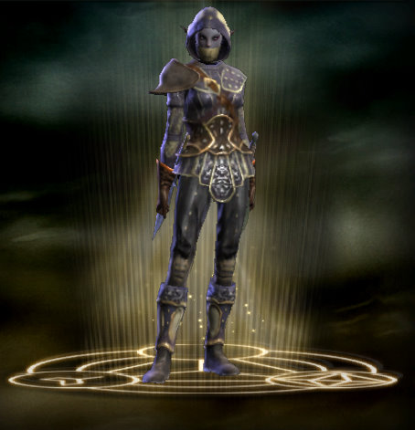
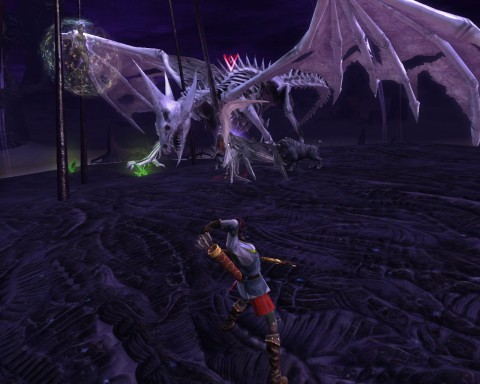

Back to: [West Karana](/posts/westkarana.md) > [2011](/posts/2011/westkarana.md) > [April](./westkarana.md)
# Rift vs Sliced Bread: A one month retrospective.

*Posted by Tipa on 2011-04-14 07:22:22*

[caption id="attachment\_6336" align="aligncenter" width="480" caption="Harlan's Vista"][/caption]

Rift's "Droughtlands" is the kind of land only a wily coyote could love, filled with dead-end canyons and high, high mesas. Harlan's Vista rises from a sticky sea of tar and rifts. On the very top is an ancient wardstone. I was doing quests around the Vista and noticed that the wardstone -- far above me -- was taken by the Guardians. As a good Defiant, once I'd finished my tasks on the ground, I scouted the twisty, mobby path up, found the wardstone and got an achievement! Yay! A picture was duly taken of this momentous moment and sent out through Twitter, where it was ignored by everyone. Some followers may have unfollowed me at that time.

The wardstone was guarded by a single Guardian NPC. I killed the NPC, destroyed the wardstone, and when it popped back up in a minute as a neutral wardstone, I claimed it for the Defiants. A low level Guardian NPC duly popped out to guard the wardstone as ineffectually as its Guardian counterpart. But it ALSO triggered a local public quest, "Never Say Nether", which promised to fortify the Defiant position on Harlan's Vista if I gathered twelve bits of nether energy from the base of the mesa. A helpful teleport circle would give me quick access to the base without having to fight my way up and down.

No instructions on where the energy was or how to collect it. After bumbling around for a bit, I figured out that I was supposed to walk into one of the wispy balls of light in the tar pits, which would turn me into a wisp that was non-aggro to all the shadow critters and other NPCs, then take the teleport circle back to the Vista, walk into the wardstone to deposit the energy. Repeat twelve times. After a few rounds of this, another Defiant started helping, and together we filled the wardstone up. The Defiant outpost then respawned with more NPCs, some barricades and a special Rare Planar Goods vendor.

This is Rift at its strongest, when it departs from the status quo and sends a little bundle of fun your way. There were a bunch of quests for that same area, but I don't remember any of them (I know I had to kill stuff). But that "Never say Nether" one -- that stuck with me.

[caption id="attachment\_6337" align="aligncenter" width="454" caption="Dina the Rogue"][/caption]

More than a month in, and I still haven't hit max level. I just haven't had as much time to play as I'd have liked. I'm a level 47 rogue, and have done all the normal dungeon instances except Realm of the Fae (newbie Guardian instance) and Charmer's Caldera. I did Abyssal Precipice last night for the first time, even though I was a level or two too low and entirely unprepared. That got me my first couple bits of gear I'll need (including a dagger with the necessary HIT stat) when I hit 50 to start on the Expert T1 dungeons, which prepare you for the Expert T2 dungeons, which prepare you for raids.

I was lucky to get that group. I am a slow leveler. A month to max level IS slow in Rift. I am being lapped in the guild by peoples alts. My guild has zoomed past me and have been in T1 Experts for awhile. In the midlevel zones in which I adventure, it's hard to find enough people in the same area to take down the persistent elite rifts. You can't do those with just two or three people and there never seems to be a critical mass unless there's a full on invasion, which focuses players and allows a raid capable of clearing major rifts to form. And THEN everything swims along nicely.

When I started my character, I leveled her balanced as both bard and ranger. When I got into my twenties, I shunted the bard into its own spec and moved the ranger into a secondary soloing spec. I figured out the macro system in the thirties and was able to successfully meld ranged and melee abilities so that they would trigger with the same key presses depending on the range to the mob, basically turning the now ranger/assassin into a one-key ability spamming machine. (One key for the spam combo builders and reaction abilities, the others a wide range of situational special moves and finishers).

I decided a couple days ago to come up with a pure melee/stealth build. I spent a few hours in the ZAM Soul Builder, read through the forums for advice, and came up with a pretty decent assassin/bladedancer/riftstalker build that combines devastating damage with some self-heals and good defense.

This would have been three entirely separate and distinct classes in EverQuest II -- a troubadour, a ranger and a swashbuckler would be the closest analogues. World of Warcraft doesn't even have a support rogue class like the bard. It really seems like I have three different characters in my back pocket when looking for dungeon groups.

I joined the Abyssal Precipice group last night in my melee dps spec (my roles are: bard, melee dps, ranged dps, and this is how I advertise). Seeing my relatively low level, a higher level bard in the group suggested I take the bard slot and he would shift to dps. We both shifted specs and breezed through the dungeon in our new roles.

This, again, is Rift at its strongest. It's not quite yet to the level of "bring the player, not the class", but it's closer than many games.

[caption id="attachment\_6338" align="aligncenter" width="480" caption="A River of Souls event rift"][/caption]

Dynamic events and the soul mechanic are Rift's bread and butter. There's room for improvement in the other areas.

Dungeons: the dungeons are fun, yes, but are tuned for such a narrow level range that most dungeons you can run only a couple of times before they just have nothing for you any more. Since a player even a level too high can breeze through a dungeon and get no xp from anything except the reward for finishing the instance quest, it is difficult to effectively build groups the further along you get. I've gone along on lower level dungeon runs just to see the places again, but the game did nothing to reward me for that.

EverQuest II started, a couple expansions ago, tuning the instanced dungeons to the levels of the players. They ALSO have a mechanic that lets players temporarily drop their level to the level of another player in the group, and they will get xp and other rewards commensurate with this level. Doing a lower level instance dungeon in EQ2 in this way still gives players rewards for helping lower level players out. I really miss this in Rift.

If all I did in Rift were the rifts themselves and dungeons, I'd have no complaints. But where it seemed in beta and when I was lower level that I could get through the game just via rifts and dungeons, that's evaporated as the player base spreads out. I had to turn back to questing as my main method of gathering experience.

It's just the same old, same old. Collect quests at a quest hub. Follow the map markings and click on the sparklies or kill what it tells you to kill. Return for the reward. I hate the artificial quest mechanic, which has as its only purpose giving you something to do when you can't do something fun. I say I don't, but I really usually do read the quest text, and the quest writers have obviously tried their best to fit bits and pieces of lore where they can. I now know why the Golden Maw hates the Storm Legion. Me, I hate them both and kill them when I can because I am a stone cold killer. The only real fun is trying to kill them in different ways.

I really like Rift, I do. But then, I really liked World of Warcraft, too. I was an absolute fanatic about that game for a long time. Thing is, I've DONE WoW. All I want from Rift is stuff I couldn't do in WoW. I've already forgotten most every WoW quest, long ago. I will have no recollection of any Rift quest I've done more than a day ago. They are empty experiences no matter the game.

Cloning EQ2's mentoring system would be a great improvement -- or they could come up with another way that players of all levels could work together. When Rift releases its first expansion, I hope they find some way to work the quest system so that there's fun involved.

Am I unhappy that I chose to spend my time in Rift vs, perhaps, EQ's new progression server or one of the other new MMOs? Not at all. But I did think it would be more fun, all the way through. That was naive of me. Underneath it all, Rift is much the same animal as WoW, something that couldn't escape anyone's notice from their first moment in the game. It's the same sort of brainless, autopilot fun as WoW, and it isn't as innovative as it wants to be.

However, this is JUST a month in. Where Rift takes a chance and departs from the norm, it shines. Rifts and soul tweaking are genuinely fun innovations. The dungeons and quests are generally non-dynamic, though well-polished. Still, why borrow from WoW when you could do something new?

Rift had a great launch, but if it wants to become legendary, it will have to take even more chances and craft something truly unique.

## Comments!

**Longasc** writes: A very informative and thoughtful report. I just wondered if Rift is so popular because it copies a lot of the same old in a new, shiny package or rather because of it's new features. Probably it is a mix of both. I just wonder how many are perfectly fine with more of the same vs the MMO vets that want to leave certain old mechanics like kill X of Y quests behind.

---

**[Elementalistly](http://simple-n-complex.blogspot.com/)** writes: "I am a slow leveler. A month to max level IS slow in Rift."

*Looks at the post and how it notes "I’m a level 47 rogue", then looks at his own level 38 Cleric...

Yea...slow; LOL

Ok...I must admit, alts have kept me back and not wanting to out-level friends I am playing with, but I like the curve in the game. It is faster than most MMO's..I mean, why would I want another 20 or 30 levels of "Kill 10x"?

As to the overall fun factor, I really think the key is thanks to more difficult areas and massing of mobs leading to a "it's better in a group" type of gameplay, helps me enjoy it more. Also, the off the path style of gaming leads to more "experiences" where it is not my goal to get to max level, but to enjoy the world they created. 

Yes, I could play that game...you know the one we all do; we hit accept, run to where the dot is and kill until complete. But Rift rewards you more if you do NOT follow the quest, and be the player. 

Enjoy the hidden bits, go where you are not suppose to be...puzzles, rifts, collections.

Stop thinking WoW and start thinking whats fun to "Me".

Great post...and cheers

---

**João Carlos** writes: The problem is not RIFT, the problem is that the quest system, that we see at all MMO, is old. Players want a dynamic world and the current thecnology don't permit a full dynamic world. The thing closer is a public quest system and that is what we see at rifts and at that wardstones.

They can improve? Yes. But Trion taked the path with less risk, the old quest system with the public quest system. It is less bold than Guild Wars 2 is trying, but GW2 is taking a lot of risk.

However, Trion aparently know that the path they need take is to make Telara a more dynamic world and they have the tools for it. They can add rifts and invasions and wardstones to all zones (the world event show it). and they can make them with difrent strategies for the players win, so they can add a lot of variety.

The FIRST world event is just happening. Take note, it is the first one and others will come. And the devs said they will apply what they learn at this first one at the next one. 

But we too need take note that the public quest system have its problems. Just look at the werewolf rift from the world event and how difficult is for the players learn how to use the correct strategy for win it. Take note that same problem happened with public quests at GW2, so they added a NPC with a "!" above its head for explain to players what to do. It is the old quest system that just don't want die, because the players are too much accostumied to them and refuse to use the brains for fight the werewolves close to the stones...

---

**[Belghast](http://aggronaut.com)** writes: Really good rundown of Rift. I agree with a lot of the points there, but I guess the thing I keep rounding the corner to on each and every post I read that complains about the questing system is this. What exactly do you want for a quest system? To me Rift does a better job at storytelling through quests than most games have, especially when you work in the epic quest chain, that is truly epic.

I understand wholeheartedly that the questing construct used within Rift is the same as it was in WoW and countless other games since. Problem is, for me at least, I cannot envision a system I would like more. I actually enjoy questing, I enjoy lining them up and knocking them out. I've made a meta-game of trying to run through quests as fast as I can in various games. In WoW, the event that probably most contributed to me quitting was the fact that I leveled from 1-85 in 2 days /played time.

I guess for me this quest construct is every bit as comforting as various players find it unimaginative. I cannot see myself really enjoying a return to the Everquest "hunt for the quest giver" era, nor do I really see much enjoyment in trying to create a hybrid decision tree questing system. While those do the job in namely the Bioware games, I still find them every bit as unimaginative and tired as this system. You always run into a situation where there is never a prompt that answers the question in a way YOUR character would answer it.

Anyways, I think this is a great rundown of rift, and points out its strengths and weaknesses. I would love to see a mentoring system, but recently I posted a top 5 things I want in Rift, and it landed at 6 just off the list. I loved being able to run instances with guildies in EQ2, and in City of Heroes where I first encountered the system. No one really enjoys being drug through content, and that is what we had to do for the most part during WoW and now do to get people quest completion in Rift. It is so much more enjoyable to revisit those dungeons again with your friends, and actually try and teach them proper gaming habits in the process.

---

**[Another Disenchanted Gamer&#8230; &laquo; Voodoo Gamer](http://voodoogamer.wordpress.com/2011/04/14/another-disenchanted-gamer/)** writes: [...] my brief time with RIFT (I like his hot girl pic better tho!).  He and I weren’t exactly the only ones [...]

---

**[What Difference Does One Month Make | MMO Melting Pot](http://www.mmomeltingpot.com/2011/04/what-difference-does-one-month-make/)** writes: [...] A month ago to be precise. Yes, Rift has now been out for a month (where does the time go?) and Tipa of West Karana has a particularly no-nonsense review of it, a month [...]

---

**[Lady Erinia](http://ladyerinia.wordpress.com/)** writes: I like Rift...I do....but......the quests are boring the heck out of me. I'm also at the point where I hate the zone I'm in. I'm a level 30 mage (storm-caller) and I love throwing thunderbolts. But...I've had enough of the kill x amount of creatures and return. collect x amount of this and return. It's repetitive. Even the Rifts can be slightly annoying. 

Right now, I feel as though I'm doing the same thing everyone else is doing...because you have a specific zone for level range....at least up to my level and there really is no...choose your own adventure component. 

Alas.

---

**[Reinventing the Quest | Tales of the Aggronaut](http://aggronaut.com/?p=710)** writes: [...] surrounding the lack of innovation in Rift’s quest system.  Tipa at West Karana gave a great run down of the game from the point of view of a player not yet max level a month into the game.  Problem is for me [...]

---

**[Anjin](http://bulletpointsblog.blogspot.com)** writes: There has been a lot of hyperbolic complaining about the quests in Rift, but I think you hit it exactly right. Although it is essentially copy-and-paste from the MMO handbook, I think it is all the more disheartening because they punted on this one system instead of giving it the spin that everything else in the game received.

---

**Bhagpuss** writes: A very fair write-up, but while I don't disagree with what you say, it doesn't really match my experience all that closely.

I'm not very interested in Dungeons. I did Realm of the Fay once at the start, mostly because I thought I "ought" to do dungeons, or at least try them out, but while it was a pleasant enough run, I haven't felt the need to try another. The idea of running dungeons repeatedly to gear up so that I can then run harder dungeons to gear up so that I can raid to get still better gear sounds like a recursive vision of Purgatory. 

I thought I was burned out on MMO questing too. Unlike you, I didn't play WoW much, but in my four months there I found the questing to be weak, uninteresting and repetetive. Why it's regarded as an exemplar of the form is totally beyond me. EQ2 questing was a lot better, but I was pretty fed up with that too by the time I came to Rift, so I fully expected to get very little from questing in Telara.

I have, however, been very pleasantly surprised. I think the quests are well above par. They are tightly defined, clearly described and use a very wide range of mechanics, many of which are entertaining or amusing. The NPC characters are distinctly characterful. I generally don't like voiceover in MMOs but some of the voiced sections of quests are really involving and well-judged. I've also found the storylines relatively interesting (by the admittedly low standards of the genre). I'm especially enjoying the "scientific" investigations in Stonefields, which have a charming 17th century feel to them.

I play GMT hours on a U.S. server, so I am almost never playing during the server's peak population hours, yet I haven't really had the issues with low population in the middle ranges that you describe. In the middle of the day, during the working week, it can be quiet, but evenings and weekends there is rarely a problem finding a critical mass of players to close a major Death Rift during this extended event. Closing a major anything-else Rift is a different matter, but I put that down to people cherry-picking while the event is on - I know I am.

My mage has been 50 for a couple of weeks now, but the interesting thing to me is that, whereas in other MMOs I would normally have stopped playign him as soon as his xp bar stopped moving, I've been playing him almost as much as when he could still level. Two reasons for this, I think. 

Firstly, he's also a 300 skill Outfitter and Runecrafter and I find the range of recipes still out of his reach highly motivating. Consequently I am keen to do all his crafting dailies and also many of the faction dailies too. I have *never* done dailies in any other MMO, and indeed have considered them to be "the devil" but for some reason in Rift I really enjoy them and actually look forward to coming home from work and getting stuck in. 

Secondly, I *love* farming for crafting materials. I have always loved it in any MMO, but I especially love it in Rift with an Elementalist/Pyro who can round up and AE armfuls of equal or higher level mobs at a time and burn them to a crisp in seconds. It might get old eventually, but after weeks of doing it, often for hours at a stretch, it still seems fresh.

The exploring in Rift is quite simply the best I've seen in an MMO since Vanguard. The world is beautiful and fascinating and rewards repeated and detailed examination. If you just stop, watch and listen you'll often see or hear some very surprising things. Most of my questing is just done on a haphazard basis as I wander about, leaving me with a wonderfully partial, fractured understanding of the world around me. I much prefer that to knowing exactly what's going on.

Anyway, not to go on any longer, but I'm finding rather to my surprise that I'm getting more drawn in to Rift the longer I play. I did expect to be thinking of greener fields about now and maybe dipping back into the many other MMOs I am theoretically playing (and paying for in some cases), but for the moment I find my mouse pointer moving straight to the Rift icon on my desktop every time.

---

**João Carlos** writes: @Bhagpuss

I am at same boat that you with relation to dailies. My level 50 dwarf mage is 300 skill Outfitter and Runecrafter and Bucthering, I am doing dailies for buy recipes and get faction. The faction part, however, I stoped while there is the wrold event, I need go to Stilmoor wait death rifts open, but when event ends I will return to Iron Peak and Shimmersand for build my faction to venerable.

However, I advice you to try the expert dungeons now at level 50. If not for the gear (T1 gear), at least for you see how they work. The advanced dungeons are really harder than the normal ones and more imaginative. The group need be very competent for win the bosses there, that bosses aren't only hit to death, each boss need a diferent strategy (as look to a wall when boss "emotes" and use a fear that youneed be LOS for not get feared and killed - I hate that boss!).

---

**[Is RIFT simply&#8230; fun? &laquo; Bio Break](http://biobreak.wordpress.com/2011/04/27/is-rift-simply-fun/)** writes: [...] not the most revolutionary game in the world, but you know what?  It’s pretty fun and I’m enjoying myself thoroughly.  Really.  [...]

---

