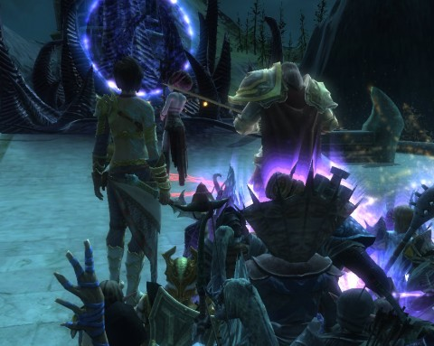
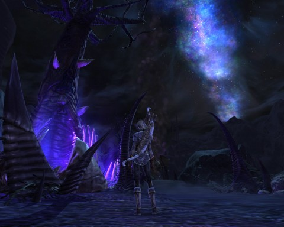

Back to: [West Karana](/posts/westkarana.md) > [2011](/posts/2011/westkarana.md) > [April](./westkarana.md)
# Rift: River of Souls? Blink and you missed it.

*Posted by Tipa on 2011-04-16 19:10:10*

[caption id="attachment\_6347" align="aligncenter" width="480" caption="Fighting a Shimmersand boss"][/caption]

Though Phase 1 of Rift's River of Souls event took its time and lasted long enough -- two weeks -- for everyone to get a chance at it, the second and third phases took only about half an hour together. If you weren't there -- or worse, if you were stuck in an hours-long queue -- you missed it. It's gone, it's over, there's a new raid now ("The River of Souls"), but the one-time rewards are done and gone.

Trion brought down all servers before the start of the event to ensure the event ran smoothly. They then staggered the event from server to server, presumably so that the servers handling the final event in Stillmoor could handle the crush of a server's entire interested population concentrated in an area the size of a small cinema.

The server didn't even bother trying to draw all the players in the area. You'd see the people in a small circle centered on your character, a couple further away. The game did its best, but just couldn't handle the load.

[caption id="attachment\_6350" align="aligncenter" width="480" caption="A Stillmoor Love-In"][/caption]

Our guild formed a raid in Shimmersand at the appointed time and after the servers returned. Trion posted that the start time for Phase 2 would be different for each server, so we spent the time closing rifts on "XP Beach", knocking shoulders with a Guardian raid, fighting over rights to the Rift boss. There may have been a little PvP here and there. I may have accidentally plinked a Guardian. I may have then been farmed by the Guardian raid until someone told me how to turn off auto-pvp flagging.

Upshot was, we were far from Wyrmbane Spire when Phase 2 finally started. By the time we made it back there, the first Shimmersand boss had been killed. We could see the progress of Phase 2 in the quest log; in every zone in the game, players would have to kill the special "colossi" bosses. Clearing every zone would trigger Phase 3.

[caption id="attachment\_6352" align="aligncenter" width="480" caption="The River of Souls instance"][/caption]

The other three bosses were in Fortune's Shore, Shimmersand's main city. We took the porticulum from the Spire to the city and I had time to help on two bosses; a giant grim shade and an enormous centaur, who one-shotted me. Nonetheless, I got a "weapon cache" from one of the bosses. Examining it starts a quest to kill a colossi, close a certain number of death rifts and defeat a certain number of death invasions. The reward, for a rogue, is either a cool looking dagger or a cool looking bow, both blue quality -- not very special stat-wise, but definitely cool looking and really emphasizing the need for some sort of appearance slots so these weapons won't get discarded immediately. They're okay, but they aren't T1, and at this stage in my roguely career, I need to be focusing on better gear.

With the bosses defeated, it was just a waiting game until the other zones finished their kills. The last to complete was the Guardian newbie zone, Silverwood.

Guardians. No surprise they'd let the server down.

Phase 3 had everyone heading to Stillmoor, to a huge castle full of deadly mobs. I guess there's a portal near it, but I only had the portal to Phoenix Rise, clear on the other side of the zone. I carefully followed higher level people to the castle and only got attacked a couple of times.

The top of the castle seemed relatively empty at first, until it became clear that the game had simply stopped trying to draw the players. After about half an hour, Alsbeth the Discordant herself stepped from a death portal and... just stood there for a long time.

Eventually she respawned, and the leader of the Guardian faction walked in and.... nothing

They respawned again, and then one last time, now with the leader of the Defiant faction there as well. They chatted for awhile, Alsbeth had some threats, the Guardian leader had the Vigil in the form of divine angels save the Defiant leader from Alsbeth's attack. They moved on her; Alsbeth fled into the River of Souls, and the event was done.

I received the title "the Discordant" for kneeling to Alsbeth when she commanded us to do so. And I got the achievements "Grim Hero" and "Grim Victory". There was a third achievement, "Take Me to the River" for entering the River of Souls expert dungeon. Which I did, as soon as the server came back up.

Because it crashed after Phase 3. It crashed again and again. It crashed while I was doing an Abyssal Precipice run. It crashed when I managed to get a Charmer's Caldera run going. And it's still crashed now.

Although Trion has promised that those who could not take part will get some sort of reward, it was clear before the event began on US servers that there would be problems. The European servers had already had the event and things went about the same way.

Players posting on the forums suggest that the abrupt ending for this event could be excused because the two week Phase 1 run was the real event; today's phases were just a coda. Certainly nobody came out of this drowning in loot. I was hoping to get a chance at one of the promised event mounts, but I don't know if anyone got one.

I guess the real take-away of this, is that Trion has in Rift a really popular game. Second, perhaps don't put major events on during free weekends. And third, players REALLY LOVE new, dynamic content -- look at Star Trek Online, which has built a reputation on their event-driven Feature Episodes. A reputation which must seem to be as much a trap as a boon sometimes.

I'm glad I made it in and was able to participate. If I'd been one of the people stuck in a five hour queue, though, I'd be pretty upset.

## Comments!

**[kaozz](http://www.ectmmo.com/)** writes: I was wondering why they'd do a one day event when the other parts were much longer. Instead of compensating they should just run it a few days longer. Great pics, looks like it might have been fun. Nice that you got the chance to participate, seems so many people missed out :(

---

**TheRemedy** writes: I'm of the mind that these singular world events are a bad idea. I remember the AQ Gates event in WoW, possibly the laggiest experience I've ever had in any game ever. And I played EQ and UO on dial-up. And my server was nice enough to launch the event during normal hours, you had servers where guilds would launch the event right before scheduled maintenance which would then block everyone from participating as the event would be gone when the servers were brought back up. It's just not smart to have an event that only lasts for a certain period of time that is never repeated as people are going to miss out, which inevitably leads to angry customers.

---

**Bhagpuss** writes: You got more done than I did. I just posted my brief account over on Keen's site so I won't repeat myself, but I only got to kill one boss and I missed out on the "kneel" thing with Alsbeth. Loot, there was none.

Still, I'd be lying if I said I didn't enjoy myself.

---

**João Carlos** writes: They changed the phase III: at alpha server it was a fight with 6 bosses. At live servers it was a chat between some NPCs.

My guess is that to have all server players at one place, for all server at same time, it was too much. There are limits to thecnology. I think the problem wasn't at teh servers per se, but the telecommunication lines, because they tryed to solve the problem staging the event at diferent times for the diferent servers.

Trion too said that they will apply the lessons they learned at the next event. From http://forums.riftgame.com/showthread.php?166240-World-Event-Tips-and-Status

"We're already taking what we've learned over the last week and today into account as we work on the next set of world events, and will be designing them such that full-server-population flashmobs aren't quite as likely to occur - Both for fun factor and performance.

Equally importantly for the future, we'll be ensuring there are more phases that each last longer , and a more clear progression, to maximize everyone's chance of participating."

I know that some people lost the event. A guild mate had a 4 hours queue and lost it. Other one had RL issues.

But Trion will make more events. Now just need wait for them. 

And it is good to take note: RIFT had big queues yesterday....

---

**[Saylah](http://notadiary.typepad.com/mysticworlds/)** writes: We're all extremely disappointed that no one from our household could get in to participate. 3 customers on 3 different servers stuck in a queue. About 25% of guild members in vent wanting to participate were in the same boat. I know they'll get better but that sorta doesn't help today as the chronicling of my Rift adventures and picture album as this permanent gap.

---

**[Shades of Zoo | Kill Ten Rats](http://www.killtenrats.com/2011/04/17/shades-of-zoo/)** writes: [...] sides to Rift only because it is live and being experienced by so many. Obviously Trion Worlds hit their first stumble when trying to provide a singular whammy of an event last Saturday. It will be [...]

---

