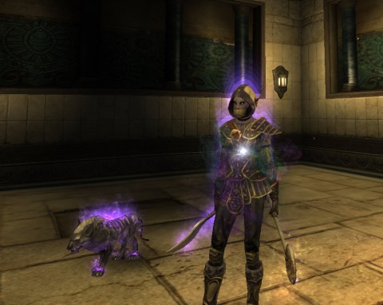

Back to: [West Karana](/posts/westkarana.md) > [2011](/posts/2011/westkarana.md) > [April](./westkarana.md)
# Rift: Ding 50!

*Posted by Tipa on 2011-04-17 19:47:51*

[caption id="attachment\_6355" align="aligncenter" width="480" caption="Couldn't get more glowy"][/caption]

Lucked into a group grinding the Abyssal Precipice instance and dinged 50 a few times in. So, I'm now max level in Rift. More than that, I have the required, for rogues, +HIT > 50 (mine is around 75), so I am geared sufficiently for T1 dungeons. In T1 dungeons, I need to work HIT to > 100, and then in T2 dungeons, to > 200 for raiding.

It's all so very EQ2 and WoW like. But here's the thing -- I never really did the whole gear progression thing in EQ2 and I never did it at all in WoW, so this gearing for the next tier up thing is foreign to me. In previous games -- EQ, and EQ2 before they made it like WoW -- I just went straight from leveling to raiding and just got raid gear.

Most other MMOs I lose interest in well before it gets to raiding, so kudos to Rift for keeping me invested in the character.

Hitting 50 leaves me halfway through the Shimmersand quests, and not started at all on the Iron Pine Peak or Stillmoor quests. The main reason to continue doing these quests is mainly to just get the story of the zones, get achievements and to build faction to buy crafting recipes.

Or I could begin to level my alt, which is the path a lot of people choose. But maybe the expert dungeons will be fun enough to do on their own merits; they are also great places for faction.

But at least the leveling is done. For now. Even though it hasn't been all that long, the lowbie zones seem like years ago. Stonefields seems like ancient history, even though I know I was there for what seemed like forever. The leveling ramped up speed after that, and only slowed down in the long haul through the 40s.

Anyway, see ya in T1!

## Comments!

**Bhagpuss** writes: I spent something like eight hours yesterday just farming and doing Mathos faction dailies in Stillmoor yesterday. I *hate* dailies with a passion. Except, apparently, in Rift I don't.

I realised after I went and handed in those dailies and looked at the vendor that I don't even really want anything he sells! It seems I'm just doing faction grind and farming crafting mats because it's really good fun. What the...?

Anyway, congratulations on 50. It seems that in Rift that really is where life begins.

---

**João Carlos** writes: Well, now that event is over (I get all items I wanted and I was at phase II and III, sorry guys that lost it, but I just have to say to you nyahahahahahaha) I will return to build faction and do T1 dungeons. I want buy some gear from faction vendors, buy some recipes and I need top most faction at IPP for advance the epic story quest.

Expert dungeons is going with pug groups, waiting more players from my guild get to level 50. We have 4-5 players now at level 50, so maybe we can start an expert dungeon group. 

My advice with relation to expert dungeons: the boss fights can be a pain, be preparated for some wipes before the group learn a strategy for defeat that bosses. And don't try T2 dungeons while your gear don't have some purples, because blue items is not enough.

---

**[Blue Kae](http://bluekae.com)** writes: Congrats on 50!

---

**[belghast](http://www.aggronaut.com)** writes: Gratz! Welcome to the 50s club. If you were on my server I would totally tank some t1s for ya :)

---

**[Callan S.](http://philosophergamer.blogspot.com/)** writes: So why do they have the tiers between max level and raiding?

Are they perhaps just there for when you can't get your raid on?

Or has peer pressure determined that no one will let you just raid with 'sub par' gear, so your stuck doing these first?

Well done on top level, btw.

---

**[Tipa](https://chasingdings.com)** writes: It's to get gear without which you will not survive long enough to be effective in a raid. Same sort of deal as with WoW.

---

**[Belghast](http://aggronaut.com)** writes: @Callan

Honestly this is the way it used to be in WoW, and how it should have stayed. Raiding is supposed to be the thing you get to by carefully gearing your way through all the existing content. The tier system gives us some clear lines and barriers to progress through. Basically the mechanic they use is each tier has a different requirement to succeed at, and by doing each tier you get the gear you need to progress to the next one.

All of the classes have a key "raid" mechanic, that they need to get to a certain level of. Beautiful thing is, that regardless of your stat the numbers are always the same for each tier.

Tanks need Toughness
Casters need Focus
Melee need Hit

so for each of the stats you need a certain level for each tier of content

T1 Expert = 50
Expert Rift = 100
T2 Expert = 100
Raid Rift = 150
Raid Dungeon = 200

I like this clearly defined ladder approach, gives you an indicator of when you are ready to move up the ladder.

---

**[Callan S.](http://philosophergamer.blogspot.com/)** writes: The only reason I can see for that is some sort of weening onto the raid structure of advancement (as I understand it).

The whole idea of raiding seem to organically rise apparently from some dragon they stuck into EQ years ago. I suppose it's not surprising for an awkward shift to occur after max level, when raiding was added (and adopted) without much reasoning and more like darwinistic mutation.

---

**[Callan S.](http://philosophergamer.blogspot.com/)** writes: Just to add: If you treat raiding as a different game to leveling, then if you have small group gearing up in between, that's a three game shift - leveling, small group gearing, raiding.

---

**Skip** writes: What leveling spec did you find worked best for your rogue? A Chloro-Lock worked great for my mage.

---

**[Tipa](https://chasingdings.com)** writes: I started out as ranger/bard, moved to bard/ranger in my 20s, then eventually moved to a assassin/riftstalker build in my 40s as it was superior in almost every respect -- faster kills, better self-heals.

---

